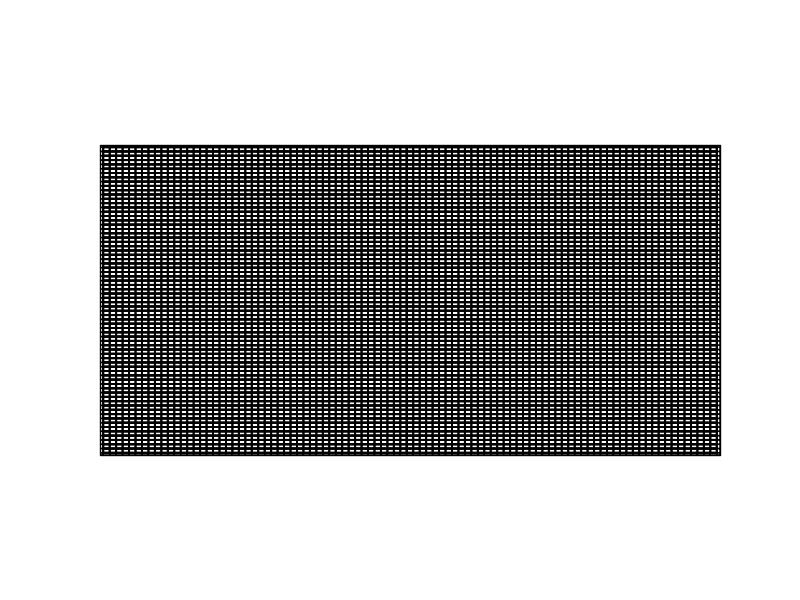
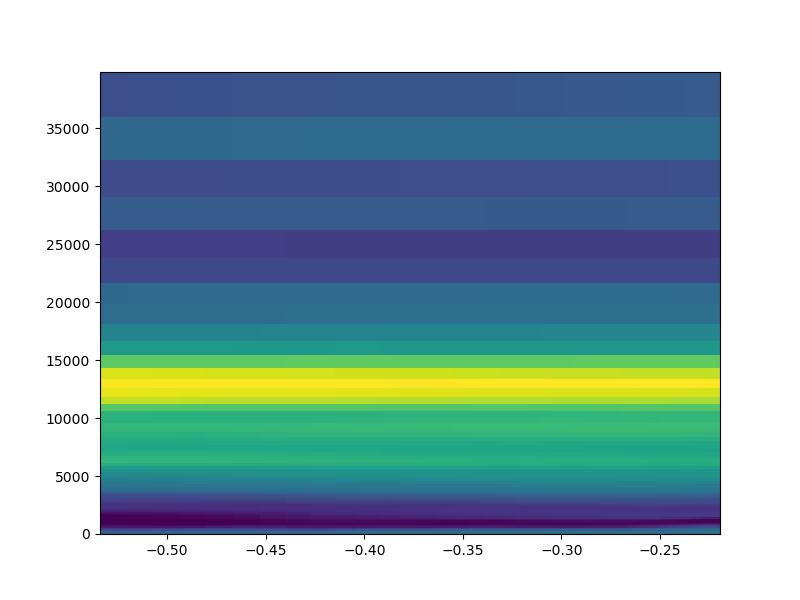
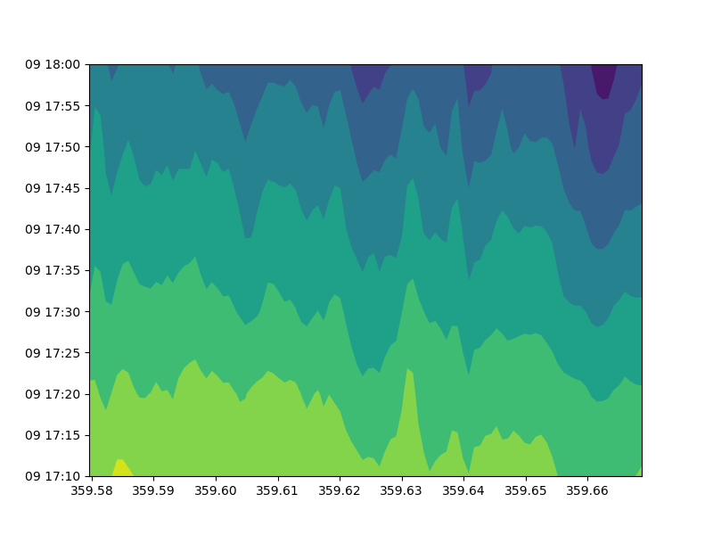
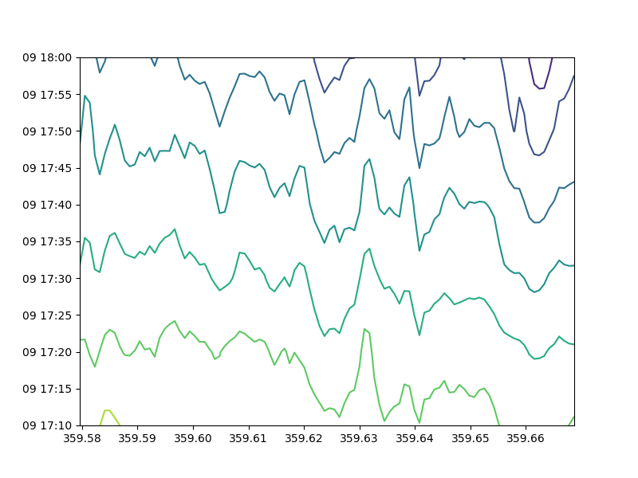
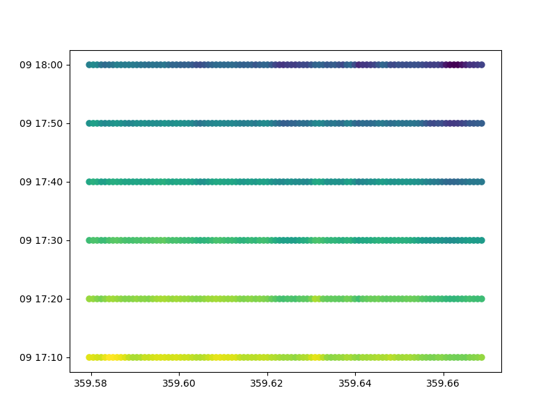

<details>

  <summary>FF</summary>

  
  #### [FF/ancillary/qrparm.mask](test_data/FF/ancillary/qrparm.mask)

  
  
  ```
      land_binary_mask / (1)              (grid_latitude: 1016; grid_longitude: 940)
        Dimension coordinates:
            grid_latitude                             x                     -
            grid_longitude                            -                     x
        Attributes:
            STASH                       m01s00i030
            source                      'Data from Met Office Unified Model'
            um_version                  '7.9'
  ```
  
  
  
  

  #### [FF/ancillary_fixed_length_header](test_data/FF/ancillary_fixed_length_header)

  
  
  
  
  ```
  
  UserWarning: Input field skipped as PPField creation failed : error = 'Unsupported header release number: 0'
  
  ```
  
  

  #### [FF/landsea_masked/testdata_mini_lsm.ff](test_data/FF/landsea_masked/testdata_mini_lsm.ff)

  
  
  ```
      land_binary_mask / (1)              (grid_latitude: 928; grid_longitude: 744)
        Dimension coordinates:
            grid_latitude                             x                    -
            grid_longitude                            -                    x
        Scalar coordinates:
            time                        2015-01-01 01:00:00
        Attributes:
            STASH                       m01s00i030
            source                      'Data from Met Office Unified Model'
            um_version                  '8.5'
  ```
  
  ```
      soil_temperature / (K)              (soil_model_level_number: 2; grid_latitude: 928; grid_longitude: 744)
        Dimension coordinates:
            soil_model_level_number                             x                 -                    -
            grid_latitude                                       -                 x                    -
            grid_longitude                                      -                 -                    x
        Scalar coordinates:
            time                        2015-01-01 01:00:00
        Attributes:
            STASH                       m01s00i020
            source                      'Data from Met Office Unified Model'
            um_version                  '8.5'
  ```
  
  
  
  

  #### [FF/lbc/small_lbc](test_data/FF/lbc/small_lbc)

  
  
  ```
      m01s31i001 / (unknown)              (grid_latitude: 16; grid_longitude: 16)
        Dimension coordinates:
            grid_latitude                             x                   -
            grid_longitude                            -                   x
        Scalar coordinates:
            forecast_period             3.0 hours
            forecast_reference_time     2012-09-27 18:00:00
            level_height                0.0 m, bound=(0.0, 0.0) m
            model_level_number          0
            sigma                       0.0, bound=(0.0, 0.0)
            time                        2012-09-27 21:00:00
        Attributes:
            STASH                       m01s31i001
            source                      'Data from Met Office Unified Model'
            um_version                  '9.1'
  ```
  
  ```
      m01s31i002 / (unknown)              (time: 2; model_level_number: 4; grid_latitude: 16; grid_longitude: 16)
        Dimension coordinates:
            time                             x                      -                 -                   -
            model_level_number               -                      x                 -                   -
            grid_latitude                    -                      -                 x                   -
            grid_longitude                   -                      -                 -                   x
        Auxiliary coordinates:
            forecast_period                  x                      -                 -                   -
        Scalar coordinates:
            forecast_reference_time     2012-09-27 18:00:00
            level_height                0.0 m, bound=(0.0, 0.0) m
            sigma                       0.0, bound=(0.0, 0.0)
        Attributes:
            STASH                       m01s31i002
            source                      'Data from Met Office Unified Model'
            um_version                  '9.1'
  ```
  
  ```
      m01s31i003 / (unknown)              (time: 2; model_level_number: 4; grid_latitude: 17; grid_longitude: 16)
        Dimension coordinates:
            time                             x                      -                 -                   -
            model_level_number               -                      x                 -                   -
            grid_latitude                    -                      -                 x                   -
            grid_longitude                   -                      -                 -                   x
        Auxiliary coordinates:
            forecast_period                  x                      -                 -                   -
        Scalar coordinates:
            forecast_reference_time     2012-09-27 18:00:00
            level_height                0.0 m, bound=(0.0, 0.0) m
            sigma                       0.0, bound=(0.0, 0.0)
        Attributes:
            STASH                       m01s31i003
            source                      'Data from Met Office Unified Model'
            um_version                  '9.1'
  ```
  
  ```
      m01s31i004 / (unknown)              (time: 2; model_level_number: 5; grid_latitude: 16; grid_longitude: 16)
        Dimension coordinates:
            time                             x                      -                 -                   -
            model_level_number               -                      x                 -                   -
            grid_latitude                    -                      -                 x                   -
            grid_longitude                   -                      -                 -                   x
        Auxiliary coordinates:
            forecast_period                  x                      -                 -                   -
        Scalar coordinates:
            forecast_reference_time     2012-09-27 18:00:00
            level_height                0.0 m, bound=(0.0, 0.0) m
            sigma                       0.0, bound=(0.0, 0.0)
        Attributes:
            STASH                       m01s31i004
            source                      'Data from Met Office Unified Model'
            um_version                  '9.1'
  ```
  
  ```
      m01s31i005 / (unknown)              (time: 2; model_level_number: 4; grid_latitude: 16; grid_longitude: 16)
        Dimension coordinates:
            time                             x                      -                 -                   -
            model_level_number               -                      x                 -                   -
            grid_latitude                    -                      -                 x                   -
            grid_longitude                   -                      -                 -                   x
        Auxiliary coordinates:
            forecast_period                  x                      -                 -                   -
        Scalar coordinates:
            forecast_reference_time     2012-09-27 18:00:00
            level_height                0.0 m, bound=(0.0, 0.0) m
            sigma                       0.0, bound=(0.0, 0.0)
        Attributes:
            STASH                       m01s31i005
            source                      'Data from Met Office Unified Model'
            um_version                  '9.1'
  ```
  
  ```
      m01s31i006 / (unknown)              (time: 2; model_level_number: 5; grid_latitude: 16; grid_longitude: 16)
        Dimension coordinates:
            time                             x                      -                 -                   -
            model_level_number               -                      x                 -                   -
            grid_latitude                    -                      -                 x                   -
            grid_longitude                   -                      -                 -                   x
        Auxiliary coordinates:
            forecast_period                  x                      -                 -                   -
        Scalar coordinates:
            forecast_reference_time     2012-09-27 18:00:00
            level_height                0.0 m, bound=(0.0, 0.0) m
            sigma                       0.0, bound=(0.0, 0.0)
        Attributes:
            STASH                       m01s31i006
            source                      'Data from Met Office Unified Model'
            um_version                  '9.1'
  ```
  
  ```
      m01s31i007 / (unknown)              (time: 2; model_level_number: 5; grid_latitude: 16; grid_longitude: 16)
        Dimension coordinates:
            time                             x                      -                 -                   -
            model_level_number               -                      x                 -                   -
            grid_latitude                    -                      -                 x                   -
            grid_longitude                   -                      -                 -                   x
        Auxiliary coordinates:
            forecast_period                  x                      -                 -                   -
        Scalar coordinates:
            forecast_reference_time     2012-09-27 18:00:00
            level_height                0.0 m, bound=(0.0, 0.0) m
            sigma                       0.0, bound=(0.0, 0.0)
        Attributes:
            STASH                       m01s31i007
            source                      'Data from Met Office Unified Model'
            um_version                  '9.1'
  ```
  
  ```
      m01s31i008 / (unknown)              (time: 2; model_level_number: 5; grid_latitude: 16; grid_longitude: 16)
        Dimension coordinates:
            time                             x                      -                 -                   -
            model_level_number               -                      x                 -                   -
            grid_latitude                    -                      -                 x                   -
            grid_longitude                   -                      -                 -                   x
        Auxiliary coordinates:
            forecast_period                  x                      -                 -                   -
        Scalar coordinates:
            forecast_reference_time     2012-09-27 18:00:00
            level_height                0.0 m, bound=(0.0, 0.0) m
            sigma                       0.0, bound=(0.0, 0.0)
        Attributes:
            STASH                       m01s31i008
            source                      'Data from Met Office Unified Model'
            um_version                  '9.1'
  ```
  
  ```
      m01s31i009 / (unknown)              (time: 2; model_level_number: 5; grid_latitude: 16; grid_longitude: 16)
        Dimension coordinates:
            time                             x                      -                 -                   -
            model_level_number               -                      x                 -                   -
            grid_latitude                    -                      -                 x                   -
            grid_longitude                   -                      -                 -                   x
        Auxiliary coordinates:
            forecast_period                  x                      -                 -                   -
        Scalar coordinates:
            forecast_reference_time     2012-09-27 18:00:00
            level_height                0.0 m, bound=(0.0, 0.0) m
            sigma                       0.0, bound=(0.0, 0.0)
        Attributes:
            STASH                       m01s31i009
            source                      'Data from Met Office Unified Model'
            um_version                  '9.1'
  ```
  
  ```
      m01s31i010 / (unknown)              (time: 2; model_level_number: 5; grid_latitude: 16; grid_longitude: 16)
        Dimension coordinates:
            time                             x                      -                 -                   -
            model_level_number               -                      x                 -                   -
            grid_latitude                    -                      -                 x                   -
            grid_longitude                   -                      -                 -                   x
        Auxiliary coordinates:
            forecast_period                  x                      -                 -                   -
        Scalar coordinates:
            forecast_reference_time     2012-09-27 18:00:00
            level_height                0.0 m, bound=(0.0, 0.0) m
            sigma                       0.0, bound=(0.0, 0.0)
        Attributes:
            STASH                       m01s31i010
            source                      'Data from Met Office Unified Model'
            um_version                  '9.1'
  ```
  
  
  
  ```
  
  UserWarning: Unable to create instance of HybridHeightFactory. The source data contains no field(s) for 'orography'.
  
  ```
  
  

  #### [FF/lbrel_missing](test_data/FF/lbrel_missing)

  
  
  ```
      high_type_cloud_area_fraction / (1) (latitude: 72; longitude: 96)
        Dimension coordinates:
            latitude                             x              -
            longitude                            -              x
        Scalar coordinates:
            forecast_period             4.5 hours, bound=(3.0, 6.0) hours
            forecast_reference_time     2012-09-28 00:00:00
            time                        2012-09-28 04:30:00, bound=(2012-09-28 03:00:00, 2012-09-28 06:00:00)
        Cell methods:
            0                           time: mean (interval: 1 hour)
        Attributes:
            STASH                       m01s09i205
            source                      'Data from Met Office Unified Model'
            um_version                  '10.3'
  ```
  
  ```
      high_type_cloud_area_fraction / (1) (latitude: 72; longitude: 96)
        Dimension coordinates:
            latitude                             x              -
            longitude                            -              x
        Scalar coordinates:
            forecast_period             4.5 hours, bound=(3.0, 6.0) hours
            forecast_reference_time     2012-09-28 00:00:00
            time                        2012-09-28 04:30:00, bound=(2012-09-28 03:00:00, 2012-09-28 06:00:00)
        Cell methods:
            0                           time: mean (interval: 1 hour)
        Attributes:
            STASH                       m01s09i205
            source                      'Data from Met Office Unified Model'
            um_version                  '10.3'
  ```
  
  
  
  ```
  
  UserWarning: Input field skipped as PPField creation failed : error = 'Unsupported header release number: -32768'
  
  ```
  
  

  #### [FF/lbrel_test_data](test_data/FF/lbrel_test_data)

  
  
  ```
      air_pressure / (Pa)                 (latitude: 30; longitude: 40)
        Dimension coordinates:
            latitude                             x              -
            longitude                            -              x
        Scalar coordinates:
            forecast_period             13681.0 hours
            forecast_reference_time     1991-03-01 00:00:00
            level_height                18.333332950000003 m, bound=(10.0000001, 26.66666665) m
            model_level_number          2
            sigma                       0.9979288770178537, bound=(0.9988700303633598, 0.9969881671712466)
            time                        1992-10-01 01:00:00
        Attributes:
            STASH                       m01s00i407
            source                      'Data from Met Office Unified Model'
            um_version                  '8.5'
  ```
  
  
  
  ```
  
  UserWarning: Input field skipped as PPField creation failed : error = 'Unsupported header release number: -32768'
  
  UserWarning: Unable to create instance of HybridHeightFactory. The source data contains no field(s) for 'orography'.
  
  ```
  
  

  #### [FF/n48_multi_field](test_data/FF/n48_multi_field)

  
  
  ```
      air_temperature / (K)               (latitude: 73; longitude: 96)
        Dimension coordinates:
            latitude                             x              -
            longitude                            -              x
        Scalar coordinates:
            forecast_period             0.0 hours
            forecast_reference_time     2011-07-11 00:00:00
            height                      1.5 m
            time                        2011-07-11 00:00:00
        Attributes:
            STASH                       m01s03i236
            source                      'Data from Met Office Unified Model'
            um_version                  '8.2'
  ```
  
  ```
      air_temperature / (K)               (latitude: 73; longitude: 96)
        Dimension coordinates:
            latitude                             x              -
            longitude                            -              x
        Scalar coordinates:
            forecast_period             -1.5 hours, bound=(-3.0, 0.0) hours
            forecast_reference_time     2011-07-11 00:00:00
            height                      1.5 m
            time                        2011-07-10 22:30:00, bound=(2011-07-10 21:00:00, 2011-07-11 00:00:00)
        Cell methods:
            0                           time: maximum (interval: 1 hour)
        Attributes:
            STASH                       m01s03i236
            source                      'Data from Met Office Unified Model'
            um_version                  '8.2'
  ```
  
  ```
      soil_temperature / (K)              (latitude: 73; longitude: 96)
        Dimension coordinates:
            latitude                             x              -
            longitude                            -              x
        Scalar coordinates:
            forecast_period             0.0 hours
            forecast_reference_time     2011-07-11 00:00:00
            soil_model_level_number     1
            time                        2011-07-11 00:00:00
        Attributes:
            STASH                       m01s08i225
            source                      'Data from Met Office Unified Model'
            um_version                  '8.2'
  ```
  
  ```
      surface_altitude / (m)              (latitude: 73; longitude: 96)
        Dimension coordinates:
            latitude                             x              -
            longitude                            -              x
        Scalar coordinates:
            forecast_period             0.0 hours
            forecast_reference_time     2011-07-11 00:00:00
            time                        2011-07-11 00:00:00
        Attributes:
            STASH                       m01s00i033
            source                      'Data from Met Office Unified Model'
            um_version                  '8.2'
  ```
  
  
  
  

  #### [FF/n48_multi_field_table_count](test_data/FF/n48_multi_field_table_count)

  
  
  ```
      air_temperature / (K)               (latitude: 73; longitude: 96)
        Dimension coordinates:
            latitude                             x              -
            longitude                            -              x
        Scalar coordinates:
            forecast_period             0.0 hours
            forecast_reference_time     2011-07-11 00:00:00
            height                      1.5 m
            time                        2011-07-11 00:00:00
        Attributes:
            STASH                       m01s03i236
            source                      'Data from Met Office Unified Model'
            um_version                  '8.2'
  ```
  
  ```
      air_temperature / (K)               (latitude: 73; longitude: 96)
        Dimension coordinates:
            latitude                             x              -
            longitude                            -              x
        Scalar coordinates:
            forecast_period             -1.5 hours, bound=(-3.0, 0.0) hours
            forecast_reference_time     2011-07-11 00:00:00
            height                      1.5 m
            time                        2011-07-10 22:30:00, bound=(2011-07-10 21:00:00, 2011-07-11 00:00:00)
        Cell methods:
            0                           time: maximum (interval: 1 hour)
        Attributes:
            STASH                       m01s03i236
            source                      'Data from Met Office Unified Model'
            um_version                  '8.2'
  ```
  
  ```
      soil_temperature / (K)              (latitude: 73; longitude: 96)
        Dimension coordinates:
            latitude                             x              -
            longitude                            -              x
        Scalar coordinates:
            forecast_period             0.0 hours
            forecast_reference_time     2011-07-11 00:00:00
            soil_model_level_number     1
            time                        2011-07-11 00:00:00
        Attributes:
            STASH                       m01s08i225
            source                      'Data from Met Office Unified Model'
            um_version                  '8.2'
  ```
  
  ```
      surface_altitude / (m)              (latitude: 73; longitude: 96)
        Dimension coordinates:
            latitude                             x              -
            longitude                            -              x
        Scalar coordinates:
            forecast_period             0.0 hours
            forecast_reference_time     2011-07-11 00:00:00
            time                        2011-07-11 00:00:00
        Attributes:
            STASH                       m01s00i033
            source                      'Data from Met Office Unified Model'
            um_version                  '8.2'
  ```
  
  
  
  

  #### [FF/structured/small](test_data/FF/structured/small)

  
  
  ```
      air_pressure / (Pa)                 (time: 2; model_level_number: 3; latitude: 30; longitude: 40)
        Dimension coordinates:
            time                             x                      -            -              -
            model_level_number               -                      x            -              -
            latitude                         -                      -            x              -
            longitude                        -                      -            -              x
        Auxiliary coordinates:
            forecast_period                  x                      -            -              -
            level_height                     -                      x            -              -
            sigma                            -                      x            -              -
        Scalar coordinates:
            forecast_reference_time     1991-03-01 00:00:00
        Attributes:
            STASH                       m01s00i407
            source                      'Data from Met Office Unified Model'
            um_version                  '8.5'
  ```
  
  
  
  ```
  
  UserWarning: Unable to create instance of HybridHeightFactory. The source data contains no field(s) for 'orography'.
  
  ```
  
  

</details>


<details>

  <summary>GRIB</summary>

  
  #### [GRIB/3_layer_viz/3_layer.grib2](test_data/GRIB/3_layer_viz/3_layer.grib2)

  
  
  ```
      air_temperature / (K)               (latitude: 73; longitude: 96)
        Dimension coordinates:
            latitude                             x              -
            longitude                            -              x
        Scalar coordinates:
            forecast_period             -11055.0 hours, bound=(-28587.0, 6477.0) hours
            forecast_reference_time     1998-03-06 03:00:00
            pressure                    100000.0 Pa
            time                        1996-11-30 12:00:00, bound=(1994-12-01 00:00:00, 1998-12-01 00:00:00)
        Cell methods:
            0                           time: mean
        Attributes:
            GRIB_PARAM                  GRIB2:d000c000n000
  ```
  
  ```
      air_temperature / (K)               (grid_latitude: 360; grid_longitude: 600)
        Dimension coordinates:
            grid_latitude                             x                    -
            grid_longitude                            -                    x
        Scalar coordinates:
            forecast_period             0 hours
            forecast_reference_time     2009-05-07 00:00:00
            pressure                    100000.0 Pa
            time                        2009-05-07 00:00:00
        Attributes:
            GRIB_PARAM                  GRIB2:d000c000n000
  ```
  
  ```
      air_temperature / (K)               (grid_latitude: 360; grid_longitude: 288)
        Dimension coordinates:
            grid_latitude                             x                    -
            grid_longitude                            -                    x
        Scalar coordinates:
            forecast_period             0.0 hours, bound=(0.0, 0.0) hours
            forecast_reference_time     2008-01-23 03:00:00
            pressure                    999900.0 Pa
            time                        2008-01-23 03:00:00, bound=(2008-01-23 03:00:00, 2008-01-23 03:00:00)
        Cell methods:
            0                           time: mean
        Attributes:
            GRIB_PARAM                  GRIB2:d000c000n000
  ```
  
  
  
  

  #### [GRIB/bulletin/40bytes.grib](test_data/GRIB/bulletin/40bytes.grib)

  
  
  ```
      icao_standard_atmosphere_reference_height / (m) (latitude: 145; longitude: 288)
        Dimension coordinates:
            latitude                                         x               -
            longitude                                        -               x
        Scalar coordinates:
            forecast_period                         15 hours
            forecast_reference_time                 2011-12-21 06:00:00
            time                                    2011-12-21 21:00:00
        Attributes:
            GRIB_PARAM                              GRIB2:d000c003n003
  ```
  
  
  
  

  #### [GRIB/bulletin/41bytes.grib](test_data/GRIB/bulletin/41bytes.grib)

  
  
  ```
      unknown / (unknown)                 (latitude: 61; longitude: 61)
        Dimension coordinates:
            latitude                             x              -
            longitude                            -              x
        Scalar coordinates:
            forecast_period             72 hours
            originating_centre          unknown centre lfpw
            time                        2013-05-03 00:00:00
  ```
  
  
  
  

  #### [GRIB/fp_units/days.grib2](test_data/GRIB/fp_units/days.grib2)

  
  
  ```
      air_temperature / (K)               (latitude: 31; longitude: 16)
        Dimension coordinates:
            latitude                             x              -
            longitude                            -              x
        Scalar coordinates:
            forecast_period             24.0 hours
            forecast_reference_time     2007-03-23 12:00:00
            time                        2007-03-24 12:00:00
        Attributes:
            GRIB_PARAM                  GRIB2:d000c000n000
            centre                      'European Centre for Medium Range Weather Forecasts'
  ```
  
  
  
  

  #### [GRIB/fp_units/hours.grib2](test_data/GRIB/fp_units/hours.grib2)

  
  
  ```
      air_temperature / (K)               (latitude: 31; longitude: 16)
        Dimension coordinates:
            latitude                             x              -
            longitude                            -              x
        Scalar coordinates:
            forecast_period             24 hours
            forecast_reference_time     2007-03-23 12:00:00
            time                        2007-03-24 12:00:00
        Attributes:
            GRIB_PARAM                  GRIB2:d000c000n000
            centre                      'European Centre for Medium Range Weather Forecasts'
  ```
  
  
  
  

  #### [GRIB/fp_units/minutes.grib2](test_data/GRIB/fp_units/minutes.grib2)

  
  
  ```
      air_temperature / (K)               (latitude: 31; longitude: 16)
        Dimension coordinates:
            latitude                             x              -
            longitude                            -              x
        Scalar coordinates:
            forecast_period             24.0 hours
            forecast_reference_time     2007-03-23 12:00:00
            time                        2007-03-24 12:00:00
        Attributes:
            GRIB_PARAM                  GRIB2:d000c000n000
            centre                      'European Centre for Medium Range Weather Forecasts'
  ```
  
  
  
  

  #### [GRIB/fp_units/seconds.grib2](test_data/GRIB/fp_units/seconds.grib2)

  
  
  ```
      air_temperature / (K)               (latitude: 31; longitude: 16)
        Dimension coordinates:
            latitude                             x              -
            longitude                            -              x
        Scalar coordinates:
            forecast_period             24.0 hours
            forecast_reference_time     2007-03-23 12:00:00
            time                        2007-03-24 12:00:00
        Attributes:
            GRIB_PARAM                  GRIB2:d000c000n000
            centre                      'European Centre for Medium Range Weather Forecasts'
  ```
  
  
  
  

  #### [GRIB/gaussian/regular_gg.grib1](test_data/GRIB/gaussian/regular_gg.grib1)

  
  
  ```
      x_wind / (m s-1)                    (latitude: 96; longitude: 192)
        Dimension coordinates:
            latitude                             x              -
            longitude                            -              x
        Scalar coordinates:
            forecast_period             0 hours
            originating_centre          US National Weather Service, National Centres for Environmental Predic...
            pressure                    850 hPa
            time                        2004-04-02 00:00:00
  ```
  
  
  
  

  #### [GRIB/gaussian/regular_gg.grib2](test_data/GRIB/gaussian/regular_gg.grib2)

  
  
  ```
      geopotential_height / (m)           (latitude: 96; longitude: 192)
        Dimension coordinates:
            latitude                             x              -
            longitude                            -              x
        Scalar coordinates:
            forecast_period             69 hours
            forecast_reference_time     2013-08-13 00:00:00
            pressure                    52500.0 Pa
            time                        2013-08-15 21:00:00
        Attributes:
            GRIB_PARAM                  GRIB2:d000c003n005
  ```
  
  
  
  

  #### [GRIB/global_t/global.grib2](test_data/GRIB/global_t/global.grib2)

  
  
  ```
      air_temperature / (K)               (latitude: 73; longitude: 96)
        Dimension coordinates:
            latitude                             x              -
            longitude                            -              x
        Scalar coordinates:
            forecast_period             -11055.0 hours, bound=(-28587.0, 6477.0) hours
            forecast_reference_time     1998-03-06 03:00:00
            pressure                    100000.0 Pa
            time                        1996-11-30 12:00:00, bound=(1994-12-01 00:00:00, 1998-12-01 00:00:00)
        Cell methods:
            0                           time: mean
        Attributes:
            GRIB_PARAM                  GRIB2:d000c000n000
  ```
  
  
  
  

  #### [GRIB/grib1_second_order_packing/GRIB_00008_FRANX01](test_data/GRIB/grib1_second_order_packing/GRIB_00008_FRANX01)

  
  
  ```
      unknown / (unknown)                 (latitude: 221; longitude: 281)
        Dimension coordinates:
            latitude                             x               -
            longitude                            -               x
        Scalar coordinates:
            forecast_period             0 hours
            originating_centre          unknown centre lfpw
            time                        0001-01-17 00:00:00
  ```
  
  
  
  

  #### [GRIB/ij_directions/ineg_jneg.grib2](test_data/GRIB/ij_directions/ineg_jneg.grib2)

  
  
  ```
      air_temperature / (K)               (latitude: 73; longitude: 96)
        Dimension coordinates:
            latitude                             x              -
            longitude                            -              x
        Scalar coordinates:
            forecast_period             -11055.0 hours, bound=(-28587.0, 6477.0) hours
            forecast_reference_time     1998-03-06 03:00:00
            pressure                    100000.0 Pa
            time                        1996-11-30 12:00:00, bound=(1994-12-01 00:00:00, 1998-12-01 00:00:00)
        Cell methods:
            0                           time: mean
        Attributes:
            GRIB_PARAM                  GRIB2:d000c000n000
  ```
  
  
  
  

  #### [GRIB/ij_directions/ineg_jpos.grib2](test_data/GRIB/ij_directions/ineg_jpos.grib2)

  
  
  ```
      air_temperature / (K)               (latitude: 73; longitude: 96)
        Dimension coordinates:
            latitude                             x              -
            longitude                            -              x
        Scalar coordinates:
            forecast_period             -11055.0 hours, bound=(-28587.0, 6477.0) hours
            forecast_reference_time     1998-03-06 03:00:00
            pressure                    100000.0 Pa
            time                        1996-11-30 12:00:00, bound=(1994-12-01 00:00:00, 1998-12-01 00:00:00)
        Cell methods:
            0                           time: mean
        Attributes:
            GRIB_PARAM                  GRIB2:d000c000n000
  ```
  
  
  
  

  #### [GRIB/ij_directions/ipos_jneg.grib2](test_data/GRIB/ij_directions/ipos_jneg.grib2)

  
  
  ```
      air_temperature / (K)               (latitude: 73; longitude: 96)
        Dimension coordinates:
            latitude                             x              -
            longitude                            -              x
        Scalar coordinates:
            forecast_period             -11055.0 hours, bound=(-28587.0, 6477.0) hours
            forecast_reference_time     1998-03-06 03:00:00
            pressure                    100000.0 Pa
            time                        1996-11-30 12:00:00, bound=(1994-12-01 00:00:00, 1998-12-01 00:00:00)
        Cell methods:
            0                           time: mean
        Attributes:
            GRIB_PARAM                  GRIB2:d000c000n000
  ```
  
  
  
  

  #### [GRIB/ij_directions/ipos_jpos.grib2](test_data/GRIB/ij_directions/ipos_jpos.grib2)

  
  
  ```
      air_temperature / (K)               (latitude: 73; longitude: 96)
        Dimension coordinates:
            latitude                             x              -
            longitude                            -              x
        Scalar coordinates:
            forecast_period             -11055.0 hours, bound=(-28587.0, 6477.0) hours
            forecast_reference_time     1998-03-06 03:00:00
            pressure                    100000.0 Pa
            time                        1996-11-30 12:00:00, bound=(1994-12-01 00:00:00, 1998-12-01 00:00:00)
        Cell methods:
            0                           time: mean
        Attributes:
            GRIB_PARAM                  GRIB2:d000c000n000
  ```
  
  
  
  

  #### [GRIB/jpeg2000/file.grib2](test_data/GRIB/jpeg2000/file.grib2)

  
  
  ```
      WAFC_CAT_potential / (1)            (latitude: 145; longitude: 288)
        Dimension coordinates:
            latitude                             x               -
            longitude                            -               x
        Scalar coordinates:
            forecast_period             18.0 hours, bound=(36.0, 0.0) hours
            forecast_reference_time     2010-02-08 06:00:00
            pressure                    25000.0 Pa
            time                        2010-02-09 00:00:00, bound=(2010-02-09 18:00:00, 2010-02-08 06:00:00)
        Cell methods:
            0                           time: mean
        Attributes:
            GRIB_PARAM                  GRIB2:d000c019n022
  ```
  
  
  
  

  #### [GRIB/lambert/lambert.grib1](test_data/GRIB/lambert/lambert.grib1)

  
  
  ```
      air_temperature / (kelvin)          (projection_y_coordinate: 799; projection_x_coordinate: 1199)
        Dimension coordinates:
            projection_y_coordinate                             x                             -
            projection_x_coordinate                             -                             x
        Scalar coordinates:
            forecast_period             36 hours
            height                      2 m
            originating_centre          US National Weather Service, National Centres for Environmental Predic...
            time                        2013-06-15 12:00:00
  ```
  
  
  
  

  #### [GRIB/lambert/lambert.grib2](test_data/GRIB/lambert/lambert.grib2)

  
  
  ```
      air_temperature / (K)               (projection_y_coordinate: 799; projection_x_coordinate: 1199)
        Dimension coordinates:
            projection_y_coordinate                             x                             -
            projection_x_coordinate                             -                             x
        Scalar coordinates:
            forecast_period             2 hours
            forecast_reference_time     2013-05-07 12:00:00
            height                      2.0 m
            time                        2013-05-07 14:00:00
        Attributes:
            GRIB_PARAM                  GRIB2:d000c000n000
  ```
  
  
  
  

  #### [GRIB/missing_values/missing_values.grib2](test_data/GRIB/missing_values/missing_values.grib2)

  
  
  ```
      x_wind / (m s-1)                    (latitude: 73; longitude: 144)
        Dimension coordinates:
            latitude                             x              -
            longitude                            -              x
        Scalar coordinates:
            forecast_period             0 hours
            forecast_reference_time     2013-05-21 00:00:00
            time                        2013-05-21 00:00:00
        Attributes:
            GRIB_PARAM                  GRIB2:d000c002n002
  ```
  
  
  
  

  #### [GRIB/polar_stereo/CMC_glb_TMP_ISBL_1015_ps30km_2013052000_P006.grib2](test_data/GRIB/polar_stereo/CMC_glb_TMP_ISBL_1015_ps30km_2013052000_P006.grib2)

  
  
  ```
      air_temperature / (K)               (projection_y_coordinate: 200; projection_x_coordinate: 247)
        Dimension coordinates:
            projection_y_coordinate                             x                             -
            projection_x_coordinate                             -                             x
        Scalar coordinates:
            forecast_period             6 hours
            forecast_reference_time     2013-05-20 00:00:00
            pressure                    101500.0 Pa
            time                        2013-05-20 06:00:00
        Attributes:
            GRIB_PARAM                  GRIB2:d000c000n000
  ```
  
  
  
  

  #### [GRIB/polar_stereo/ST4.2013052210.01h](test_data/GRIB/polar_stereo/ST4.2013052210.01h)

  
  
  ```
      unknown / (unknown)                 (projection_y_coordinate: 881; projection_x_coordinate: 1121)
        Dimension coordinates:
            projection_y_coordinate                             x                             -
            projection_x_coordinate                             -                             x
        Scalar coordinates:
            forecast_period             0.5 hours, bound=(0.0, 1.0) hours
            originating_centre          US National Weather Service, National Centres for Environmental Predic...
            time                        2013-05-22 09:30:00, bound=(2013-05-22 09:00:00, 2013-05-22 10:00:00)
        Cell methods:
            0                           time: sum
  ```
  
  
  
  

  #### [GRIB/reduced/reduced_gg.grib2](test_data/GRIB/reduced/reduced_gg.grib2)

  
  
  ```
      geopotential / (m2 s-2)             (-- : 13280)
        Auxiliary coordinates:
            latitude                        x
            longitude                       x
        Scalar coordinates:
            forecast_period             0 hours
            forecast_reference_time     2013-02-01 00:00:00
            level_pressure              2.000040054321289 Pa
            model_level_number          1
            sigma                       0.0
            time                        2013-02-01 00:00:00
        Attributes:
            GRIB_PARAM                  GRIB2:d000c003n004
            centre                      'European Centre for Medium Range Weather Forecasts'
  ```
  
  
  
  ```
  
  UserWarning: Unable to create instance of HybridPressureFactory. The source data contains no field(s) for 'ref_surface_pressure'.
  
  ```
  
  

  #### [GRIB/reduced/reduced_ll.grib1](test_data/GRIB/reduced/reduced_ll.grib1)

  
  
  ```
      air_temperature / (kelvin)          (-- : 3447)
        Scalar coordinates:
            forecast_period             24 hours
            originating_centre          U.K. Met Office - Exeter
            pressure                    850 hPa
            time                        2013-05-01 00:00:00
  ```
  
  
  
  

  #### [GRIB/reduced/reduced_ll_missing.grib1](test_data/GRIB/reduced/reduced_ll_missing.grib1)

  
  
  ```
      air_temperature / (kelvin)          (-- : 3127)
        Scalar coordinates:
            forecast_period             24 hours
            originating_centre          U.K. Met Office - Exeter
            pressure                    850 hPa
            time                        2013-05-01 00:00:00
  ```
  
  
  
  

  #### [GRIB/rotated_nae_t/sensible_pole.grib2](test_data/GRIB/rotated_nae_t/sensible_pole.grib2)

  
  
  ```
      air_temperature / (K)               (grid_latitude: 360; grid_longitude: 600)
        Dimension coordinates:
            grid_latitude                             x                    -
            grid_longitude                            -                    x
        Scalar coordinates:
            forecast_period             0 hours
            forecast_reference_time     2009-05-07 00:00:00
            pressure                    100000.0 Pa
            time                        2009-05-07 00:00:00
        Attributes:
            GRIB_PARAM                  GRIB2:d000c000n000
  ```
  
  
  
  

  #### [GRIB/rotated_uk/uk_wrongparam.grib1](test_data/GRIB/rotated_uk/uk_wrongparam.grib1)

  
  
  ```
      air_temperature / (kelvin)          (grid_latitude: 360; grid_longitude: 288)
        Dimension coordinates:
            grid_latitude                             x                    -
            grid_longitude                            -                    x
        Scalar coordinates:
            forecast_period             2 hours
            originating_centre          U.K. Met Office - Exeter
            pressure                    600 hPa
            time                        2007-07-19 14:00:00
  ```
  
  
  
  

  #### [GRIB/shape_of_earth/0.grib2](test_data/GRIB/shape_of_earth/0.grib2)

  
  
  ```
      air_temperature / (K)               (latitude: 73; longitude: 96)
        Dimension coordinates:
            latitude                             x              -
            longitude                            -              x
        Scalar coordinates:
            forecast_period             -11055.0 hours, bound=(-28587.0, 6477.0) hours
            forecast_reference_time     1998-03-06 03:00:00
            pressure                    100000.0 Pa
            time                        1996-11-30 12:00:00, bound=(1994-12-01 00:00:00, 1998-12-01 00:00:00)
        Cell methods:
            0                           time: mean
        Attributes:
            GRIB_PARAM                  GRIB2:d000c000n000
  ```
  
  
  
  

  #### [GRIB/shape_of_earth/1.grib2](test_data/GRIB/shape_of_earth/1.grib2)

  
  
  ```
      air_temperature / (K)               (latitude: 73; longitude: 96)
        Dimension coordinates:
            latitude                             x              -
            longitude                            -              x
        Scalar coordinates:
            forecast_period             -11055.0 hours, bound=(-28587.0, 6477.0) hours
            forecast_reference_time     1998-03-06 03:00:00
            pressure                    100000.0 Pa
            time                        1996-11-30 12:00:00, bound=(1994-12-01 00:00:00, 1998-12-01 00:00:00)
        Cell methods:
            0                           time: mean
        Attributes:
            GRIB_PARAM                  GRIB2:d000c000n000
  ```
  
  
  
  

  #### [GRIB/shape_of_earth/2.grib2](test_data/GRIB/shape_of_earth/2.grib2)

  
  
  ```
      air_temperature / (K)               (latitude: 73; longitude: 96)
        Dimension coordinates:
            latitude                             x              -
            longitude                            -              x
        Scalar coordinates:
            forecast_period             -11055.0 hours, bound=(-28587.0, 6477.0) hours
            forecast_reference_time     1998-03-06 03:00:00
            pressure                    100000.0 Pa
            time                        1996-11-30 12:00:00, bound=(1994-12-01 00:00:00, 1998-12-01 00:00:00)
        Cell methods:
            0                           time: mean
        Attributes:
            GRIB_PARAM                  GRIB2:d000c000n000
  ```
  
  
  
  

  #### [GRIB/shape_of_earth/3.grib2](test_data/GRIB/shape_of_earth/3.grib2)

  
  
  ```
      air_temperature / (K)               (latitude: 73; longitude: 96)
        Dimension coordinates:
            latitude                             x              -
            longitude                            -              x
        Scalar coordinates:
            forecast_period             -11055.0 hours, bound=(-28587.0, 6477.0) hours
            forecast_reference_time     1998-03-06 03:00:00
            pressure                    100000.0 Pa
            time                        1996-11-30 12:00:00, bound=(1994-12-01 00:00:00, 1998-12-01 00:00:00)
        Cell methods:
            0                           time: mean
        Attributes:
            GRIB_PARAM                  GRIB2:d000c000n000
  ```
  
  
  
  

  #### [GRIB/shape_of_earth/4.grib2](test_data/GRIB/shape_of_earth/4.grib2)

  
  
  ```
      air_temperature / (K)               (latitude: 73; longitude: 96)
        Dimension coordinates:
            latitude                             x              -
            longitude                            -              x
        Scalar coordinates:
            forecast_period             -11055.0 hours, bound=(-28587.0, 6477.0) hours
            forecast_reference_time     1998-03-06 03:00:00
            pressure                    100000.0 Pa
            time                        1996-11-30 12:00:00, bound=(1994-12-01 00:00:00, 1998-12-01 00:00:00)
        Cell methods:
            0                           time: mean
        Attributes:
            GRIB_PARAM                  GRIB2:d000c000n000
  ```
  
  
  
  

  #### [GRIB/shape_of_earth/5.grib2](test_data/GRIB/shape_of_earth/5.grib2)

  
  
  ```
      air_temperature / (K)               (latitude: 73; longitude: 96)
        Dimension coordinates:
            latitude                             x              -
            longitude                            -              x
        Scalar coordinates:
            forecast_period             -11055.0 hours, bound=(-28587.0, 6477.0) hours
            forecast_reference_time     1998-03-06 03:00:00
            pressure                    100000.0 Pa
            time                        1996-11-30 12:00:00, bound=(1994-12-01 00:00:00, 1998-12-01 00:00:00)
        Cell methods:
            0                           time: mean
        Attributes:
            GRIB_PARAM                  GRIB2:d000c000n000
  ```
  
  
  
  

  #### [GRIB/shape_of_earth/6.grib2](test_data/GRIB/shape_of_earth/6.grib2)

  
  
  ```
      air_temperature / (K)               (latitude: 73; longitude: 96)
        Dimension coordinates:
            latitude                             x              -
            longitude                            -              x
        Scalar coordinates:
            forecast_period             -11055.0 hours, bound=(-28587.0, 6477.0) hours
            forecast_reference_time     1998-03-06 03:00:00
            pressure                    100000.0 Pa
            time                        1996-11-30 12:00:00, bound=(1994-12-01 00:00:00, 1998-12-01 00:00:00)
        Cell methods:
            0                           time: mean
        Attributes:
            GRIB_PARAM                  GRIB2:d000c000n000
  ```
  
  
  
  

  #### [GRIB/shape_of_earth/7.grib2](test_data/GRIB/shape_of_earth/7.grib2)

  
  
  ```
      air_temperature / (K)               (latitude: 73; longitude: 96)
        Dimension coordinates:
            latitude                             x              -
            longitude                            -              x
        Scalar coordinates:
            forecast_period             -11055.0 hours, bound=(-28587.0, 6477.0) hours
            forecast_reference_time     1998-03-06 03:00:00
            pressure                    100000.0 Pa
            time                        1996-11-30 12:00:00, bound=(1994-12-01 00:00:00, 1998-12-01 00:00:00)
        Cell methods:
            0                           time: mean
        Attributes:
            GRIB_PARAM                  GRIB2:d000c000n000
  ```
  
  
  
  

  #### [GRIB/shape_of_earth/global.grib1](test_data/GRIB/shape_of_earth/global.grib1)

  
  
  ```
      air_temperature / (kelvin)          (latitude: 481; longitude: 640)
        Dimension coordinates:
            latitude                             x               -
            longitude                            -               x
        Scalar coordinates:
            forecast_period             0 hours
            originating_centre          U.K. Met Office - Exeter
            pressure                    1000 hPa
            time                        2008-12-12 00:00:00
  ```
  
  
  
  

  #### [GRIB/time_processed/time_bound.grib1](test_data/GRIB/time_processed/time_bound.grib1)

  
  
  ```
      UNKNOWN LOCAL PARAM 106.137 / (unknown) (latitude: 321; longitude: 481)
        Dimension coordinates:
            latitude                                 x               -
            longitude                                -               x
        Scalar coordinates:
            forecast_period                 1.5 hours, bound=(0.0, 3.0) hours
            originating_centre              U.K. Met Office - Exeter
            time                            2011-03-15 01:30:00, bound=(2011-03-15 00:00:00, 2011-03-15 03:00:00)
        Cell methods:
            0                               time: mean
  ```
  
  
  
  

  #### [GRIB/time_processed/time_bound.grib2](test_data/GRIB/time_processed/time_bound.grib2)

  
  
  ```
      air_temperature / (K)               (latitude: 73; longitude: 96)
        Dimension coordinates:
            latitude                             x              -
            longitude                            -              x
        Scalar coordinates:
            forecast_period             -11055.0 hours, bound=(-28587.0, 6477.0) hours
            forecast_reference_time     1998-03-06 03:00:00
            pressure                    100000.0 Pa
            time                        1996-11-30 12:00:00, bound=(1994-12-01 00:00:00, 1998-12-01 00:00:00)
        Cell methods:
            0                           time: mean
        Attributes:
            GRIB_PARAM                  GRIB2:d000c000n000
  ```
  
  
  
  

  #### [GRIB/uk_t/uk_t.grib2](test_data/GRIB/uk_t/uk_t.grib2)

  
  
  ```
      air_temperature / (K)               (latitude: 33; longitude: 47)
        Dimension coordinates:
            latitude                             x              -
            longitude                            -              x
        Scalar coordinates:
            forecast_period             48 hours
            forecast_reference_time     2010-01-01 00:00:00
            pressure                    0.0 Pa
            time                        2010-01-03 00:00:00
        Attributes:
            GRIB_PARAM                  GRIB2:d000c000n000
  ```
  
  
  
  

  #### [GRIB/umukv/ukv_chan9.grib2](test_data/GRIB/umukv/ukv_chan9.grib2)

  
  
  ```
      unknown / (unknown)                              (projection_y_coordinate: 227; projection_x_coordinate: 390)
        Dimension coordinates:
            projection_y_coordinate                                          x                             -
            projection_x_coordinate                                          -                             x
        Scalar coordinates:
            instrument_type                          207
            satellite_number                         56
            satellite_series                         333
            sensor_band_central_radiation_wavenumber 92.0 m-1
            time                                     2010-09-08 21:00:00
        Attributes:
            GRIB_PARAM                               GRIB2:d003c000n002
  ```
  
  
  
  

</details>


<details>

  <summary>NIMROD</summary>

  
  #### [NIMROD/uk2km/WO0000000003452/201007020900_u1096_ng_ey00_visibility0180_screen_2km](test_data/NIMROD/uk2km/WO0000000003452/201007020900_u1096_ng_ey00_visibility0180_screen_2km)

  
  
  ```
      Visibility / (m)                    (time: 2; projection_y_coordinate: 704; projection_x_coordinate: 548)
        Dimension coordinates:
            time                             x                           -                             -
            projection_y_coordinate          -                           x                             -
            projection_x_coordinate          -                           -                             x
        Auxiliary coordinates:
            forecast_period                  x                           -                             -
        Scalar coordinates:
            forecast_reference_time     2010-07-02 06:00:00
        Attributes:
            field_code                  155
            institution                 'Met Office'
            nimrod_version              2
            num_model_levels            1
            source                      'UM?'
            title                       'Unknown'
  ```
  
  
  
  

  #### [NIMROD/uk2km/cutouts/probability_fields](test_data/NIMROD/uk2km/cutouts/probability_fields)

  
  
  ```
      mean_of_cloud_area_fraction_in_atmosphere / (1) (-- : 2; projection_y_coordinate: 3; projection_x_coordinate: 3)
        Dimension coordinates:
            projection_y_coordinate                     -                           x                           -
            projection_x_coordinate                     -                           -                           x
        Auxiliary coordinates:
            height                                      x                           -                           -
        Scalar coordinates:
            experiment_number                       0
            forecast_period                         3600 second
            forecast_reference_time                 2020-01-28 03:00:00
            time                                    2020-01-28 04:00:00
        Attributes:
            field_code                              172
            institution                             'Met Office'
            nimrod_version                          2
            num_model_levels                        1
            source                                  'ek00cloud diagnostics'
            title                                   'Unknown'
  ```
  
  ```
      cloud_area_fraction_in_atmosphere / (1) (-- : 4; projection_y_coordinate: 3; projection_x_coordinate: 3)
        Dimension coordinates:
            projection_y_coordinate             -                           x                           -
            projection_x_coordinate             -                           -                           x
        Auxiliary coordinates:
            height                              x                           -                           -
            percentile                          x                           -                           -
        Scalar coordinates:
            experiment_number               0
            forecast_period                 3600 second
            forecast_reference_time         2020-01-28 03:00:00
            time                            2020-01-28 04:00:00
        Attributes:
            Probability methods             ['ST (Some Time)']
            field_code                      172
            institution                     'Met Office'
            nimrod_version                  2
            num_model_levels                1
            source                          'ek11cloud diagnostics'
            title                           'Unknown'
  ```
  
  ```
      standard_deviation_of_cloud_area_fraction_in_atmosphere / (1) (projection_y_coordinate: 3; projection_x_coordinate: 3)
        Dimension coordinates:
            projection_y_coordinate                                                       x                           -
            projection_x_coordinate                                                       -                           x
        Scalar coordinates:
            experiment_number                                     0
            forecast_period                                       3600 second
            forecast_reference_time                               2020-01-28 03:00:00
            height                                                0.0 m, bound=(0.0, 304.8) m
            time                                                  2020-01-28 04:00:00
        Attributes:
            field_code                                            172
            institution                                           'Met Office'
            nimrod_version                                        2
            num_model_levels                                      1
            source                                                'ek11cloud diagnostics'
            title                                                 'Unknown'
  ```
  
  ```
      probability_of_cloud_area_fraction_in_atmosphere / (1) (threshold: 2; projection_y_coordinate: 3; projection_x_coordinate: 3)
        Dimension coordinates:
            threshold                                                x                           -                           -
            projection_y_coordinate                                  -                           x                           -
            projection_x_coordinate                                  -                           -                           x
        Scalar coordinates:
            experiment_number                              0
            forecast_period                                3600 second
            forecast_reference_time                        2020-01-28 03:00:00
            height                                         0.0 m, bound=(0.0, 304.8) m
            time                                           2020-01-28 04:00:00
        Attributes:
            Probability methods                            ['ST (Some Time)']
            field_code                                     172
            institution                                    'Met Office'
            neighbourhood_radius                           '28.0 km'
            nimrod_version                                 2
            num_model_levels                               1
            recursive_filter_alpha                         0.6
            recursive_filter_iterations                    2
            source                                         'ek11cloud diagnostics'
            title                                          'Unknown'
  ```
  
  ```
      probability_of_cloud_area_fraction_in_atmosphere / (1) (threshold: 2; projection_y_coordinate: 3; projection_x_coordinate: 3)
        Dimension coordinates:
            threshold                                                x                           -                           -
            projection_y_coordinate                                  -                           x                           -
            projection_x_coordinate                                  -                           -                           x
        Scalar coordinates:
            experiment_number                              0
            forecast_period                                3600 second
            forecast_reference_time                        2020-01-28 03:00:00
            height                                         0.0 m, bound=(0.0, 304.8) m
            time                                           2020-01-28 04:00:00
        Attributes:
            Probability methods                            ['ST (Some Time)']
            field_code                                     172
            institution                                    'Met Office'
            nimrod_version                                 2
            num_model_levels                               1
            source                                         'ek11cloud diagnostics'
            title                                          'Unknown'
  ```
  
  ```
      probability_of_fog fraction / (1)   (projection_y_coordinate: 3; projection_x_coordinate: 3)
        Dimension coordinates:
            projection_y_coordinate                             x                           -
            projection_x_coordinate                             -                           x
        Scalar coordinates:
            experiment_number           0
            fog_fraction                0.5, bound=(0.375, 0.625)
            forecast_period             3600 second
            forecast_reference_time     2020-01-28 03:00:00
            height                      1.65 m
            time                        2020-01-28 04:00:00
        Attributes:
            Probability methods         ['ST (Some Time)']
            field_code                  29
            institution                 'Met Office'
            neighbourhood_radius        '8.0 km'
            nimrod_version              2
            num_model_levels            1
            recursive_filter_alpha      0.2
            recursive_filter_iterations 1
            source                      'UM?'
            title                       'Unknown'
  ```
  
  ```
      minimum_cloud_base / (m)            (projection_y_coordinate: 3; projection_x_coordinate: 3)
        Dimension coordinates:
            projection_y_coordinate                             x                           -
            projection_x_coordinate                             -                           x
        Scalar coordinates:
            experiment_number           0
            forecast_period             3600 second
            forecast_reference_time     2020-01-28 03:00:00
            percentile                  0.5
            time                        2020-01-28 04:00:00
        Attributes:
            Probability methods         ['ST (Some Time)']
            field_code                  161
            institution                 'Met Office'
            nimrod_version              2
            num_model_levels            1
            source                      'ek11cloud diagnostics'
            title                       'Unknown'
  ```
  
  ```
      probability_of_minimum_cloud_base / (1) (projection_y_coordinate: 3; projection_x_coordinate: 3)
        Dimension coordinates:
            projection_y_coordinate                                 x                           -
            projection_x_coordinate                                 -                           x
        Scalar coordinates:
            experiment_number               0
            forecast_period                 3600 second
            forecast_reference_time         2020-01-28 03:00:00
            height                          210.0 metres, bound=(157.5, 262.5) metres
            time                            2020-01-28 04:00:00
        Attributes:
            Probability methods             ['ST (Some Time)']
            field_code                      161
            institution                     'Met Office'
            neighbourhood_radius            '28.0 km'
            nimrod_version                  2
            num_model_levels                1
            recursive_filter_alpha          0.6
            recursive_filter_iterations     2
            source                          'ek11cloud diagnostics'
            title                           'Unknown'
  ```
  
  ```
      probability_of_minimum_cloud_base / (1) (projection_y_coordinate: 3; projection_x_coordinate: 3)
        Dimension coordinates:
            projection_y_coordinate                                 x                           -
            projection_x_coordinate                                 -                           x
        Scalar coordinates:
            experiment_number               0
            forecast_period                 3600 second
            forecast_reference_time         2020-01-28 03:00:00
            height                          61.0 metres
            time                            2020-01-28 04:00:00
        Attributes:
            Probability methods             ['ST (Some Time)']
            field_code                      161
            institution                     'Met Office'
            nimrod_version                  2
            num_model_levels                1
            source                          'ek11cloud diagnostics'
            title                           'Unknown'
  ```
  
  ```
      mean_of_minimum_cloud_base / (m)    (projection_y_coordinate: 3; projection_x_coordinate: 3)
        Dimension coordinates:
            projection_y_coordinate                             x                           -
            projection_x_coordinate                             -                           x
        Scalar coordinates:
            cloud_area_fraction         0.625
            experiment_number           0
            forecast_period             3600 second
            forecast_reference_time     2020-01-28 03:00:00
            time                        2020-01-28 04:00:00
        Attributes:
            field_code                  161
            institution                 'Met Office'
            nimrod_version              2
            num_model_levels            1
            source                      'ek00cloud diagnostics'
            title                       'Unknown'
  ```
  
  ```
      mean_of_snow_melting_level_above_sea_level / (m) (projection_y_coordinate: 3; projection_x_coordinate: 3)
        Dimension coordinates:
            projection_y_coordinate                                          x                           -
            projection_x_coordinate                                          -                           x
        Scalar coordinates:
            experiment_number                        0
            forecast_period                          3600 second
            forecast_reference_time                  2020-01-28 03:00:00
            time                                     2020-01-28 04:00:00
        Attributes:
            field_code                               101
            institution                              'Met Office'
            nimrod_version                           2
            num_model_levels                         1
            source                                   'rainfc'
            title                                    'Unknown'
  ```
  
  ```
      snow_melting_level_above_sea_level / (m) (projection_y_coordinate: 3; projection_x_coordinate: 3)
        Dimension coordinates:
            projection_y_coordinate                                  x                           -
            projection_x_coordinate                                  -                           x
        Scalar coordinates:
            experiment_number                0
            forecast_period                  3600 second
            forecast_reference_time          2020-01-28 03:00:00
            percentile                       0.1
            time                             2020-01-28 04:00:00
        Attributes:
            Probability methods              ['ST (Some Time)']
            field_code                       101
            institution                      'Met Office'
            nimrod_version                   2
            num_model_levels                 1
            source                           'rainfc'
            title                            'Unknown'
  ```
  
  ```
      standard_deviation_of_snow_melting_level_above_sea_level / (m) (projection_y_coordinate: 3; projection_x_coordinate: 3)
        Dimension coordinates:
            projection_y_coordinate                                                        x                           -
            projection_x_coordinate                                                        -                           x
        Scalar coordinates:
            experiment_number                                      0
            forecast_period                                        3600 second
            forecast_reference_time                                2020-01-28 03:00:00
            time                                                   2020-01-28 04:00:00
        Attributes:
            field_code                                             101
            institution                                            'Met Office'
            nimrod_version                                         2
            num_model_levels                                       1
            source                                                 'rainfc'
            title                                                  'Unknown'
  ```
  
  ```
      probability_of_snow_melting_level_above_sea_level / (1) (projection_y_coordinate: 3; projection_x_coordinate: 3)
        Dimension coordinates:
            projection_y_coordinate                                                 x                           -
            projection_x_coordinate                                                 -                           x
        Scalar coordinates:
            experiment_number                               0
            forecast_period                                 3600 second
            forecast_reference_time                         2020-01-28 03:00:00
            threshold                                       50.0 m, bound=(37.5, 62.5) m
            time                                            2020-01-28 04:00:00
        Attributes:
            Probability methods                             ['ST (Some Time)']
            field_code                                      101
            institution                                     'Met Office'
            neighbourhood_radius                            '28.0 km'
            nimrod_version                                  2
            num_model_levels                                1
            recursive_filter_alpha                          0.6
            recursive_filter_iterations                     2
            source                                          'rainfc'
            title                                           'Unknown'
  ```
  
  ```
      probability_of_snow_melting_level_above_sea_level / (1) (projection_y_coordinate: 3; projection_x_coordinate: 3)
        Dimension coordinates:
            projection_y_coordinate                                                 x                           -
            projection_x_coordinate                                                 -                           x
        Scalar coordinates:
            experiment_number                               0
            forecast_period                                 3600 second
            forecast_reference_time                         2020-01-28 03:00:00
            threshold                                       100.0 m
            time                                            2020-01-28 04:00:00
        Attributes:
            Probability methods                             ['ST (Some Time)']
            field_code                                      101
            institution                                     'Met Office'
            nimrod_version                                  2
            num_model_levels                                1
            source                                          'rainfc'
            title                                           'Unknown'
  ```
  
  ```
      mean_of_amount_of_precipitation / (mm) (projection_y_coordinate: 3; projection_x_coordinate: 3)
        Dimension coordinates:
            projection_y_coordinate                                x                           -
            projection_x_coordinate                                -                           x
        Scalar coordinates:
            experiment_number              0
            forecast_period                3600 second, bound=(0, 3600) second
            forecast_reference_time        2020-01-28 03:00:00
            time                           2020-01-28 04:00:00, bound=(2020-01-28 03:00:00, 2020-01-28 04:00:00)
        Attributes:
            field_code                     61
            institution                    'Met Office'
            nimrod_version                 2
            num_model_levels               1
            processing                     ['accumulation or average']
            source                         'ek00'
            title                          'Unknown'
  ```
  
  ```
      amount_of_precipitation / (mm)      (projection_y_coordinate: 3; projection_x_coordinate: 3)
        Dimension coordinates:
            projection_y_coordinate                             x                           -
            projection_x_coordinate                             -                           x
        Scalar coordinates:
            experiment_number           0
            forecast_period             3600 second, bound=(0, 3600) second
            forecast_reference_time     2020-01-28 03:00:00
            percentile                  0.5
            time                        2020-01-28 04:00:00, bound=(2020-01-28 03:00:00, 2020-01-28 04:00:00)
        Attributes:
            Probability methods         ['ST (Some Time)']
            field_code                  61
            institution                 'Met Office'
            nimrod_version              2
            num_model_levels            1
            processing                  ['accumulation or average']
            source                      'ek11'
            title                       'Unknown'
  ```
  
  ```
      standard_deviation_of_amount_of_precipitation / (mm) (projection_y_coordinate: 3; projection_x_coordinate: 3)
        Dimension coordinates:
            projection_y_coordinate                                              x                           -
            projection_x_coordinate                                              -                           x
        Scalar coordinates:
            experiment_number                            0
            forecast_period                              3600 second, bound=(0, 3600) second
            forecast_reference_time                      2020-01-28 03:00:00
            time                                         2020-01-28 04:00:00, bound=(2020-01-28 03:00:00, 2020-01-28 04:00:00)
        Attributes:
            field_code                                   61
            institution                                  'Met Office'
            nimrod_version                               2
            num_model_levels                             1
            processing                                   ['accumulation or average']
            source                                       'ek11'
            title                                        'Unknown'
  ```
  
  ```
      probability_of_amount_of_precipitation / (1) (threshold: 2; projection_y_coordinate: 3; projection_x_coordinate: 3)
        Dimension coordinates:
            threshold                                      x                           -                           -
            projection_y_coordinate                        -                           x                           -
            projection_x_coordinate                        -                           -                           x
        Scalar coordinates:
            experiment_number                    0
            forecast_period                      3600 second, bound=(0, 3600) second
            forecast_reference_time              2020-01-28 03:00:00
            time                                 2020-01-28 04:00:00, bound=(2020-01-28 03:00:00, 2020-01-28 04:00:00)
        Attributes:
            Probability methods                  ['ST (Some Time)']
            field_code                           61
            institution                          'Met Office'
            neighbourhood_radius                 '28.0 km'
            nimrod_version                       2
            num_model_levels                     1
            processing                           ['accumulation or average']
            recursive_filter_alpha               0.6
            recursive_filter_iterations          2
            source                               'ek11'
            title                                'Unknown'
  ```
  
  ```
      probability_of_amount_of_precipitation / (1) (projection_y_coordinate: 3; projection_x_coordinate: 3)
        Dimension coordinates:
            projection_y_coordinate                                      x                           -
            projection_x_coordinate                                      -                           x
        Scalar coordinates:
            experiment_number                    0
            forecast_period                      3600 second, bound=(0, 3600) second
            forecast_reference_time              2020-01-28 03:00:00
            threshold                            5.0 mm
            time                                 2020-01-28 04:00:00, bound=(2020-01-28 03:00:00, 2020-01-28 04:00:00)
        Attributes:
            Probability methods                  ['ST (Some Time)']
            field_code                           61
            institution                          'Met Office'
            nimrod_version                       2
            num_model_levels                     1
            processing                           ['accumulation or average']
            source                               'ek11'
            title                                'Unknown'
  ```
  
  ```
      probability_of_rate_of_precipitation / (1) (threshold: 2; projection_y_coordinate: 3; projection_x_coordinate: 3)
        Dimension coordinates:
            threshold                                    x                           -                           -
            projection_y_coordinate                      -                           x                           -
            projection_x_coordinate                      -                           -                           x
        Scalar coordinates:
            experiment_number                  0
            forecast_period                    3600 second, bound=(0, 3600) second
            forecast_reference_time            2020-01-28 03:00:00
            time                               2020-01-28 04:00:00, bound=(2020-01-28 03:00:00, 2020-01-28 04:00:00)
        Attributes:
            Probability methods                ['AT (All Time)']
            field_code                         63
            institution                        'Met Office'
            neighbourhood_radius               '28.0 km'
            nimrod_version                     2
            num_model_levels                   1
            probability_period_of_event        30
            recursive_filter_alpha             0.6
            recursive_filter_iterations        2
            source                             'ek11'
            title                              'Unknown'
  ```
  
  ```
      probability_of_rate_of_precipitation / (1) (projection_y_coordinate: 3; projection_x_coordinate: 3)
        Dimension coordinates:
            projection_y_coordinate                                    x                           -
            projection_x_coordinate                                    -                           x
        Scalar coordinates:
            experiment_number                  0
            forecast_period                    3600 second, bound=(0, 3600) second
            forecast_reference_time            2020-01-28 03:00:00
            threshold                          0.2 mm hr^-1, bound=(0.15, 0.25) mm hr^-1
            time                               2020-01-28 04:00:00, bound=(2020-01-28 03:00:00, 2020-01-28 04:00:00)
        Attributes:
            Probability methods                ['ST (Some Time)']
            field_code                         63
            institution                        'Met Office'
            neighbourhood_radius               '28.0 km'
            nimrod_version                     2
            num_model_levels                   1
            recursive_filter_alpha             0.6
            recursive_filter_iterations        2
            source                             'ek11'
            title                              'Unknown'
  ```
  
  ```
      mean_of_rate_of_precipitation / (mm/hr) (projection_y_coordinate: 3; projection_x_coordinate: 3)
        Dimension coordinates:
            projection_y_coordinate                                 x                           -
            projection_x_coordinate                                 -                           x
        Scalar coordinates:
            experiment_number               0
            forecast_period                 3600 second, bound=(0, 3600) second
            forecast_reference_time         2020-01-28 03:00:00
            time                            2020-01-28 04:00:00, bound=(2020-01-28 03:00:00, 2020-01-28 04:00:00)
        Attributes:
            field_code                      63
            institution                     'Met Office'
            nimrod_version                  2
            num_model_levels                1
            source                          'ek00'
            title                           'Unknown'
  ```
  
  ```
      mean_of_snowfall / (mm)             (projection_y_coordinate: 3; projection_x_coordinate: 3)
        Dimension coordinates:
            projection_y_coordinate                             x                           -
            projection_x_coordinate                             -                           x
        Scalar coordinates:
            experiment_number           0
            forecast_period             3600 second, bound=(0, 3600) second
            forecast_reference_time     2020-01-28 03:00:00
            time                        2020-01-28 04:00:00, bound=(2020-01-28 03:00:00, 2020-01-28 04:00:00)
        Attributes:
            field_code                  218
            institution                 'Met Office'
            nimrod_version              2
            num_model_levels            1
            processing                  ['accumulation or average']
            source                      'ek${M'
            title                       'Unknown'
  ```
  
  ```
      snowfall / (mm)                     (projection_y_coordinate: 3; projection_x_coordinate: 3)
        Dimension coordinates:
            projection_y_coordinate                             x                           -
            projection_x_coordinate                             -                           x
        Scalar coordinates:
            experiment_number           0
            forecast_period             3600 second, bound=(0, 3600) second
            forecast_reference_time     2020-01-28 03:00:00
            percentile                  0.1
            time                        2020-01-28 04:00:00, bound=(2020-01-28 03:00:00, 2020-01-28 04:00:00)
        Attributes:
            Probability methods         ['ST (Some Time)']
            field_code                  218
            institution                 'Met Office'
            nimrod_version              2
            num_model_levels            1
            processing                  ['accumulation or average']
            source                      'ek${M'
            title                       'Unknown'
  ```
  
  ```
      probability_of_precipitation type / (1) (projection_y_coordinate: 3; projection_x_coordinate: 3)
        Dimension coordinates:
            projection_y_coordinate                                 x                           -
            projection_x_coordinate                                 -                           x
        Scalar coordinates:
            experiment_number               0
            forecast_period                 3600 second
            forecast_reference_time         2020-01-28 03:00:00
            threshold                       40.0, bound=(40.0, 40.0)
            time                            2020-01-28 04:00:00
        Attributes:
            Probability methods             ['ST (Some Time)']
            field_code                      421
            institution                     'Met Office'
            neighbourhood_radius            '28.0 km'
            nimrod_version                  2
            num_model_levels                1
            recursive_filter_alpha          0.6
            recursive_filter_iterations     2
            source                          'rainfc'
            title                           'Unknown'
  ```
  
  ```
      mean_of_air_pressure_at_mean_sea_level / (hPa) (projection_y_coordinate: 3; projection_x_coordinate: 3)
        Dimension coordinates:
            projection_y_coordinate                                        x                           -
            projection_x_coordinate                                        -                           x
        Scalar coordinates:
            experiment_number                      0
            forecast_period                        3600 second
            forecast_reference_time                2020-01-28 03:00:00
            time                                   2020-01-28 04:00:00
        Attributes:
            field_code                             12
            institution                            'Met Office'
            nimrod_version                         2
            num_model_levels                       1
            source                                 'ek00'
            title                                  'Unknown'
  ```
  
  ```
      temperature / (degC)                (projection_y_coordinate: 3; projection_x_coordinate: 3)
        Dimension coordinates:
            projection_y_coordinate                             x                           -
            projection_x_coordinate                             -                           x
        Scalar coordinates:
            experiment_number           0
            forecast_period             3600 second
            forecast_reference_time     2020-01-28 03:00:00
            height                      1.65 m
            percentile                  0.5
            time                        2020-01-28 04:00:00
        Attributes:
            Probability methods         ['ST (Some Time)']
            field_code                  58
            institution                 'Met Office'
            nimrod_version              2
            num_model_levels            1
            source                      'UM?'
            title                       'Unknown'
  ```
  
  ```
      mean_of_Visibility / (m)            (projection_y_coordinate: 3; projection_x_coordinate: 3)
        Dimension coordinates:
            projection_y_coordinate                             x                           -
            projection_x_coordinate                             -                           x
        Scalar coordinates:
            experiment_number           0
            forecast_period             3600 second
            forecast_reference_time     2020-01-28 03:00:00
            height                      1.65 m
            time                        2020-01-28 04:00:00
        Attributes:
            field_code                  155
            institution                 'Met Office'
            nimrod_version              2
            num_model_levels            1
            source                      'UM?'
            title                       'Unknown'
  ```
  
  ```
      Visibility / (m)                    (projection_y_coordinate: 3; projection_x_coordinate: 3)
        Dimension coordinates:
            projection_y_coordinate                             x                           -
            projection_x_coordinate                             -                           x
        Scalar coordinates:
            experiment_number           0
            forecast_period             3600 second
            forecast_reference_time     2020-01-28 03:00:00
            height                      1.65 m
            percentile                  0.1
            time                        2020-01-28 04:00:00
        Attributes:
            Probability methods         ['ST (Some Time)']
            field_code                  155
            institution                 'Met Office'
            nimrod_version              2
            num_model_levels            1
            source                      'UM?'
            title                       'Unknown'
  ```
  
  ```
      mean_of_wind direction / (Degrees)  (projection_y_coordinate: 3; projection_x_coordinate: 3)
        Dimension coordinates:
            projection_y_coordinate                             x                           -
            projection_x_coordinate                             -                           x
        Scalar coordinates:
            experiment_number           0
            forecast_period             3600 second
            forecast_reference_time     2020-01-28 03:00:00
            height                      10.0 m
            time                        2020-01-28 04:00:00
        Attributes:
            field_code                  806
            institution                 'Met Office'
            nimrod_version              2
            num_model_levels            1
            source                      'downscaled UM 10m wind'
            title                       'Unknown'
  ```
  
  ```
      mean_of_wind_speed_of_gust / (m/s)  (experiment_number: 2; projection_y_coordinate: 3; projection_x_coordinate: 3)
        Dimension coordinates:
            experiment_number                             x                           -                           -
            projection_y_coordinate                       -                           x                           -
            projection_x_coordinate                       -                           -                           x
        Scalar coordinates:
            forecast_period             3600 second, bound=(0, 3600) second
            forecast_reference_time     2020-01-28 03:00:00
            height                      10.0 m
            time                        2020-01-28 04:00:00, bound=(2020-01-28 03:00:00, 2020-01-28 04:00:00)
        Attributes:
            field_code                  817
            institution                 'Met Office'
            nimrod_version              2
            num_model_levels            1
            source                      'ek00'
            title                       'Unknown'
  ```
  
  ```
      probability_of_wind_speed_of_gust / (1) (projection_y_coordinate: 3; projection_x_coordinate: 3)
        Dimension coordinates:
            projection_y_coordinate                                 x                           -
            projection_x_coordinate                                 -                           x
        Scalar coordinates:
            experiment_number               0
            forecast_period                 3600 second, bound=(0, 3600) second
            forecast_reference_time         2020-01-28 03:00:00
            height                          10.0 m
            threshold                       22.0 m s^-1, bound=(19.8, 24.2) m s^-1
            time                            2020-01-28 04:00:00, bound=(2020-01-28 03:00:00, 2020-01-28 04:00:00)
        Attributes:
            Probability methods             ['SW (Some Where)']
            field_code                      817
            institution                     'Met Office'
            neighbourhood_radius            '28.0 km'
            nimrod_version                  2
            num_model_levels                1
            recursive_filter_alpha          0.5
            recursive_filter_iterations     2
            source                          'ek11'
            threshold_vicinity_radius       '32.0 km'
            title                           'Unknown'
  ```
  
  ```
      probability_of_wind_speed_of_gust / (1) (projection_y_coordinate: 3; projection_x_coordinate: 3)
        Dimension coordinates:
            projection_y_coordinate                                 x                           -
            projection_x_coordinate                                 -                           x
        Scalar coordinates:
            experiment_number               0
            forecast_period                 3600 second, bound=(0, 3600) second
            forecast_reference_time         2020-01-28 03:00:00
            height                          10.0 m
            threshold                       22.0 m s^-1
            time                            2020-01-28 04:00:00, bound=(2020-01-28 03:00:00, 2020-01-28 04:00:00)
        Attributes:
            Probability methods             ['ST (Some Time)']
            field_code                      817
            institution                     'Met Office'
            nimrod_version                  2
            num_model_levels                1
            source                          'ek11'
            title                           'Unknown'
  ```
  
  ```
      mean_of_wind speed / (knots)        (projection_y_coordinate: 3; projection_x_coordinate: 3)
        Dimension coordinates:
            projection_y_coordinate                             x                           -
            projection_x_coordinate                             -                           x
        Scalar coordinates:
            experiment_number           0
            forecast_period             3600 second
            forecast_reference_time     2020-01-28 03:00:00
            height                      10.0 m
            time                        2020-01-28 04:00:00
        Attributes:
            field_code                  804
            institution                 'Met Office'
            nimrod_version              2
            num_model_levels            1
            source                      'downscaled UM 10m wind'
            title                       'Unknown'
  ```
  
  ```
      wind speed / (knots)                (projection_y_coordinate: 3; projection_x_coordinate: 3)
        Dimension coordinates:
            projection_y_coordinate                             x                           -
            projection_x_coordinate                             -                           x
        Scalar coordinates:
            experiment_number           0
            forecast_period             3600 second
            forecast_reference_time     2020-01-28 03:00:00
            height                      10.0 m
            percentile                  0.1
            time                        2020-01-28 04:00:00
        Attributes:
            Probability methods         ['ST (Some Time)']
            field_code                  804
            institution                 'Met Office'
            nimrod_version              2
            num_model_levels            1
            source                      'downscaled UM 10m wind'
            title                       'Unknown'
  ```
  
  ```
      standard_deviation_of_wind speed / (knots) (projection_y_coordinate: 3; projection_x_coordinate: 3)
        Dimension coordinates:
            projection_y_coordinate                                    x                           -
            projection_x_coordinate                                    -                           x
        Scalar coordinates:
            experiment_number                  0
            forecast_period                    3600 second
            forecast_reference_time            2020-01-28 03:00:00
            height                             10.0 m
            time                               2020-01-28 04:00:00
        Attributes:
            field_code                         804
            institution                        'Met Office'
            nimrod_version                     2
            num_model_levels                   1
            source                             'downscaled UM 10m wind'
            title                              'Unknown'
  ```
  
  ```
      probability_of_wind speed / (1)     (projection_y_coordinate: 3; projection_x_coordinate: 3)
        Dimension coordinates:
            projection_y_coordinate                             x                           -
            projection_x_coordinate                             -                           x
        Scalar coordinates:
            experiment_number           0
            forecast_period             3600 second
            forecast_reference_time     2020-01-28 03:00:00
            height                      10.0 m
            threshold                   15.0 knots, bound=(13.5, 16.5) knots
            time                        2020-01-28 04:00:00
        Attributes:
            Probability methods         ['SW (Some Where)']
            field_code                  804
            institution                 'Met Office'
            neighbourhood_radius        '28.0 km'
            nimrod_version              2
            num_model_levels            1
            recursive_filter_alpha      0.5
            recursive_filter_iterations 2
            source                      'downscaled UM 10m wind'
            threshold_vicinity_radius   '32.0 km'
            title                       'Unknown'
  ```
  
  ```
      probability_of_wind speed / (1)     (projection_y_coordinate: 3; projection_x_coordinate: 3)
        Dimension coordinates:
            projection_y_coordinate                             x                           -
            projection_x_coordinate                             -                           x
        Scalar coordinates:
            experiment_number           0
            forecast_period             3600 second
            forecast_reference_time     2020-01-28 03:00:00
            height                      10.0 m
            threshold                   15.0 knots
            time                        2020-01-28 04:00:00
        Attributes:
            Probability methods         ['ST (Some Time)']
            field_code                  804
            institution                 'Met Office'
            nimrod_version              2
            num_model_levels            1
            source                      'downscaled UM 10m wind'
            title                       'Unknown'
  ```
  
  ```
      10m ensemble mean U wind / (m/s)    (projection_y_coordinate: 3; projection_x_coordinate: 3)
        Dimension coordinates:
            projection_y_coordinate                             x                           -
            projection_x_coordinate                             -                           x
        Scalar coordinates:
            experiment_number           0
            forecast_period             3600 second
            forecast_reference_time     2020-01-28 03:00:00
            height                      10.0 m
            time                        2020-01-28 04:00:00
        Attributes:
            field_code                  5
            institution                 'Met Office'
            nimrod_version              2
            num_model_levels            1
            source                      'umek'
            title                       'Unknown'
  ```
  
  ```
      10m ensemble mean V wind / (m/s)    (projection_y_coordinate: 3; projection_x_coordinate: 3)
        Dimension coordinates:
            projection_y_coordinate                             x                           -
            projection_x_coordinate                             -                           x
        Scalar coordinates:
            experiment_number           0
            forecast_period             3600 second
            forecast_reference_time     2020-01-28 03:00:00
            height                      10.0 m
            time                        2020-01-28 04:00:00
        Attributes:
            field_code                  6
            institution                 'Met Office'
            nimrod_version              2
            num_model_levels            1
            source                      'umek'
            title                       'Unknown'
  ```
  
  ```
      wind_speed_of_gust / (m/s)          (experiment_number: 2; projection_y_coordinate: 3; projection_x_coordinate: 3)
        Dimension coordinates:
            experiment_number                             x                           -                           -
            projection_y_coordinate                       -                           x                           -
            projection_x_coordinate                       -                           -                           x
        Scalar coordinates:
            forecast_period             3600 second, bound=(0, 3600) second
            forecast_reference_time     2020-01-28 03:00:00
            height                      10.0 m
            percentile                  0.1
            time                        2020-01-28 04:00:00, bound=(2020-01-28 03:00:00, 2020-01-28 04:00:00)
        Attributes:
            Probability methods         ['ST (Some Time)']
            field_code                  817
            institution                 'Met Office'
            nimrod_version              2
            num_model_levels            1
            source                      'ek11'
            title                       'Unknown'
  ```
  
  
  
  

  #### [NIMROD/uk2km/cutouts/u1096_ng_bmr04_precip_2km](test_data/NIMROD/uk2km/cutouts/u1096_ng_bmr04_precip_2km)

  
  
  ```
      precip accumulation / (mm)          (-- : 2; projection_y_coordinate: 3; projection_x_coordinate: 3)
        Dimension coordinates:
            projection_y_coordinate         -                           x                           -
            projection_x_coordinate         -                           -                           x
        Auxiliary coordinates:
            forecast_period                 x                           -                           -
            time                            x                           -                           -
        Scalar coordinates:
            experiment_number           0
            forecast_reference_time     2020-01-28 05:00:00
            realization                 4
        Attributes:
            field_code                  214
            institution                 'Met Office'
            nimrod_version              2
            num_model_levels            1
            processing                  ['accumulation or average']
            source                      'STEPS'
            title                       'Unknown'
  ```
  
  
  
  

  #### [NIMROD/uk2km/cutouts/u1096_ng_bsr05_precip_accum60_2km](test_data/NIMROD/uk2km/cutouts/u1096_ng_bsr05_precip_accum60_2km)

  
  
  ```
      precip accumulation / (mm)          (projection_y_coordinate: 3; projection_x_coordinate: 3)
        Dimension coordinates:
            projection_y_coordinate                             x                           -
            projection_x_coordinate                             -                           x
        Scalar coordinates:
            experiment_number           0
            forecast_period             7200 second, bound=(3600, 7200) second
            forecast_reference_time     2020-01-28 05:00:00
            realization                 5
            time                        2020-01-28 07:00:00, bound=(2020-01-28 06:00:00, 2020-01-28 07:00:00)
        Attributes:
            field_code                  214
            institution                 'Met Office'
            nimrod_version              2
            num_model_levels            1
            processing                  ['accumulation or average']
            source                      'STEPS'
            title                       'Unknown'
  ```
  
  
  
  

  #### [NIMROD/uk2km/cutouts/u1096_ng_ek00_cloud3d0060_2km](test_data/NIMROD/uk2km/cutouts/u1096_ng_ek00_cloud3d0060_2km)

  
  
  ```
      3dcloudcover / (1)                  (height: 57; projection_y_coordinate: 3; projection_x_coordinate: 3)
        Dimension coordinates:
            height                             x                            -                           -
            projection_y_coordinate            -                            x                           -
            projection_x_coordinate            -                            -                           x
        Scalar coordinates:
            experiment_number           0
            forecast_period             3600 second
            forecast_reference_time     2020-01-28 03:00:00
            realization                 0
            time                        2020-01-28 04:00:00
        Attributes:
            field_code                  79
            institution                 'Met Office'
            nimrod_version              2
            num_model_levels            57
            source                      'ek'
            title                       'Unknown'
  ```
  
  ```
      3dcloudcover / (1)                  (height: 26; projection_y_coordinate: 3; projection_x_coordinate: 3)
        Dimension coordinates:
            height                             x                            -                           -
            projection_y_coordinate            -                            x                           -
            projection_x_coordinate            -                            -                           x
        Scalar coordinates:
            experiment_number           0
            forecast_period             3600 second
            forecast_reference_time     2020-01-28 03:00:00
            realization                 0
            time                        2020-01-28 04:00:00
        Attributes:
            field_code                  79
            institution                 'Met Office'
            nimrod_version              2
            num_model_levels            26
            source                      'ek'
            title                       'Unknown'
  ```
  
  
  
  

  #### [NIMROD/uk2km/cutouts/u1096_ng_ek00_cloud_2km](test_data/NIMROD/uk2km/cutouts/u1096_ng_ek00_cloud_2km)

  
  
  ```
      convective cloud base / (m)         (projection_y_coordinate: 3; projection_x_coordinate: 3)
        Dimension coordinates:
            projection_y_coordinate                             x                           -
            projection_x_coordinate                             -                           x
        Scalar coordinates:
            experiment_number           0
            forecast_period             7200 second
            forecast_reference_time     2020-01-28 03:00:00
            realization                 0
            time                        2020-01-28 05:00:00
        Attributes:
            field_code                  87
            institution                 'Met Office'
            nimrod_version              2
            num_model_levels            1
            source                      'ek'
            title                       'Unknown'
  ```
  
  ```
      convective cloud top / (m)          (projection_y_coordinate: 3; projection_x_coordinate: 3)
        Dimension coordinates:
            projection_y_coordinate                             x                           -
            projection_x_coordinate                             -                           x
        Scalar coordinates:
            experiment_number           0
            forecast_period             7200 second
            forecast_reference_time     2020-01-28 03:00:00
            realization                 0
            time                        2020-01-28 05:00:00
        Attributes:
            field_code                  88
            institution                 'Met Office'
            nimrod_version              2
            num_model_levels            1
            source                      'ek'
            title                       'Unknown'
  ```
  
  ```
      Worst Convective Cloud T / (m)      (projection_y_coordinate: 3; projection_x_coordinate: 3)
        Dimension coordinates:
            projection_y_coordinate                             x                           -
            projection_x_coordinate                             -                           x
        Scalar coordinates:
            experiment_number           2
            forecast_period             7200 second
            forecast_reference_time     2020-01-28 03:00:00
            realization                 0
            time                        2020-01-28 05:00:00
        Attributes:
            field_code                  88
            institution                 'Met Office'
            neighbourhood_radius        '10.0 km'
            nimrod_version              2
            num_model_levels            1
            source                      'CDP'
            title                       'Unknown'
  ```
  
  ```
      Worst Convective Cloud B / (m)      (projection_y_coordinate: 3; projection_x_coordinate: 3)
        Dimension coordinates:
            projection_y_coordinate                             x                           -
            projection_x_coordinate                             -                           x
        Scalar coordinates:
            experiment_number           2
            forecast_period             7200 second
            forecast_reference_time     2020-01-28 03:00:00
            realization                 0
            time                        2020-01-28 05:00:00
        Attributes:
            field_code                  87
            institution                 'Met Office'
            neighbourhood_radius        '10.0 km'
            nimrod_version              2
            num_model_levels            1
            source                      'CDP'
            title                       'Unknown'
  ```
  
  ```
      cloud_area_fraction_in_atmosphere / (1) (-- : 6; projection_y_coordinate: 3; projection_x_coordinate: 3)
        Dimension coordinates:
            projection_y_coordinate             -                           x                           -
            projection_x_coordinate             -                           -                           x
        Auxiliary coordinates:
            height                              x                           -                           -
        Scalar coordinates:
            experiment_number               0
            forecast_period                 7200 second
            forecast_reference_time         2020-01-28 03:00:00
            realization                     0
            time                            2020-01-28 05:00:00
        Attributes:
            field_code                      172
            institution                     'Met Office'
            nimrod_version                  2
            num_model_levels                1
            source                          'ek00cloud diagnostics'
            title                           'Unknown'
  ```
  
  ```
      cloud top / (m)                     (projection_y_coordinate: 3; projection_x_coordinate: 3)
        Dimension coordinates:
            projection_y_coordinate                             x                           -
            projection_x_coordinate                             -                           x
        Scalar coordinates:
            experiment_number           0
            forecast_period             7200 second
            forecast_reference_time     2020-01-28 03:00:00
            realization                 0
            time                        2020-01-28 05:00:00
        Attributes:
            field_code                  207
            institution                 'Met Office'
            nimrod_version              2
            num_model_levels            1
            source                      'ek00cloud diagnostics'
            title                       'Unknown'
  ```
  
  ```
      minimum_cloud_base / (m)            (cloud_area_fraction: 6; projection_y_coordinate: 3; projection_x_coordinate: 3)
        Dimension coordinates:
            cloud_area_fraction                             x                           -                           -
            projection_y_coordinate                         -                           x                           -
            projection_x_coordinate                         -                           -                           x
        Scalar coordinates:
            experiment_number           0
            forecast_period             7200 second
            forecast_reference_time     2020-01-28 03:00:00
            realization                 0
            time                        2020-01-28 05:00:00
        Attributes:
            field_code                  161
            institution                 'Met Office'
            nimrod_version              2
            num_model_levels            1
            source                      'ek00cloud diagnostics'
            title                       'Unknown'
  ```
  
  
  
  

  #### [NIMROD/uk2km/cutouts/u1096_ng_ek00_convection_2km](test_data/NIMROD/uk2km/cutouts/u1096_ng_ek00_convection_2km)

  
  
  ```
      Absolute helicity 0-1km / (m^2/s^2) (projection_y_coordinate: 3; projection_x_coordinate: 3)
        Dimension coordinates:
            projection_y_coordinate                             x                           -
            projection_x_coordinate                             -                           x
        Scalar coordinates:
            altitude                    0.0 m, bound=(0.0, 1000.0) m
            experiment_number           2
            forecast_period             7200 second
            forecast_reference_time     2020-01-28 03:00:00
            realization                 0
            time                        2020-01-28 05:00:00
        Attributes:
            field_code                  502
            institution                 'Met Office'
            nimrod_version              2
            num_model_levels            1
            source                      ''
            title                       'Unknown'
  ```
  
  ```
      Tornado index / (unknown)           (projection_y_coordinate: 3; projection_x_coordinate: 3)
        Dimension coordinates:
            projection_y_coordinate                             x                           -
            projection_x_coordinate                             -                           x
        Scalar coordinates:
            experiment_number           2
            forecast_period             7200 second
            forecast_reference_time     2020-01-28 03:00:00
            realization                 0
            time                        2020-01-28 05:00:00
        Attributes:
            field_code                  503
            institution                 'Met Office'
            nimrod_version              2
            num_model_levels            1
            source                      ''
            title                       'Unknown'
  ```
  
  ```
      Total precipitable water / (mm)     (projection_y_coordinate: 3; projection_x_coordinate: 3)
        Dimension coordinates:
            projection_y_coordinate                             x                           -
            projection_x_coordinate                             -                           x
        Scalar coordinates:
            experiment_number           2
            forecast_period             7200 second
            forecast_reference_time     2020-01-28 03:00:00
            realization                 0
            time                        2020-01-28 05:00:00
        Attributes:
            field_code                  506
            institution                 'Met Office'
            nimrod_version              2
            num_model_levels            1
            source                      ''
            title                       'Unknown'
  ```
  
  ```
      Lifted Index / (unknown)            (projection_y_coordinate: 3; projection_x_coordinate: 3)
        Dimension coordinates:
            projection_y_coordinate                             x                           -
            projection_x_coordinate                             -                           x
        Scalar coordinates:
            experiment_number           2
            forecast_period             7200 second
            forecast_reference_time     2020-01-28 03:00:00
            realization                 0
            time                        2020-01-28 05:00:00
        Attributes:
            field_code                  507
            institution                 'Met Office'
            nimrod_version              2
            num_model_levels            1
            source                      ''
            title                       'Unknown'
  ```
  
  ```
      probability_of_Lightning probability / (1) (projection_y_coordinate: 3; projection_x_coordinate: 3)
        Dimension coordinates:
            projection_y_coordinate                                    x                           -
            projection_x_coordinate                                    -                           x
        Scalar coordinates:
            experiment_number                  2
            forecast_period                    7200 second
            forecast_reference_time            2020-01-28 03:00:00
            realization                        0
            threshold                          0.001 min^-1
            time                               2020-01-28 05:00:00
        Attributes:
            Probability methods                ['ST (Some Time)']
            field_code                         422
            institution                        'Met Office'
            neighbourhood_radius               '60.0 km'
            nimrod_version                     2
            num_model_levels                   1
            recursive_filter_alpha             0.6
            recursive_filter_iterations        2
            source                             ''
            threshold_vicinity_radius          '1.0 km'
            title                              'Unknown'
  ```
  
  ```
      Davies parameter / (unknown)        (projection_y_coordinate: 3; projection_x_coordinate: 3)
        Dimension coordinates:
            projection_y_coordinate                             x                           -
            projection_x_coordinate                             -                           x
        Scalar coordinates:
            experiment_number           2
            forecast_period             7200 second
            forecast_reference_time     2020-01-28 03:00:00
            realization                 0
            time                        2020-01-28 05:00:00
        Attributes:
            field_code                  511
            institution                 'Met Office'
            nimrod_version              2
            num_model_levels            1
            source                      ''
            title                       'Unknown'
  ```
  
  ```
      Hail size / (mm)                    (projection_y_coordinate: 3; projection_x_coordinate: 3)
        Dimension coordinates:
            projection_y_coordinate                             x                           -
            projection_x_coordinate                             -                           x
        Scalar coordinates:
            experiment_number           2
            forecast_period             7200 second
            forecast_reference_time     2020-01-28 03:00:00
            realization                 0
            time                        2020-01-28 05:00:00
        Attributes:
            field_code                  512
            institution                 'Met Office'
            nimrod_version              2
            num_model_levels            1
            source                      ''
            title                       'Unknown'
  ```
  
  ```
      lightning rate / (min^-1)           (projection_y_coordinate: 3; projection_x_coordinate: 3)
        Dimension coordinates:
            projection_y_coordinate                             x                           -
            projection_x_coordinate                             -                           x
        Scalar coordinates:
            experiment_number           2
            forecast_period             7200 second
            forecast_reference_time     2020-01-28 03:00:00
            radius_of_max               50.0 km
            realization                 0
            time                        2020-01-28 05:00:00
        Attributes:
            field_code                  422
            institution                 'Met Office'
            nimrod_version              2
            num_model_levels            1
            source                      'ek'
            title                       'Unknown'
  ```
  
  ```
      lightning rate (for Auto / (min^-1) (projection_y_coordinate: 3; projection_x_coordinate: 3)
        Dimension coordinates:
            projection_y_coordinate                             x                           -
            projection_x_coordinate                             -                           x
        Scalar coordinates:
            experiment_number           2
            forecast_period             7200 second
            forecast_reference_time     2020-01-28 03:00:00
            radius_of_max               16.0 km
            realization                 0
            time                        2020-01-28 05:00:00
        Attributes:
            field_code                  422
            institution                 'Met Office'
            nimrod_version              2
            num_model_levels            1
            source                      'ek'
            title                       'Unknown'
  ```
  
  
  
  

  #### [NIMROD/uk2km/cutouts/u1096_ng_ek00_convwind_2km](test_data/NIMROD/uk2km/cutouts/u1096_ng_ek00_convwind_2km)

  
  
  ```
      vector_wind_shear / (m/s)           (projection_y_coordinate: 3; projection_x_coordinate: 3)
        Dimension coordinates:
            projection_y_coordinate                             x                           -
            projection_x_coordinate                             -                           x
        Scalar coordinates:
            altitude                    1000.0 m, bound=(1000.0, 6000.0) m
            experiment_number           2
            forecast_period             7200 second
            forecast_reference_time     2020-01-28 03:00:00
            realization                 0
            time                        2020-01-28 05:00:00
        Attributes:
            field_code                  501
            institution                 'Met Office'
            nimrod_version              2
            num_model_levels            1
            source                      ''
            title                       'Unknown'
  ```
  
  ```
      Dir. wind shear 1-6km / (unknown)   (projection_y_coordinate: 3; projection_x_coordinate: 3)
        Dimension coordinates:
            projection_y_coordinate                             x                           -
            projection_x_coordinate                             -                           x
        Scalar coordinates:
            altitude                    1000.0 m, bound=(1000.0, 6000.0) m
            experiment_number           2
            forecast_period             7200 second
            forecast_reference_time     2020-01-28 03:00:00
            realization                 0
            time                        2020-01-28 05:00:00
        Attributes:
            field_code                  504
            institution                 'Met Office'
            nimrod_version              2
            num_model_levels            1
            source                      ''
            title                       'Unknown'
  ```
  
  ```
      low_level_jet_u_component / (m/s)   (projection_y_coordinate: 3; projection_x_coordinate: 3)
        Dimension coordinates:
            projection_y_coordinate                             x                           -
            projection_x_coordinate                             -                           x
        Scalar coordinates:
            altitude                    0.0 m, bound=(0.0, 1000.0) m
            experiment_number           2
            forecast_period             7200 second
            forecast_reference_time     2020-01-28 03:00:00
            realization                 0
            time                        2020-01-28 05:00:00
        Attributes:
            field_code                  508
            institution                 'Met Office'
            nimrod_version              2
            num_model_levels            1
            source                      ''
            title                       'Unknown'
  ```
  
  ```
      low_level_jet_v_component / (m/s)   (projection_y_coordinate: 3; projection_x_coordinate: 3)
        Dimension coordinates:
            projection_y_coordinate                             x                           -
            projection_x_coordinate                             -                           x
        Scalar coordinates:
            altitude                    0.0 m, bound=(0.0, 1000.0) m
            experiment_number           2
            forecast_period             7200 second
            forecast_reference_time     2020-01-28 03:00:00
            realization                 0
            time                        2020-01-28 05:00:00
        Attributes:
            field_code                  514
            institution                 'Met Office'
            nimrod_version              2
            num_model_levels            1
            source                      ''
            title                       'Unknown'
  ```
  
  ```
      low_level_jet_curvature / (S^-1)    (projection_y_coordinate: 3; projection_x_coordinate: 3)
        Dimension coordinates:
            projection_y_coordinate                             x                           -
            projection_x_coordinate                             -                           x
        Scalar coordinates:
            altitude                    0.0 m, bound=(0.0, 1000.0) m
            experiment_number           2
            forecast_period             7200 second
            forecast_reference_time     2020-01-28 03:00:00
            realization                 0
            time                        2020-01-28 05:00:00
        Attributes:
            field_code                  509
            institution                 'Met Office'
            nimrod_version              2
            num_model_levels            1
            source                      ''
            title                       'Unknown'
  ```
  
  ```
      10m convective wind gust / (m/s)    (projection_y_coordinate: 3; projection_x_coordinate: 3)
        Dimension coordinates:
            projection_y_coordinate                             x                           -
            projection_x_coordinate                             -                           x
        Scalar coordinates:
            experiment_number           0
            forecast_period             7200 second
            forecast_reference_time     2020-01-28 03:00:00
            height                      10.0 m
            realization                 0
            time                        2020-01-28 05:00:00
        Attributes:
            field_code                  800
            institution                 'Met Office'
            nimrod_version              2
            num_model_levels            1
            source                      'rainfc'
            title                       'Unknown'
  ```
  
  
  
  

  #### [NIMROD/uk2km/cutouts/u1096_ng_ek00_frzlev_2km](test_data/NIMROD/uk2km/cutouts/u1096_ng_ek00_frzlev_2km)

  
  
  ```
      wet bulb freezing level / (m)       (projection_y_coordinate: 3; projection_x_coordinate: 3)
        Dimension coordinates:
            projection_y_coordinate                             x                           -
            projection_x_coordinate                             -                           x
        Scalar coordinates:
            experiment_number           0
            forecast_period             7200 second
            forecast_reference_time     2020-01-28 03:00:00
            realization                 0
            time                        2020-01-28 05:00:00
        Attributes:
            field_code                  206
            institution                 'Met Office'
            nimrod_version              2
            num_model_levels            1
            source                      'ek'
            title                       'Unknown'
  ```
  
  ```
      dry bulb freezing level / (m)       (projection_y_coordinate: 3; projection_x_coordinate: 3)
        Dimension coordinates:
            projection_y_coordinate                             x                           -
            projection_x_coordinate                             -                           x
        Scalar coordinates:
            experiment_number           0
            forecast_period             7200 second
            forecast_reference_time     2020-01-28 03:00:00
            realization                 0
            time                        2020-01-28 05:00:00
        Attributes:
            field_code                  50
            institution                 'Met Office'
            nimrod_version              2
            num_model_levels            1
            source                      'ek'
            title                       'Unknown'
  ```
  
  ```
      snow_melting_level_above_sea_level / (m) (projection_y_coordinate: 3; projection_x_coordinate: 3)
        Dimension coordinates:
            projection_y_coordinate                                  x                           -
            projection_x_coordinate                                  -                           x
        Scalar coordinates:
            experiment_number                0
            forecast_period                  7200 second
            forecast_reference_time          2020-01-28 03:00:00
            realization                      0
            time                             2020-01-28 05:00:00
        Attributes:
            field_code                       101
            institution                      'Met Office'
            nimrod_version                   2
            num_model_levels                 1
            source                           'rainfc'
            title                            'Unknown'
  ```
  
  ```
      snow_melting_level_above_sea_level / (m) (projection_y_coordinate: 3; projection_x_coordinate: 3)
        Dimension coordinates:
            projection_y_coordinate                                  x                           -
            projection_x_coordinate                                  -                           x
        Scalar coordinates:
            experiment_number                0
            forecast_period                  7200 second
            forecast_reference_time          2020-01-28 03:00:00
            realization                      0
            time                             2020-01-28 05:00:00
        Attributes:
            field_code                       101
            institution                      'Met Office'
            nimrod_version                   2
            num_model_levels                 1
            processing                       ['warm bias applied']
            source                           'rainfc'
            title                            'Unknown'
  ```
  
  ```
      snow_melting_level_above_sea_level / (m) (projection_y_coordinate: 3; projection_x_coordinate: 3)
        Dimension coordinates:
            projection_y_coordinate                                  x                           -
            projection_x_coordinate                                  -                           x
        Scalar coordinates:
            experiment_number                0
            forecast_period                  7200 second
            forecast_reference_time          2020-01-28 03:00:00
            realization                      0
            time                             2020-01-28 05:00:00
        Attributes:
            field_code                       101
            institution                      'Met Office'
            nimrod_version                   2
            num_model_levels                 1
            processing                       ['cold bias applied']
            source                           'rainfc'
            title                            'Unknown'
  ```
  
  ```
      rain_melted_level_above_sea_level / (m) (projection_y_coordinate: 3; projection_x_coordinate: 3)
        Dimension coordinates:
            projection_y_coordinate                                 x                           -
            projection_x_coordinate                                 -                           x
        Scalar coordinates:
            experiment_number               0
            forecast_period                 7200 second
            forecast_reference_time         2020-01-28 03:00:00
            realization                     0
            time                            2020-01-28 05:00:00
        Attributes:
            field_code                      102
            institution                     'Met Office'
            nimrod_version                  2
            num_model_levels                1
            source                          'rainfc'
            title                           'Unknown'
  ```
  
  ```
      rain_melted_level_above_sea_level / (m) (projection_y_coordinate: 3; projection_x_coordinate: 3)
        Dimension coordinates:
            projection_y_coordinate                                 x                           -
            projection_x_coordinate                                 -                           x
        Scalar coordinates:
            experiment_number               0
            forecast_period                 7200 second
            forecast_reference_time         2020-01-28 03:00:00
            realization                     0
            time                            2020-01-28 05:00:00
        Attributes:
            field_code                      102
            institution                     'Met Office'
            nimrod_version                  2
            num_model_levels                1
            processing                      ['warm bias applied']
            source                          'rainfc'
            title                           'Unknown'
  ```
  
  ```
      rain_melted_level_above_sea_level / (m) (projection_y_coordinate: 3; projection_x_coordinate: 3)
        Dimension coordinates:
            projection_y_coordinate                                 x                           -
            projection_x_coordinate                                 -                           x
        Scalar coordinates:
            experiment_number               0
            forecast_period                 7200 second
            forecast_reference_time         2020-01-28 03:00:00
            realization                     0
            time                            2020-01-28 05:00:00
        Attributes:
            field_code                      102
            institution                     'Met Office'
            nimrod_version                  2
            num_model_levels                1
            processing                      ['cold bias applied']
            source                          'rainfc'
            title                           'Unknown'
  ```
  
  
  
  

  #### [NIMROD/uk2km/cutouts/u1096_ng_ek00_height_2km](test_data/NIMROD/uk2km/cutouts/u1096_ng_ek00_height_2km)

  
  
  ```
      boundary layer depth / (m)          (projection_y_coordinate: 3; projection_x_coordinate: 3)
        Dimension coordinates:
            projection_y_coordinate                             x                           -
            projection_x_coordinate                             -                           x
        Scalar coordinates:
            experiment_number           0
            forecast_period             7200 second
            forecast_reference_time     2020-01-28 03:00:00
            realization                 0
            time                        2020-01-28 05:00:00
        Attributes:
            field_code                  300
            institution                 'Met Office'
            nimrod_version              2
            num_model_levels            1
            source                      'ek'
            title                       'Unknown'
  ```
  
  
  
  

  #### [NIMROD/uk2km/cutouts/u1096_ng_ek00_precip_2km](test_data/NIMROD/uk2km/cutouts/u1096_ng_ek00_precip_2km)

  
  
  ```
      rate_of_precipitation / (mm/hr)     (projection_y_coordinate: 3; projection_x_coordinate: 3)
        Dimension coordinates:
            projection_y_coordinate                             x                           -
            projection_x_coordinate                             -                           x
        Scalar coordinates:
            experiment_number           0
            forecast_period             7200 second
            forecast_reference_time     2020-01-28 03:00:00
            realization                 0
            time                        2020-01-28 05:00:00
        Attributes:
            field_code                  63
            institution                 'Met Office'
            nimrod_version              2
            num_model_levels            1
            source                      'ek'
            title                       'Unknown'
  ```
  
  ```
      Min rainrate in last hr / (mm/hr)   (projection_y_coordinate: 3; projection_x_coordinate: 3)
        Dimension coordinates:
            projection_y_coordinate                             x                           -
            projection_x_coordinate                             -                           x
        Scalar coordinates:
            experiment_number           0
            forecast_period             7200 second, bound=(3600, 7200) second
            forecast_reference_time     2020-01-28 03:00:00
            realization                 0
            time                        2020-01-28 05:00:00, bound=(2020-01-28 04:00:00, 2020-01-28 05:00:00)
        Attributes:
            field_code                  213
            institution                 'Met Office'
            nimrod_version              2
            num_model_levels            1
            processing                  ['minimum in period']
            source                      'ek'
            title                       'Unknown'
  ```
  
  ```
      Max rainrate in last hr / (mm/hr)   (projection_y_coordinate: 3; projection_x_coordinate: 3)
        Dimension coordinates:
            projection_y_coordinate                             x                           -
            projection_x_coordinate                             -                           x
        Scalar coordinates:
            experiment_number           0
            forecast_period             7200 second, bound=(3600, 7200) second
            forecast_reference_time     2020-01-28 03:00:00
            realization                 0
            time                        2020-01-28 05:00:00, bound=(2020-01-28 04:00:00, 2020-01-28 05:00:00)
        Attributes:
            field_code                  213
            institution                 'Met Office'
            nimrod_version              2
            num_model_levels            1
            processing                  ['maximum in period']
            source                      'ek'
            title                       'Unknown'
  ```
  
  
  
  

  #### [NIMROD/uk2km/cutouts/u1096_ng_ek00_precipaccum_2km](test_data/NIMROD/uk2km/cutouts/u1096_ng_ek00_precipaccum_2km)

  
  
  ```
      amount_of_precipitation / (mm)      (-- : 2; projection_y_coordinate: 3; projection_x_coordinate: 3)
        Dimension coordinates:
            projection_y_coordinate         -                           x                           -
            projection_x_coordinate         -                           -                           x
        Auxiliary coordinates:
            forecast_period                 x                           -                           -
            time                            x                           -                           -
        Scalar coordinates:
            experiment_number           0
            forecast_reference_time     2020-01-28 03:00:00
            realization                 0
        Attributes:
            field_code                  61
            institution                 'Met Office'
            nimrod_version              2
            num_model_levels            1
            processing                  ['accumulation or average']
            source                      'ek'
            title                       'Unknown'
  ```
  
  
  
  

  #### [NIMROD/uk2km/cutouts/u1096_ng_ek00_preciptype_2km](test_data/NIMROD/uk2km/cutouts/u1096_ng_ek00_preciptype_2km)

  
  
  ```
      snow probability / (1)              (projection_y_coordinate: 3; projection_x_coordinate: 3)
        Dimension coordinates:
            projection_y_coordinate                             x                           -
            projection_x_coordinate                             -                           x
        Scalar coordinates:
            experiment_number           0
            forecast_period             7200 second
            forecast_reference_time     2020-01-28 03:00:00
            realization                 0
            time                        2020-01-28 05:00:00
        Attributes:
            field_code                  28
            institution                 'Met Office'
            nimrod_version              2
            num_model_levels            1
            source                      'rainfc'
            title                       'Unknown'
  ```
  
  ```
      snow probability / (1)              (projection_y_coordinate: 3; projection_x_coordinate: 3)
        Dimension coordinates:
            projection_y_coordinate                             x                           -
            projection_x_coordinate                             -                           x
        Scalar coordinates:
            experiment_number           0
            forecast_period             7200 second
            forecast_reference_time     2020-01-28 03:00:00
            realization                 0
            time                        2020-01-28 05:00:00
        Attributes:
            field_code                  28
            institution                 'Met Office'
            nimrod_version              2
            num_model_levels            1
            processing                  ['warm bias applied']
            source                      'rainfc'
            title                       'Unknown'
  ```
  
  ```
      snow probability / (1)              (projection_y_coordinate: 3; projection_x_coordinate: 3)
        Dimension coordinates:
            projection_y_coordinate                             x                           -
            projection_x_coordinate                             -                           x
        Scalar coordinates:
            experiment_number           0
            forecast_period             7200 second
            forecast_reference_time     2020-01-28 03:00:00
            realization                 0
            time                        2020-01-28 05:00:00
        Attributes:
            field_code                  28
            institution                 'Met Office'
            nimrod_version              2
            num_model_levels            1
            processing                  ['cold bias applied']
            source                      'rainfc'
            title                       'Unknown'
  ```
  
  ```
      snow fraction / (1)                 (projection_y_coordinate: 3; projection_x_coordinate: 3)
        Dimension coordinates:
            projection_y_coordinate                             x                           -
            projection_x_coordinate                             -                           x
        Scalar coordinates:
            experiment_number           0
            forecast_period             7200 second
            forecast_reference_time     2020-01-28 03:00:00
            realization                 0
            time                        2020-01-28 05:00:00
        Attributes:
            field_code                  27
            institution                 'Met Office'
            nimrod_version              2
            num_model_levels            1
            source                      'rainfc'
            title                       'Unknown'
  ```
  
  ```
      snow fraction / (1)                 (projection_y_coordinate: 3; projection_x_coordinate: 3)
        Dimension coordinates:
            projection_y_coordinate                             x                           -
            projection_x_coordinate                             -                           x
        Scalar coordinates:
            experiment_number           0
            forecast_period             7200 second
            forecast_reference_time     2020-01-28 03:00:00
            realization                 0
            time                        2020-01-28 05:00:00
        Attributes:
            field_code                  27
            institution                 'Met Office'
            nimrod_version              2
            num_model_levels            1
            processing                  ['warm bias applied']
            source                      'rainfc'
            title                       'Unknown'
  ```
  
  ```
      snow fraction / (1)                 (projection_y_coordinate: 3; projection_x_coordinate: 3)
        Dimension coordinates:
            projection_y_coordinate                             x                           -
            projection_x_coordinate                             -                           x
        Scalar coordinates:
            experiment_number           0
            forecast_period             7200 second
            forecast_reference_time     2020-01-28 03:00:00
            realization                 0
            time                        2020-01-28 05:00:00
        Attributes:
            field_code                  27
            institution                 'Met Office'
            nimrod_version              2
            num_model_levels            1
            processing                  ['cold bias applied']
            source                      'rainfc'
            title                       'Unknown'
  ```
  
  ```
      precipitation type / (1)            (projection_y_coordinate: 3; projection_x_coordinate: 3)
        Dimension coordinates:
            projection_y_coordinate                             x                           -
            projection_x_coordinate                             -                           x
        Scalar coordinates:
            experiment_number           0
            forecast_period             7200 second
            forecast_reference_time     2020-01-28 03:00:00
            realization                 0
            time                        2020-01-28 05:00:00
        Attributes:
            field_code                  421
            institution                 'Met Office'
            nimrod_version              2
            num_model_levels            1
            source                      'rainfc'
            title                       'Unknown'
  ```
  
  ```
      precipitation type / (1)            (projection_y_coordinate: 3; projection_x_coordinate: 3)
        Dimension coordinates:
            projection_y_coordinate                             x                           -
            projection_x_coordinate                             -                           x
        Scalar coordinates:
            experiment_number           0
            forecast_period             7200 second
            forecast_reference_time     2020-01-28 03:00:00
            realization                 0
            time                        2020-01-28 05:00:00
        Attributes:
            field_code                  421
            institution                 'Met Office'
            nimrod_version              2
            num_model_levels            1
            processing                  ['warm bias applied']
            source                      'rainfc'
            title                       'Unknown'
  ```
  
  ```
      precipitation type / (1)            (projection_y_coordinate: 3; projection_x_coordinate: 3)
        Dimension coordinates:
            projection_y_coordinate                             x                           -
            projection_x_coordinate                             -                           x
        Scalar coordinates:
            experiment_number           0
            forecast_period             7200 second
            forecast_reference_time     2020-01-28 03:00:00
            realization                 0
            time                        2020-01-28 05:00:00
        Attributes:
            field_code                  421
            institution                 'Met Office'
            nimrod_version              2
            num_model_levels            1
            processing                  ['cold bias applied']
            source                      'rainfc'
            title                       'Unknown'
  ```
  
  
  
  

  #### [NIMROD/uk2km/cutouts/u1096_ng_ek00_pressure_2km](test_data/NIMROD/uk2km/cutouts/u1096_ng_ek00_pressure_2km)

  
  
  ```
      surfpressure / (hPa)                (projection_y_coordinate: 3; projection_x_coordinate: 3)
        Dimension coordinates:
            projection_y_coordinate                             x                           -
            projection_x_coordinate                             -                           x
        Scalar coordinates:
            experiment_number           0
            forecast_period             7200 second
            forecast_reference_time     2020-01-28 03:00:00
            realization                 0
            time                        2020-01-28 05:00:00
        Attributes:
            field_code                  205
            institution                 'Met Office'
            nimrod_version              2
            num_model_levels            1
            source                      'ek'
            title                       'Unknown'
  ```
  
  ```
      air_pressure_at_mean_sea_level / (hPa) (projection_y_coordinate: 3; projection_x_coordinate: 3)
        Dimension coordinates:
            projection_y_coordinate                                x                           -
            projection_x_coordinate                                -                           x
        Scalar coordinates:
            experiment_number              0
            forecast_period                7200 second
            forecast_reference_time        2020-01-28 03:00:00
            realization                    0
            time                           2020-01-28 05:00:00
        Attributes:
            field_code                     12
            institution                    'Met Office'
            nimrod_version                 2
            num_model_levels               1
            source                         'ek'
            title                          'Unknown'
  ```
  
  
  
  

  #### [NIMROD/uk2km/cutouts/u1096_ng_ek00_radiation_2km](test_data/NIMROD/uk2km/cutouts/u1096_ng_ek00_radiation_2km)

  
  
  ```
      total down surf SW flux / (W/m2)    (projection_y_coordinate: 3; projection_x_coordinate: 3)
        Dimension coordinates:
            projection_y_coordinate                             x                           -
            projection_x_coordinate                             -                           x
        Scalar coordinates:
            experiment_number           0
            forecast_period             7200 second
            forecast_reference_time     2020-01-28 03:00:00
            realization                 0
            time                        2020-01-28 05:00:00
        Attributes:
            field_code                  91
            institution                 'Met Office'
            nimrod_version              2
            num_model_levels            1
            source                      'ek'
            title                       'Unknown'
  ```
  
  ```
      diffuse down surf LW flx / (W/m2)   (projection_y_coordinate: 3; projection_x_coordinate: 3)
        Dimension coordinates:
            projection_y_coordinate                             x                           -
            projection_x_coordinate                             -                           x
        Scalar coordinates:
            experiment_number           0
            forecast_period             7200 second
            forecast_reference_time     2020-01-28 03:00:00
            realization                 0
            time                        2020-01-28 05:00:00
        Attributes:
            field_code                  92
            institution                 'Met Office'
            nimrod_version              2
            num_model_levels            1
            source                      'ek'
            title                       'Unknown'
  ```
  
  ```
      surface sensible heat fl / (W/m2)   (projection_y_coordinate: 3; projection_x_coordinate: 3)
        Dimension coordinates:
            projection_y_coordinate                             x                           -
            projection_x_coordinate                             -                           x
        Scalar coordinates:
            experiment_number           0
            forecast_period             7200 second
            forecast_reference_time     2020-01-28 03:00:00
            realization                 0
            time                        2020-01-28 05:00:00
        Attributes:
            field_code                  303
            institution                 'Met Office'
            nimrod_version              2
            num_model_levels            1
            source                      'ek'
            title                       'Unknown'
  ```
  
  ```
      net surf SW flux / (W/m2)           (projection_y_coordinate: 3; projection_x_coordinate: 3)
        Dimension coordinates:
            projection_y_coordinate                             x                           -
            projection_x_coordinate                             -                           x
        Scalar coordinates:
            experiment_number           0
            forecast_period             7200 second
            forecast_reference_time     2020-01-28 03:00:00
            realization                 0
            time                        2020-01-28 05:00:00
        Attributes:
            field_code                  91
            institution                 'Met Office'
            nimrod_version              2
            num_model_levels            1
            source                      'ek'
            title                       'Unknown'
  ```
  
  ```
      direct down surf SW flux / (W/m2)   (projection_y_coordinate: 3; projection_x_coordinate: 3)
        Dimension coordinates:
            projection_y_coordinate                             x                           -
            projection_x_coordinate                             -                           x
        Scalar coordinates:
            experiment_number           0
            forecast_period             7200 second
            forecast_reference_time     2020-01-28 03:00:00
            realization                 0
            time                        2020-01-28 05:00:00
        Attributes:
            field_code                  91
            institution                 'Met Office'
            nimrod_version              2
            num_model_levels            1
            source                      'ek'
            title                       'Unknown'
  ```
  
  ```
      diffuse down surf SW flx / (W/m2)   (projection_y_coordinate: 3; projection_x_coordinate: 3)
        Dimension coordinates:
            projection_y_coordinate                             x                           -
            projection_x_coordinate                             -                           x
        Scalar coordinates:
            experiment_number           0
            forecast_period             7200 second
            forecast_reference_time     2020-01-28 03:00:00
            realization                 0
            time                        2020-01-28 05:00:00
        Attributes:
            field_code                  91
            institution                 'Met Office'
            nimrod_version              2
            num_model_levels            1
            source                      'ek'
            title                       'Unknown'
  ```
  
  ```
      net surf LW flux / (W/m2)           (projection_y_coordinate: 3; projection_x_coordinate: 3)
        Dimension coordinates:
            projection_y_coordinate                             x                           -
            projection_x_coordinate                             -                           x
        Scalar coordinates:
            experiment_number           0
            forecast_period             7200 second
            forecast_reference_time     2020-01-28 03:00:00
            realization                 0
            time                        2020-01-28 05:00:00
        Attributes:
            field_code                  92
            institution                 'Met Office'
            nimrod_version              2
            num_model_levels            1
            source                      'ek'
            title                       'Unknown'
  ```
  
  
  
  

  #### [NIMROD/uk2km/cutouts/u1096_ng_ek00_radiationuv_2km](test_data/NIMROD/uk2km/cutouts/u1096_ng_ek00_radiationuv_2km)

  
  
  ```
      total down surf UV flux / (W/m2)    (projection_y_coordinate: 3; projection_x_coordinate: 3)
        Dimension coordinates:
            projection_y_coordinate                             x                           -
            projection_x_coordinate                             -                           x
        Scalar coordinates:
            experiment_number           0
            forecast_period             7200 second, bound=(3600, 7200) second
            forecast_reference_time     2020-01-28 03:00:00
            realization                 0
            time                        2020-01-28 05:00:00, bound=(2020-01-28 04:00:00, 2020-01-28 05:00:00)
        Attributes:
            field_code                  96
            institution                 'Met Office'
            nimrod_version              2
            num_model_levels            1
            source                      'ek'
            title                       'Unknown'
  ```
  
  ```
      direct down surf UV flux / (W/m2)   (projection_y_coordinate: 3; projection_x_coordinate: 3)
        Dimension coordinates:
            projection_y_coordinate                             x                           -
            projection_x_coordinate                             -                           x
        Scalar coordinates:
            experiment_number           0
            forecast_period             7200 second
            forecast_reference_time     2020-01-28 03:00:00
            realization                 0
            time                        2020-01-28 05:00:00
        Attributes:
            field_code                  96
            institution                 'Met Office'
            nimrod_version              2
            num_model_levels            1
            source                      'ek'
            title                       'Unknown'
  ```
  
  ```
      total down clearsky UV f / (W/m2)   (projection_y_coordinate: 3; projection_x_coordinate: 3)
        Dimension coordinates:
            projection_y_coordinate                             x                           -
            projection_x_coordinate                             -                           x
        Scalar coordinates:
            experiment_number           0
            forecast_period             7200 second, bound=(3600, 7200) second
            forecast_reference_time     2020-01-28 03:00:00
            realization                 0
            time                        2020-01-28 05:00:00, bound=(2020-01-28 04:00:00, 2020-01-28 05:00:00)
        Attributes:
            field_code                  96
            institution                 'Met Office'
            nimrod_version              2
            num_model_levels            1
            source                      'ek'
            title                       'Unknown'
  ```
  
  
  
  

  #### [NIMROD/uk2km/cutouts/u1096_ng_ek00_refl_2km](test_data/NIMROD/uk2km/cutouts/u1096_ng_ek00_refl_2km)

  
  
  ```
      3dreflectivity / (BZ)               (air_pressure: 15; projection_y_coordinate: 3; projection_x_coordinate: 3)
        Dimension coordinates:
            air_pressure                             x                            -                           -
            projection_y_coordinate                  -                            x                           -
            projection_x_coordinate                  -                            -                           x
        Scalar coordinates:
            experiment_number           0
            forecast_period             7200 second
            forecast_reference_time     2020-01-28 03:00:00
            realization                 0
            time                        2020-01-28 05:00:00
        Attributes:
            field_code                  480
            institution                 'Met Office'
            nimrod_version              2
            num_model_levels            1
            source                      'ek'
            title                       'Unknown'
  ```
  
  
  
  

  #### [NIMROD/uk2km/cutouts/u1096_ng_ek00_relhumidity3d0060_2km](test_data/NIMROD/uk2km/cutouts/u1096_ng_ek00_relhumidity3d0060_2km)

  
  
  ```
      3drelhumidity / (1)                 (height: 57; projection_y_coordinate: 3; projection_x_coordinate: 3)
        Dimension coordinates:
            height                             x                            -                           -
            projection_y_coordinate            -                            x                           -
            projection_x_coordinate            -                            -                           x
        Scalar coordinates:
            experiment_number           0
            forecast_period             3600 second
            forecast_reference_time     2020-01-28 03:00:00
            realization                 0
            time                        2020-01-28 04:00:00
        Attributes:
            field_code                  8
            institution                 'Met Office'
            nimrod_version              2
            num_model_levels            57
            source                      'ek'
            title                       'Unknown'
  ```
  
  
  
  

  #### [NIMROD/uk2km/cutouts/u1096_ng_ek00_relhumidity_2km](test_data/NIMROD/uk2km/cutouts/u1096_ng_ek00_relhumidity_2km)

  
  
  ```
      relative humidity / (1)             (projection_y_coordinate: 3; projection_x_coordinate: 3)
        Dimension coordinates:
            projection_y_coordinate                             x                           -
            projection_x_coordinate                             -                           x
        Scalar coordinates:
            experiment_number           0
            forecast_period             7200 second
            forecast_reference_time     2020-01-28 03:00:00
            height                      1.65 m
            realization                 0
            time                        2020-01-28 05:00:00
        Attributes:
            field_code                  8
            institution                 'Met Office'
            nimrod_version              2
            num_model_levels            1
            source                      'UM?'
            title                       'Unknown'
  ```
  
  
  
  

  #### [NIMROD/uk2km/cutouts/u1096_ng_ek00_snow_2km](test_data/NIMROD/uk2km/cutouts/u1096_ng_ek00_snow_2km)

  
  
  ```
      surface snow depth / (cm)           (projection_y_coordinate: 3; projection_x_coordinate: 3)
        Dimension coordinates:
            projection_y_coordinate                             x                           -
            projection_x_coordinate                             -                           x
        Scalar coordinates:
            experiment_number           0
            forecast_period             7200 second
            forecast_reference_time     2020-01-28 03:00:00
            realization                 0
            time                        2020-01-28 05:00:00
        Attributes:
            field_code                  121
            institution                 'Met Office'
            nimrod_version              2
            num_model_levels            1
            source                      'ek'
            title                       'Unknown'
  ```
  
  ```
      snowmelt / (mm)                     (projection_y_coordinate: 3; projection_x_coordinate: 3)
        Dimension coordinates:
            projection_y_coordinate                             x                           -
            projection_x_coordinate                             -                           x
        Scalar coordinates:
            experiment_number           0
            forecast_period             7200 second, bound=(3600, 7200) second
            forecast_reference_time     2020-01-28 03:00:00
            realization                 0
            time                        2020-01-28 05:00:00, bound=(2020-01-28 04:00:00, 2020-01-28 05:00:00)
        Attributes:
            field_code                  185
            institution                 'Met Office'
            nimrod_version              2
            num_model_levels            1
            processing                  ['accumulation or average']
            source                      'ek'
            title                       'Unknown'
  ```
  
  ```
      Lumb Crit Precip Rate / (mm/hr)     (projection_y_coordinate: 3; projection_x_coordinate: 3)
        Dimension coordinates:
            projection_y_coordinate                             x                           -
            projection_x_coordinate                             -                           x
        Scalar coordinates:
            experiment_number           0
            forecast_period             7200 second
            forecast_reference_time     2020-01-28 03:00:00
            realization                 0
            time                        2020-01-28 05:00:00
        Attributes:
            field_code                  100
            institution                 'Met Office'
            nimrod_version              2
            num_model_levels            1
            source                      'rainfc'
            title                       'Unknown'
  ```
  
  
  
  

  #### [NIMROD/uk2km/cutouts/u1096_ng_ek00_soil3d0060_2km](test_data/NIMROD/uk2km/cutouts/u1096_ng_ek00_soil3d0060_2km)

  
  
  ```
      3dsoilmoisture / (mm)               (depth_below_ground: 4; projection_y_coordinate: 3; projection_x_coordinate: 3)
        Dimension coordinates:
            depth_below_ground                             x                           -                           -
            projection_y_coordinate                        -                           x                           -
            projection_x_coordinate                        -                           -                           x
        Scalar coordinates:
            experiment_number           0
            forecast_period             3600 second
            forecast_reference_time     2020-01-28 03:00:00
            realization                 0
            time                        2020-01-28 04:00:00
        Attributes:
            field_code                  191
            institution                 'Met Office'
            nimrod_version              2
            num_model_levels            4
            source                      'ek'
            title                       'Unknown'
  ```
  
  ```
      3dsoiltemp / (degC)                 (depth_below_ground: 4; projection_y_coordinate: 3; projection_x_coordinate: 3)
        Dimension coordinates:
            depth_below_ground                             x                           -                           -
            projection_y_coordinate                        -                           x                           -
            projection_x_coordinate                        -                           -                           x
        Scalar coordinates:
            experiment_number           0
            forecast_period             3600 second
            forecast_reference_time     2020-01-28 03:00:00
            realization                 0
            time                        2020-01-28 04:00:00
        Attributes:
            field_code                  190
            institution                 'Met Office'
            nimrod_version              2
            num_model_levels            4
            source                      'ek'
            title                       'Unknown'
  ```
  
  ```
      unfrozensoilwater / (1)             (depth_below_ground: 4; projection_y_coordinate: 3; projection_x_coordinate: 3)
        Dimension coordinates:
            depth_below_ground                             x                           -                           -
            projection_y_coordinate                        -                           x                           -
            projection_x_coordinate                        -                           -                           x
        Scalar coordinates:
            experiment_number           0
            forecast_period             3600 second
            forecast_reference_time     2020-01-28 03:00:00
            realization                 0
            time                        2020-01-28 04:00:00
        Attributes:
            field_code                  192
            institution                 'Met Office'
            nimrod_version              2
            num_model_levels            4
            source                      'ek'
            title                       'Unknown'
  ```
  
  ```
      frozensoilwater / (1)               (depth_below_ground: 4; projection_y_coordinate: 3; projection_x_coordinate: 3)
        Dimension coordinates:
            depth_below_ground                             x                           -                           -
            projection_y_coordinate                        -                           x                           -
            projection_x_coordinate                        -                           -                           x
        Scalar coordinates:
            experiment_number           0
            forecast_period             3600 second
            forecast_reference_time     2020-01-28 03:00:00
            realization                 0
            time                        2020-01-28 04:00:00
        Attributes:
            field_code                  193
            institution                 'Met Office'
            nimrod_version              2
            num_model_levels            4
            source                      'ek'
            title                       'Unknown'
  ```
  
  
  
  ```
  
  UserWarning: Unmatched vertical coord types 12 != 0. Assuming 12
  
  ```
  
  

  #### [NIMROD/uk2km/cutouts/u1096_ng_ek00_soil_2km](test_data/NIMROD/uk2km/cutouts/u1096_ng_ek00_soil_2km)

  
  
  ```
      surftemp / (degC)                   (projection_y_coordinate: 3; projection_x_coordinate: 3)
        Dimension coordinates:
            projection_y_coordinate                             x                           -
            projection_x_coordinate                             -                           x
        Scalar coordinates:
            experiment_number           0
            forecast_period             7200 second
            forecast_reference_time     2020-01-28 03:00:00
            realization                 0
            time                        2020-01-28 05:00:00
        Attributes:
            field_code                  18
            institution                 'Met Office'
            nimrod_version              2
            num_model_levels            1
            source                      'ek'
            title                       'Unknown'
  ```
  
  ```
      tile surftemp / (degC)              (-- : 10; projection_y_coordinate: 3; projection_x_coordinate: 3)
        Dimension coordinates:
            projection_y_coordinate         -                            x                           -
            projection_x_coordinate         -                            -                           x
        Auxiliary coordinates:
            soil_type                       x                            -                           -
        Scalar coordinates:
            experiment_number           0
            forecast_period             7200 second
            forecast_reference_time     2020-01-28 03:00:00
            realization                 0
            time                        2020-01-28 05:00:00
        Attributes:
            field_code                  301
            institution                 'Met Office'
            nimrod_version              2
            num_model_levels            1
            source                      'ek'
            title                       'Unknown'
  ```
  
  ```
      tile screen temp / (degC)           (-- : 10; projection_y_coordinate: 3; projection_x_coordinate: 3)
        Dimension coordinates:
            projection_y_coordinate         -                            x                           -
            projection_x_coordinate         -                            -                           x
        Auxiliary coordinates:
            soil_type                       x                            -                           -
        Scalar coordinates:
            experiment_number           0
            forecast_period             7200 second
            forecast_reference_time     2020-01-28 03:00:00
            realization                 0
            time                        2020-01-28 05:00:00
        Attributes:
            field_code                  302
            institution                 'Met Office'
            nimrod_version              2
            num_model_levels            1
            source                      'ek'
            title                       'Unknown'
  ```
  
  
  
  

  #### [NIMROD/uk2km/cutouts/u1096_ng_ek00_temperature_2km](test_data/NIMROD/uk2km/cutouts/u1096_ng_ek00_temperature_2km)

  
  
  ```
      temperature / (degC)                (projection_y_coordinate: 3; projection_x_coordinate: 3)
        Dimension coordinates:
            projection_y_coordinate                             x                           -
            projection_x_coordinate                             -                           x
        Scalar coordinates:
            experiment_number           0
            forecast_period             7200 second, bound=(3600, 7200) second
            forecast_reference_time     2020-01-28 03:00:00
            height                      1.65 m
            realization                 0
            time                        2020-01-28 05:00:00, bound=(2020-01-28 04:00:00, 2020-01-28 05:00:00)
        Attributes:
            field_code                  58
            institution                 'Met Office'
            nimrod_version              2
            num_model_levels            1
            processing                  ['minimum in period']
            source                      'ek'
            title                       'Unknown'
  ```
  
  ```
      temperature / (degC)                (projection_y_coordinate: 3; projection_x_coordinate: 3)
        Dimension coordinates:
            projection_y_coordinate                             x                           -
            projection_x_coordinate                             -                           x
        Scalar coordinates:
            experiment_number           0
            forecast_period             7200 second, bound=(3600, 7200) second
            forecast_reference_time     2020-01-28 03:00:00
            height                      1.65 m
            realization                 0
            time                        2020-01-28 05:00:00, bound=(2020-01-28 04:00:00, 2020-01-28 05:00:00)
        Attributes:
            field_code                  58
            institution                 'Met Office'
            nimrod_version              2
            num_model_levels            1
            processing                  ['maximum in period']
            source                      'ek'
            title                       'Unknown'
  ```
  
  ```
      temperature / (degC)                (projection_y_coordinate: 3; projection_x_coordinate: 3)
        Dimension coordinates:
            projection_y_coordinate                             x                           -
            projection_x_coordinate                             -                           x
        Scalar coordinates:
            experiment_number           0
            forecast_period             7200 second
            forecast_reference_time     2020-01-28 03:00:00
            height                      1.65 m
            realization                 0
            time                        2020-01-28 05:00:00
        Attributes:
            field_code                  58
            institution                 'Met Office'
            nimrod_version              2
            num_model_levels            1
            source                      'UM?'
            title                       'Unknown'
  ```
  
  ```
      screen dewpoint / (degC)            (projection_y_coordinate: 3; projection_x_coordinate: 3)
        Dimension coordinates:
            projection_y_coordinate                             x                           -
            projection_x_coordinate                             -                           x
        Scalar coordinates:
            experiment_number           0
            forecast_period             7200 second
            forecast_reference_time     2020-01-28 03:00:00
            height                      1.65 m
            realization                 0
            time                        2020-01-28 05:00:00
        Attributes:
            field_code                  154
            institution                 'Met Office'
            nimrod_version              2
            num_model_levels            1
            source                      'UM?'
            title                       'Unknown'
  ```
  
  
  
  

  #### [NIMROD/uk2km/cutouts/u1096_ng_ek00_visibility_2km](test_data/NIMROD/uk2km/cutouts/u1096_ng_ek00_visibility_2km)

  
  
  ```
      screen liquid water temp / (degC)   (projection_y_coordinate: 3; projection_x_coordinate: 3)
        Dimension coordinates:
            projection_y_coordinate                             x                           -
            projection_x_coordinate                             -                           x
        Scalar coordinates:
            experiment_number           0
            forecast_period             7200 second
            forecast_reference_time     2020-01-28 03:00:00
            height                      1.65 m
            realization                 0
            time                        2020-01-28 05:00:00
        Attributes:
            field_code                  122
            institution                 'Met Office'
            nimrod_version              2
            num_model_levels            1
            source                      'ek'
            title                       'Unknown'
  ```
  
  ```
      screen total water / (g/kg)         (projection_y_coordinate: 3; projection_x_coordinate: 3)
        Dimension coordinates:
            projection_y_coordinate                             x                           -
            projection_x_coordinate                             -                           x
        Scalar coordinates:
            experiment_number           0
            forecast_period             7200 second
            forecast_reference_time     2020-01-28 03:00:00
            height                      1.65 m
            realization                 0
            time                        2020-01-28 05:00:00
        Attributes:
            field_code                  133
            institution                 'Met Office'
            nimrod_version              2
            num_model_levels            1
            source                      'ek'
            title                       'Unknown'
  ```
  
  ```
      screenaerosol / (ug/kg)             (projection_y_coordinate: 3; projection_x_coordinate: 3)
        Dimension coordinates:
            projection_y_coordinate                             x                           -
            projection_x_coordinate                             -                           x
        Scalar coordinates:
            experiment_number           0
            forecast_period             7200 second
            forecast_reference_time     2020-01-28 03:00:00
            height                      1.65 m
            realization                 0
            time                        2020-01-28 05:00:00
        Attributes:
            field_code                  221
            institution                 'Met Office'
            nimrod_version              2
            num_model_levels            1
            source                      'ek'
            title                       'Unknown'
  ```
  
  ```
      Visibility / (m)                    (projection_y_coordinate: 3; projection_x_coordinate: 3)
        Dimension coordinates:
            projection_y_coordinate                             x                           -
            projection_x_coordinate                             -                           x
        Scalar coordinates:
            experiment_number           0
            forecast_period             7200 second
            forecast_reference_time     2020-01-28 03:00:00
            height                      1.65 m
            realization                 0
            time                        2020-01-28 05:00:00
        Attributes:
            field_code                  155
            institution                 'Met Office'
            nimrod_version              2
            num_model_levels            1
            source                      'UM?'
            title                       'Unknown'
  ```
  
  ```
      Worst visibility in grid point / (m) (projection_y_coordinate: 3; projection_x_coordinate: 3)
        Dimension coordinates:
            projection_y_coordinate                              x                           -
            projection_x_coordinate                              -                           x
        Scalar coordinates:
            experiment_number            0
            forecast_period              7200 second
            forecast_reference_time      2020-01-28 03:00:00
            height                       1.65 m
            realization                  0
            time                         2020-01-28 05:00:00
        Attributes:
            field_code                   156
            institution                  'Met Office'
            nimrod_version               2
            num_model_levels             1
            source                       'UM?'
            title                        'Unknown'
  ```
  
  
  
  

  #### [NIMROD/uk2km/cutouts/u1096_ng_ek00_wind_2km](test_data/NIMROD/uk2km/cutouts/u1096_ng_ek00_wind_2km)

  
  
  ```
      wind speed / (m/s)                  (projection_y_coordinate: 3; projection_x_coordinate: 3)
        Dimension coordinates:
            projection_y_coordinate                             x                           -
            projection_x_coordinate                             -                           x
        Scalar coordinates:
            experiment_number           0
            forecast_period             7200 second
            forecast_reference_time     2020-01-28 03:00:00
            height                      10.0 m
            realization                 0
            time                        2020-01-28 05:00:00
        Attributes:
            field_code                  804
            institution                 'Met Office'
            nimrod_version              2
            num_model_levels            1
            processing                  ['scaled to UM resolution']
            source                      'wspd'
            title                       'Unknown'
  ```
  
  ```
      wind speed / (knots)                (projection_y_coordinate: 3; projection_x_coordinate: 3)
        Dimension coordinates:
            projection_y_coordinate                             x                           -
            projection_x_coordinate                             -                           x
        Scalar coordinates:
            experiment_number           0
            forecast_period             7200 second
            forecast_reference_time     2020-01-28 03:00:00
            height                      10.0 m
            realization                 0
            time                        2020-01-28 05:00:00
        Attributes:
            field_code                  804
            institution                 'Met Office'
            nimrod_version              2
            num_model_levels            1
            source                      'downscaled UM 10m wind'
            title                       'Unknown'
  ```
  
  ```
      wind direction / (Degrees)          (projection_y_coordinate: 3; projection_x_coordinate: 3)
        Dimension coordinates:
            projection_y_coordinate                             x                           -
            projection_x_coordinate                             -                           x
        Scalar coordinates:
            experiment_number           0
            forecast_period             7200 second
            forecast_reference_time     2020-01-28 03:00:00
            height                      10.0 m
            realization                 0
            time                        2020-01-28 05:00:00
        Attributes:
            field_code                  806
            institution                 'Met Office'
            nimrod_version              2
            num_model_levels            1
            source                      'downscaled UM 10m wind'
            title                       'Unknown'
  ```
  
  ```
      Speed / (m/s)                       (projection_y_coordinate: 3; projection_x_coordinate: 3)
        Dimension coordinates:
            projection_y_coordinate                             x                           -
            projection_x_coordinate                             -                           x
        Scalar coordinates:
            experiment_number           0
            forecast_period             7200 second
            forecast_reference_time     2020-01-28 03:00:00
            height                      10.0 m
            realization                 0
            time                        2020-01-28 05:00:00
        Attributes:
            field_code                  824
            institution                 'Met Office'
            nimrod_version              2
            num_model_levels            1
            source                      'UMFC shear gust'
            title                       'Unknown'
  ```
  
  ```
      wind_speed_of_gust / (m/s)          (experiment_number: 2; projection_y_coordinate: 3; projection_x_coordinate: 3)
        Dimension coordinates:
            experiment_number                             x                           -                           -
            projection_y_coordinate                       -                           x                           -
            projection_x_coordinate                       -                           -                           x
        Scalar coordinates:
            forecast_period             7200 second
            forecast_reference_time     2020-01-28 03:00:00
            height                      10.0 m
            realization                 0
            time                        2020-01-28 05:00:00
        Attributes:
            field_code                  817
            institution                 'Met Office'
            nimrod_version              2
            num_model_levels            1
            source                      'ek'
            title                       'Unknown'
  ```
  
  ```
      wind_speed_of_gust / (m/s)          (projection_y_coordinate: 3; projection_x_coordinate: 3)
        Dimension coordinates:
            projection_y_coordinate                             x                           -
            projection_x_coordinate                             -                           x
        Scalar coordinates:
            experiment_number           0
            forecast_period             7200 second, bound=(3600, 7200) second
            forecast_reference_time     2020-01-28 03:00:00
            height                      10.0 m
            realization                 0
            time                        2020-01-28 05:00:00, bound=(2020-01-28 04:00:00, 2020-01-28 05:00:00)
        Attributes:
            field_code                  817
            institution                 'Met Office'
            nimrod_version              2
            num_model_levels            1
            processing                  ['maximum in period']
            source                      'ek'
            title                       'Unknown'
  ```
  
  
  
  

  #### [NIMROD/uk2km/cutouts/u1096_ng_ek00_winduv3d0015_2km](test_data/NIMROD/uk2km/cutouts/u1096_ng_ek00_winduv3d0015_2km)

  
  
  ```
      3dwind-u / (m/s)                    (projection_y_coordinate: 3; projection_x_coordinate: 3)
        Dimension coordinates:
            projection_y_coordinate                             x                           -
            projection_x_coordinate                             -                           x
        Scalar coordinates:
            experiment_number           0
            forecast_period             900 second
            forecast_reference_time     2020-01-28 03:00:00
            height                      155.0 m
            realization                 0
            time                        2020-01-28 03:15:00
        Attributes:
            field_code                  5
            institution                 'Met Office'
            nimrod_version              2
            num_model_levels            1
            source                      'ek'
            title                       'Unknown'
  ```
  
  ```
      3dwind-v / (m/s)                    (projection_y_coordinate: 3; projection_x_coordinate: 3)
        Dimension coordinates:
            projection_y_coordinate                             x                           -
            projection_x_coordinate                             -                           x
        Scalar coordinates:
            experiment_number           0
            forecast_period             900 second
            forecast_reference_time     2020-01-28 03:00:00
            height                      155.0 m
            realization                 0
            time                        2020-01-28 03:15:00
        Attributes:
            field_code                  6
            institution                 'Met Office'
            nimrod_version              2
            num_model_levels            1
            source                      'ek'
            title                       'Unknown'
  ```
  
  
  
  

  #### [NIMROD/uk2km/cutouts/u1096_ng_ek00_winduv_2km](test_data/NIMROD/uk2km/cutouts/u1096_ng_ek00_winduv_2km)

  
  
  ```
      z0 veg and downscaled / (m/s)       (projection_y_coordinate: 3; projection_x_coordinate: 3)
        Dimension coordinates:
            projection_y_coordinate                             x                           -
            projection_x_coordinate                             -                           x
        Scalar coordinates:
            experiment_number           0
            forecast_period             7200 second
            forecast_reference_time     2020-01-28 03:00:00
            height                      10.0 m
            realization                 0
            time                        2020-01-28 05:00:00
        Attributes:
            field_code                  5
            institution                 'Met Office'
            nimrod_version              2
            num_model_levels            1
            source                      'downscaled UM level1 u&v'
            title                       'Unknown'
  ```
  
  ```
      z0 veg and downscaled / (m/s)       (projection_y_coordinate: 3; projection_x_coordinate: 3)
        Dimension coordinates:
            projection_y_coordinate                             x                           -
            projection_x_coordinate                             -                           x
        Scalar coordinates:
            experiment_number           0
            forecast_period             7200 second
            forecast_reference_time     2020-01-28 03:00:00
            height                      10.0 m
            realization                 0
            time                        2020-01-28 05:00:00
        Attributes:
            field_code                  6
            institution                 'Met Office'
            nimrod_version              2
            num_model_levels            1
            source                      'downscaled UM level1 u&v'
            title                       'Unknown'
  ```
  
  
  
  

  #### [NIMROD/uk2km/cutouts/u1096_ng_ek01_cape_2km](test_data/NIMROD/uk2km/cutouts/u1096_ng_ek01_cape_2km)

  
  
  ```
      CDP Dilute CAPE / (J/kg)            (projection_y_coordinate: 3; projection_x_coordinate: 3)
        Dimension coordinates:
            projection_y_coordinate                             x                           -
            projection_x_coordinate                             -                           x
        Scalar coordinates:
            experiment_number           2
            forecast_period             7200 second
            forecast_reference_time     2020-01-28 03:00:00
            realization                 1
            time                        2020-01-28 05:00:00
        Attributes:
            field_code                  505
            institution                 'Met Office'
            nimrod_version              2
            num_model_levels            1
            source                      ''
            title                       'Unknown'
  ```
  
  ```
      Most-sig Non-surf CAPE / (J/kg)     (projection_y_coordinate: 3; projection_x_coordinate: 3)
        Dimension coordinates:
            projection_y_coordinate                             x                           -
            projection_x_coordinate                             -                           x
        Scalar coordinates:
            experiment_number           2
            forecast_period             7200 second
            forecast_reference_time     2020-01-28 03:00:00
            realization                 1
            time                        2020-01-28 05:00:00
        Attributes:
            field_code                  515
            institution                 'Met Office'
            nimrod_version              2
            num_model_levels            1
            source                      ''
            title                       'Unknown'
  ```
  
  ```
      Non-surf Thermo-CAPE / (J/kg)       (projection_y_coordinate: 3; projection_x_coordinate: 3)
        Dimension coordinates:
            projection_y_coordinate                             x                           -
            projection_x_coordinate                             -                           x
        Scalar coordinates:
            air_temperature             273.16 K, bound=(273.16, 253.16) K
            experiment_number           2
            forecast_period             7200 second
            forecast_reference_time     2020-01-28 03:00:00
            realization                 1
            time                        2020-01-28 05:00:00
        Attributes:
            field_code                  515
            institution                 'Met Office'
            nimrod_version              2
            num_model_levels            1
            source                      ''
            title                       'Unknown'
  ```
  
  ```
      Non-surf CAPE base / (m)            (projection_y_coordinate: 3; projection_x_coordinate: 3)
        Dimension coordinates:
            projection_y_coordinate                             x                           -
            projection_x_coordinate                             -                           x
        Scalar coordinates:
            experiment_number           2
            forecast_period             7200 second
            forecast_reference_time     2020-01-28 03:00:00
            realization                 1
            time                        2020-01-28 05:00:00
        Attributes:
            field_code                  516
            institution                 'Met Office'
            nimrod_version              2
            num_model_levels            1
            source                      ''
            title                       'Unknown'
  ```
  
  ```
      Non-surf CAPE ceiling / (m)         (projection_y_coordinate: 3; projection_x_coordinate: 3)
        Dimension coordinates:
            projection_y_coordinate                             x                           -
            projection_x_coordinate                             -                           x
        Scalar coordinates:
            experiment_number           2
            forecast_period             7200 second
            forecast_reference_time     2020-01-28 03:00:00
            realization                 1
            time                        2020-01-28 05:00:00
        Attributes:
            field_code                  517
            institution                 'Met Office'
            nimrod_version              2
            num_model_levels            1
            source                      ''
            title                       'Unknown'
  ```
  
  ```
      CIN / (J/kg)                        (projection_y_coordinate: 3; projection_x_coordinate: 3)
        Dimension coordinates:
            projection_y_coordinate                             x                           -
            projection_x_coordinate                             -                           x
        Scalar coordinates:
            experiment_number           2
            forecast_period             7200 second
            forecast_reference_time     2020-01-28 03:00:00
            realization                 1
            time                        2020-01-28 05:00:00
        Attributes:
            field_code                  513
            institution                 'Met Office'
            nimrod_version              2
            num_model_levels            1
            source                      ''
            title                       'Unknown'
  ```
  
  
  
  

  #### [NIMROD/uk2km/cutouts/u1096_ng_ek07_precip0540_accum180_18km](test_data/NIMROD/uk2km/cutouts/u1096_ng_ek07_precip0540_accum180_18km)

  
  
  ```
      amount_of_precipitation / (mm)      (projection_y_coordinate: 2; projection_x_coordinate: 2)
        Dimension coordinates:
            projection_y_coordinate                             x                           -
            projection_x_coordinate                             -                           x
        Scalar coordinates:
            experiment_number           0
            forecast_period             32400 second, bound=(21600, 32400) second
            forecast_reference_time     2020-01-28 03:00:00
            realization                 7
            time                        2020-01-28 12:00:00, bound=(2020-01-28 09:00:00, 2020-01-28 12:00:00)
        Attributes:
            field_code                  61
            institution                 'Met Office'
            nimrod_version              2
            num_model_levels            1
            processing                  ['accumulation or average']
            source                      'ek'
            title                       'Unknown'
  ```
  
  
  
  

  #### [NIMROD/uk2km/cutouts/u1096_ng_umqv_fog_2km](test_data/NIMROD/uk2km/cutouts/u1096_ng_umqv_fog_2km)

  
  
  ```
      fog fraction / (1)                  (visibility_in_air: 7; projection_y_coordinate: 3; projection_x_coordinate: 3)
        Dimension coordinates:
            visibility_in_air                             x                           -                           -
            projection_y_coordinate                       -                           x                           -
            projection_x_coordinate                       -                           -                           x
        Scalar coordinates:
            experiment_number           0
            forecast_period             7200 second
            forecast_reference_time     2020-01-28 03:00:00
            height                      1.65 m
            time                        2020-01-28 05:00:00
        Attributes:
            field_code                  29
            institution                 'Met Office'
            nimrod_version              2
            num_model_levels            1
            source                      '1.5km UK UM'
            title                       'Unknown'
  ```
  
  
  
  

</details>


<details>

  <summary>NetCDF</summary>

  
  #### [NetCDF/ORCA2/votemper.nc](test_data/NetCDF/ORCA2/votemper.nc)

  
  
  ```
      sea_water_potential_temperature / (degC) (time: 1; depth: 31; -- : 148; -- : 180)
        Dimension coordinates:
            time                                  x         -        -         -
            depth                                 -         x        -         -
        Auxiliary coordinates:
            latitude                              -         -        x         x
            longitude                             -         -        x         x
        Cell measures:
            cell_area                             -         -        x         x
        Cell methods:
            0                                time: mean
        Attributes:
            Conventions                      'CF-1.1'
            DOMAIN_DIM_N001                  'x'
            DOMAIN_DIM_N002                  'y'
            DOMAIN_DIM_N003                  'ncorners'
            DOMAIN_DIM_N004                  'deptht'
            DOMAIN_DIM_N005                  'ndepth_bounds'
            DOMAIN_DIM_N006                  'time_counter'
            DOMAIN_dimensions_ids            array([1, 2], dtype=int32)
            DOMAIN_halo_size_end             array([0, 0], dtype=int32)
            DOMAIN_halo_size_start           array([0, 0], dtype=int32)
            DOMAIN_number                    0
            DOMAIN_number_total              1
            DOMAIN_position_first            array([1, 1], dtype=int32)
            DOMAIN_position_last             array([182, 149], dtype=int32)
            DOMAIN_size_global               array([182, 149], dtype=int32)
            DOMAIN_size_local                array([182, 149], dtype=int32)
            DOMAIN_type                      'box'
            NCO                              '4.0.8'
            TimeStamp                        '2008-SEP-09 11:18:37 GMT+0000'
            file_name                        'ORCA2_1d_00010101_00010101_grid_T_0000.nc'
            history                          'Mon Apr  2 10:25:46 2012: /project/ukmo/rhel6/nco/bin/ncks -v votemper,deptht_bounds,nav_lat,nav_lon,areat,latt_bounds,lont_bounds ...'
            interval_operation               5760.0
            interval_write                   86400.0
            production                       'An IPSL model'
            short_name                       'votemper'
  ```
  
  
  
  

  #### [NetCDF/global/xyt/SMALL_hires_wind_u_for_ipcc4.nc](test_data/NetCDF/global/xyt/SMALL_hires_wind_u_for_ipcc4.nc)

  
  
  ```
      eastward_wind / (m s-1)             (time: 31; latitude: 160; longitude: 320)
        Dimension coordinates:
            time                             x             -               -
            latitude                         -             x               -
            longitude                        -             -               x
        Scalar coordinates:
            height                      10.0 m
        Cell methods:
            0                           time: mean (interval: 6 minutes)
        Attributes:
            Conventions                 'CF-1.0'
            cmor_version                0.96
            comment                     'This run was initiated from the end of the corresponding 20C3M run of CCSR/NIES/FRCGC ...'
            contact                     'Seita Emori (emori@nies.go.jp)'
            experiment_id               '720 ppm stabilization experiment (SRES A1B)'
            history                     ' At   15:14:34 on 01/13/2005: CMOR altered the data in the following ways: ...'
            institution                 'CCSR/NIES/FRCGC (Center for Climate System Research, Tokyo, Japan / National ...'
            original_name               '10m zonal wind'
            original_units              'm/s'
            project_id                  'IPCC Fourth Assessment'
            realization                 1
            references                  'K-1 Coupled GCM Description (K-1 Technical Report No.1) in preparation'
            source                      'MIROC3.2 (2004): atmosphere: AGCM (AGCM5.7b, T106 L56); ocean & sea ice: ...'
            table_id                    'Table A2 (17 November 2004)'
            title                       'CCSR/NIES/FRCGC  model output prepared for IPCC Fourth Assessment 720 ppm ...'
  ```
  
  
  
  

  #### [NetCDF/global/xyt/SMALL_total_column_co2.nc](test_data/NetCDF/global/xyt/SMALL_total_column_co2.nc)

  
  
  ```
      Total column Carbon Dioxide / (kg m**-2) (time: 31; latitude: 161; longitude: 320)
        Dimension coordinates:
            time                                  x             -               -
            latitude                              -             x               -
            longitude                             -             -               x
        Attributes:
            Conventions                      'CF-1.0'
            history                          'Thu Feb 11 10:56:57 2010: ncks total_column_co2.nc -o SMALL_total_column_co2.nc ...'
  ```
  
  
  
  

  #### [NetCDF/global/xyt/SMALL_total_column_co2.nc.k2](test_data/NetCDF/global/xyt/SMALL_total_column_co2.nc.k2)

  
  
  ```
      Total column Carbon Dioxide / (kg m**-2) (time: 31; latitude: 161; longitude: 320)
        Dimension coordinates:
            time                                  x             -               -
            latitude                              -             x               -
            longitude                             -             -               x
        Attributes:
            Conventions                      'CF-1.0'
            history                          'Thu Feb 11 10:56:57 2010: ncks total_column_co2.nc -o SMALL_total_column_co2.nc ...'
  ```
  
  
  
  

  #### [NetCDF/global/xyt/SMALL_total_column_co2.nc4.k3](test_data/NetCDF/global/xyt/SMALL_total_column_co2.nc4.k3)

  
  
  ```
      Total column Carbon Dioxide / (kg m**-2) (time: 31; latitude: 161; longitude: 320)
        Dimension coordinates:
            time                                  x             -               -
            latitude                              -             x               -
            longitude                             -             -               x
        Attributes:
            Conventions                      'CF-1.0'
            history                          'Thu Feb 11 10:56:57 2010: ncks total_column_co2.nc -o SMALL_total_column_co2.nc ...'
  ```
  
  
  
  

  #### [NetCDF/global/xyt/SMALL_total_column_co2.nc4.k4](test_data/NetCDF/global/xyt/SMALL_total_column_co2.nc4.k4)

  
  
  ```
      Total column Carbon Dioxide / (kg m**-2) (time: 31; latitude: 161; longitude: 320)
        Dimension coordinates:
            time                                  x             -               -
            latitude                              -             x               -
            longitude                             -             -               x
        Attributes:
            Conventions                      'CF-1.0'
            history                          'Thu Feb 11 10:56:57 2010: ncks total_column_co2.nc -o SMALL_total_column_co2.nc ...'
  ```
  
  
  
  

  #### [NetCDF/global/xyz_t/GEMS_CO2_Apr2006.nc](test_data/NetCDF/global/xyz_t/GEMS_CO2_Apr2006.nc)

  
  
  ```
      Carbon Dioxide / (kg kg**-1)        (time: 1; model_level_number: 60; latitude: 181; longitude: 360)
        Dimension coordinates:
            time                             x                      -             -               -
            model_level_number               -                      x             -               -
            latitude                         -                      -             x               -
            longitude                        -                      -             -               x
        Attributes:
            Conventions                 'CF-1.0'
            history                     '2009-08-25 13:46:31 GMT by mars2netcdf-0.92'
  ```
  
  ```
      Logarithm of surface pressure / (no_unit) (time: 1; model_level_number: 60; latitude: 181; longitude: 360)
        Dimension coordinates:
            time                                   x                      -             -               -
            model_level_number                     -                      x             -               -
            latitude                               -                      -             x               -
            longitude                              -                      -             -               x
        Attributes:
            Conventions                       'CF-1.0'
            history                           '2009-08-25 13:46:31 GMT by mars2netcdf-0.92'
  ```
  
  
  
  

  #### [NetCDF/label_and_climate/A1B-99999a-river-sep-2070-2099.nc](test_data/NetCDF/label_and_climate/A1B-99999a-river-sep-2070-2099.nc)

  
  
  ```
      realization weights / (unknown)     (sample number: 10000)
        Dimension coordinates:
            sample number                             x
        Attributes:
            Conventions                 'CF-1.0'
            history                     '12/07/2007: MAA CREATE_PROBDF_FILE: Version Beta'
            institution                 'Met Office Hadley Centre'
            invalid_standard_name       'realization_weights'
            meaning_period              'sep'
            references                  'Murphy, J.M., B. B. B. Booth, M. Collins, G. R. Harris, D. M. H. Sexton ...'
            scenario                    'IPCC SRES A1B'
            source                      'Probabilistic climate prediction based on family of Met Office Hadley Centre ...'
            title                       'Change in SEP mean Max air temperature at 1.5m relative to 1961-90 for ...'
  ```
  
  ```
      Max air temperature at 1.5m / (K)        (time: 1; -- : 23; cumulative distribution function: 107)
        Dimension coordinates:
            time                                  x       -                                     -
            cumulative distribution function      -       -                                     x
        Auxiliary coordinates:
            region                                -       x                                     -
        Cell methods:
            0                                time: maximum within days
            1                                time: mean within years
            2                                time: mean over years
        Attributes:
            Conventions                      'CF-1.0'
            base_units                       'K'
            history                          '12/07/2007: MAA CREATE_PROBDF_FILE: Version Beta'
            institution                      'Met Office Hadley Centre'
            meaning_period                   'sep'
            references                       'Murphy, J.M., B. B. B. Booth, M. Collins, G. R. Harris, D. M. H. Sexton ...'
            scenario                         'IPCC SRES A1B'
            source                           'Probabilistic climate prediction based on family of Met Office Hadley Centre ...'
            title                            'Change in SEP mean Max air temperature at 1.5m relative to 1961-90 for ...'
  ```
  
  ```
      Max air temperature at 1.5m / (K)   (time: 1; -- : 23; sample number: 10000)
        Dimension coordinates:
            time                             x       -                  -
            sample number                    -       -                  x
        Auxiliary coordinates:
            region                           -       x                  -
        Cell methods:
            0                           time: maximum within days
            1                           time: mean within years
            2                           time: mean over years
        Attributes:
            Conventions                 'CF-1.0'
            base_units                  'K'
            comment                     'Anomaly of 30-year average of monthly/seasonal/annual average of daily ...'
            history                     '12/07/2007: MAA CREATE_PROBDF_FILE: Version Beta'
            institution                 'Met Office Hadley Centre'
            meaning_period              'sep'
            realization_weights         'weights'
            references                  'Murphy, J.M., B. B. B. Booth, M. Collins, G. R. Harris, D. M. H. Sexton ...'
            scenario                    'IPCC SRES A1B'
            source                      'Probabilistic climate prediction based on family of Met Office Hadley Centre ...'
            title                       'Change in SEP mean Max air temperature at 1.5m relative to 1961-90 for ...'
  ```
  
  
  
  

  #### [NetCDF/label_and_climate/small_FC_167_mon_19601101.nc](test_data/NetCDF/label_and_climate/small_FC_167_mon_19601101.nc)

  
  
  ```
      time_bnd / (hours)                  (-- : 2; -- : 2)
        Attributes:
            Comment                     'Data interpolated from original model grid into a regular grid. Data restrictions: ...'
            Conventions                 'CF-1.0'
            Created                     'Thu Apr 16 14:36:57 2009'
            Generator                   'SeasPy v1.1'
            NCO                         '4.1.0'
            References                  'http://www.ecmwf.int/research/EU_projects/ENSEMBLES/index.html, http:/ ...'
            Title                       'ENSEMBLES project'
            history                     'Thu Nov 29 14:26:19 2012: /project/ukmo/rhel6/nco/bin/ncks -d time,0,1 ...'
  ```
  
  ```
      air_temperature / (K)               (-- : 2; -- : 21; -- : 73; longitude: 144)
        Dimension coordinates:
            longitude                       -       -        -              x
        Auxiliary coordinates:
            forecast_period                 x       -        -              -
            forecast_reference_time         x       -        -              -
            Experiment identifier           -       x        -              -
            institution                     -       x        -              -
            realization                     -       x        -              -
            source                          -       x        -              -
            latitude                        -       -        x              -
        Scalar coordinates:
            height                      2.0 m
        Cell methods:
            0                           forecast_period: mean (interval 6 h)
        Attributes:
            Comment                     'Data interpolated from original model grid into a regular grid. Data restrictions: ...'
            Conventions                 'CF-1.0'
            Created                     'Thu Apr 16 14:36:57 2009'
            Generator                   'SeasPy v1.1'
            NCO                         '4.1.0'
            References                  'http://www.ecmwf.int/research/EU_projects/ENSEMBLES/index.html, http:/ ...'
            Title                       'ENSEMBLES project'
            data_type                   'float'
            history                     'Thu Nov 29 14:26:19 2012: /project/ukmo/rhel6/nco/bin/ncks -d time,0,1 ...'
            unit_long                   'kelvin'
  ```
  
  
  
  ```
  
  UserWarning: Ignoring variable 'time_bnd' referenced by variable 'tas': Dimensions ('time', 'time_bnd') do not span ('time', 'ensemble', 'latitude', 'longitude')
  
  UserWarning: Gracefully filling 'latitude' dimension coordinate masked points
  
  UserWarning: Failed to create 'latitude' dimension coordinate: The 'latitude' DimCoord points array must be strictly monotonic.
Gracefully creating 'latitude' auxiliary coordinate instead.
  
  ```
  
  

  #### [NetCDF/lambert_azimuthal_equal_area/euro_air_temp.nc](test_data/NetCDF/lambert_azimuthal_equal_area/euro_air_temp.nc)

  
  
  ```
      air_temperature / (K)               (projection_y_coordinate: 15; projection_x_coordinate: 15)
        Dimension coordinates:
            projection_y_coordinate                             x                            -
            projection_x_coordinate                             -                            x
        Scalar coordinates:
            forecast_period             6477.0 hours
            forecast_reference_time     1998-03-06 03:00:00
            pressure                    1000.0 hPa
            time                        1998-12-01 00:00:00
        Attributes:
            Conventions                 'CF-1.5'
            STASH                       m01s16i203
            source                      'Data from Met Office Unified Model'
  ```
  
  
  
  ```
  
  FutureWarning: Ignoring a datum in netCDF load for consistency with existing behaviour. In a future version of Iris, this datum will be applied. To apply the datum when loading, use the iris.FUTURE.datum_support flag.
  
  ```
  
  

  #### [NetCDF/lambert_conformal/test_lcc.nc](test_data/NetCDF/lambert_conformal/test_lcc.nc)

  
  
  ```
      air_temperature / (Celsius)         (time: 12; projection_y_coordinate: 60; projection_x_coordinate: 60)
        Dimension coordinates:
            time                             x                            -                            -
            projection_y_coordinate          -                            x                            -
            projection_x_coordinate          -                            -                            x
        Auxiliary coordinates:
            latitude                         -                            x                            x
            longitude                        -                            x                            x
        Cell methods:
            0                           time: mean
        Attributes:
            Conventions                 'CF-1.5'
            Note                        'This dataset is for test purposes only'
            contact                     'Armin Leuprecht <armin.leuprecht@uni-graz.at>'
            institution                 'Wegener Center, University of Graz'
            source                      'Spartacus'
            title                       'Innsbruck monthly mean temperature 2010'
  ```
  
  
  
  ```
  
  FutureWarning: Ignoring a datum in netCDF load for consistency with existing behaviour. In a future version of Iris, this datum will be applied. To apply the datum when loading, use the iris.FUTURE.datum_support flag.
  
  ```
  
  

  #### [NetCDF/mercator/false_east_north_merc.nc](test_data/NetCDF/mercator/false_east_north_merc.nc)

  
  
  ```
      air_pressure_at_sea_level / (Pa)    (time: 1; projection_y_coordinate: 10; projection_x_coordinate: 10)
        Dimension coordinates:
            time                             x                           -                            -
            projection_y_coordinate          -                           x                            -
            projection_x_coordinate          -                           -                            x
        Cell methods:
            0                           time: mean
        Attributes:
            Conventions                 'CF-1.7'
  ```
  
  
  
  ```
  
  FutureWarning: Ignoring a datum in netCDF load for consistency with existing behaviour. In a future version of Iris, this datum will be applied. To apply the datum when loading, use the iris.FUTURE.datum_support flag.
  
  ```
  
  

  #### [NetCDF/mercator/non_unit_scale_factor_merc.nc](test_data/NetCDF/mercator/non_unit_scale_factor_merc.nc)

  
  
  ```
      wibble / (unknown)                  (projection_y_coordinate: 5; projection_x_coordinate: 5)
        Dimension coordinates:
            projection_y_coordinate                             x                           -
            projection_x_coordinate                             -                           x
        Attributes:
            Conventions                 'CF-1.7'
  ```
  
  
  
  ```
  
  FutureWarning: Ignoring a datum in netCDF load for consistency with existing behaviour. In a future version of Iris, this datum will be applied. To apply the datum when loading, use the iris.FUTURE.datum_support flag.
  
  ```
  
  

  #### [NetCDF/mercator/toa_brightness_temperature.nc](test_data/NetCDF/mercator/toa_brightness_temperature.nc)

  
  
  ```
      toa_brightness_temperature / (K)    (projection_y_coordinate: 192; projection_x_coordinate: 192)
        Dimension coordinates:
            projection_y_coordinate                             x                             -
            projection_x_coordinate                             -                             x
        Auxiliary coordinates:
            latitude                                            x                             x
            longitude                                           x                             x
        Scalar coordinates:
            time                        2016-05-16 12:00:00
        Attributes:
            Conventions                 'CF-1.5'
            Note                        'This dataset is for test purposes only'
            acknowledgement             'EUMETSAT'
            creator_email               'sat_systems@metoffice.gov.uk'
            creator_name                'Satellite Applications, Met Office'
            creator_type                'group'
            geospatial_lat_max          0.0
            geospatial_lat_min          0.0
            geospatial_lon_max          0.0
            geospatial_lon_min          0.0
            history                     'Created: 2016-05-23T09:40:00Z'
            institution                 'Met Office, UK'
            instrument                  'SEVIRI'
            keywords                    'Infra-red, brightness temperature, MSG, SEVIRI'
            platform                    'MSG'
            source                      'EUMETSAT'
            standard_name_vocabulary    'CF Standard Name Table v27'
            summary                     'Infra-red channel top of atmosphere brightness temperature, central wavelength ...'
            title                       'TOA brightness temperature, 10.80 micron (MSG)'
  ```
  
  
  
  ```
  
  FutureWarning: Ignoring a datum in netCDF load for consistency with existing behaviour. In a future version of Iris, this datum will be applied. To apply the datum when loading, use the iris.FUTURE.datum_support flag.
  
  ```
  
  

  #### [NetCDF/polar/toa_brightness_temperature.nc](test_data/NetCDF/polar/toa_brightness_temperature.nc)

  
  
  ```
      toa_brightness_temperature / (K)    (projection_y_coordinate: 160; projection_x_coordinate: 256)
        Dimension coordinates:
            projection_y_coordinate                             x                             -
            projection_x_coordinate                             -                             x
        Scalar coordinates:
            time                        2016-05-16 12:00:00
        Attributes:
            Conventions                 'CF-1.7'
            Note                        'This dataset is for test purposes only'
            acknowledgement             'EUMETSAT'
            creator_email               'sat_systems@metoffice.gov.uk'
            creator_name                'Satellite Applications, Met Office'
            creator_type                'group'
            geospatial_lat_max          2.2e-44
            geospatial_lat_min          0.0
            geospatial_lon_max          0.0
            geospatial_lon_min          0.0
            history                     'Created: 2016-05-23T09:40:00Z'
            institution                 'Met Office, UK'
            instrument                  'SEVIRI'
            keywords                    'Infra-red, brightness temperature, MSG, SEVIRI'
            platform                    'MSG'
            source                      'EUMETSAT'
            standard_name_vocabulary    'CF Standard Name Table v27'
            summary                     'Infra-red channel top of atmosphere brightness temperature, central wavelength ...'
            title                       'TOA brightness temperature, 10.80 micron (MSG)'
  ```
  
  
  
  ```
  
  FutureWarning: Ignoring a datum in netCDF load for consistency with existing behaviour. In a future version of Iris, this datum will be applied. To apply the datum when loading, use the iris.FUTURE.datum_support flag.
  
  ```
  
  

  #### [NetCDF/regrid/regrid_template_global_latlon.nc](test_data/NetCDF/regrid/regrid_template_global_latlon.nc)

  
  
  ```
      sample_grid / (unknown)             (latitude: 180; longitude: 360)
        Dimension coordinates:
            latitude                             x               -
            longitude                            -               x
        Attributes:
            Conventions                 'CF-1.7'
  ```
  
  
  
  ```
  
  FutureWarning: Ignoring a datum in netCDF load for consistency with existing behaviour. In a future version of Iris, this datum will be applied. To apply the datum when loading, use the iris.FUTURE.datum_support flag.
  
  ```
  
  

  #### [NetCDF/regrid/regrid_xyt.nc](test_data/NetCDF/regrid/regrid_xyt.nc)

  
  
  ```
      m01s30i455 / (unknown)              (time: 60; latitude: 325; longitude: 37)
        Dimension coordinates:
            time                             x             -               -
            latitude                         -             x               -
            longitude                        -             -               x
        Auxiliary coordinates:
            forecast_period                  x             -               -
        Scalar coordinates:
            forecast_reference_time     1993-11-01 00:00:00
            pressure                    -1.0 hPa
            realization                 106
        Attributes:
            Conventions                 'CF-1.7'
            STASH                       m01s30i455
            source                      'Data from Met Office Unified Model'
            um_version                  '11.5'
  ```
  
  
  
  ```
  
  FutureWarning: Ignoring a datum in netCDF load for consistency with existing behaviour. In a future version of Iris, this datum will be applied. To apply the datum when loading, use the iris.FUTURE.datum_support flag.
  
  ```
  
  

  #### [NetCDF/rotated/xy/rotPole_landAreaFraction.nc](test_data/NetCDF/rotated/xy/rotPole_landAreaFraction.nc)

  
  
  ```
      land_area_fraction / (1)            (grid_latitude: 95; grid_longitude: 85)
        Dimension coordinates:
            grid_latitude                             x                   -
            grid_longitude                            -                   x
        Auxiliary coordinates:
            latitude                                  x                   x
            longitude                                 x                   x
        Attributes:
            Conventions                 'CF-1.0'
            conventionsURL              'http://www.cgd.ucar.edu/cms/eaton/cf-metadata/index.html'
            creation_date               '2007-04-25 12:18:23'
            experiment_id               'RT3 50'
            institution                 'MPI-M'
            project_id                  'ENSEMBLES'
            realization                 '1'
            source                      'REMO'
  ```
  
  
  
  ```
  
  FutureWarning: Ignoring a datum in netCDF load for consistency with existing behaviour. In a future version of Iris, this datum will be applied. To apply the datum when loading, use the iris.FUTURE.datum_support flag.
  
  ```
  
  

  #### [NetCDF/rotated/xyt/small_rotPole_precipitation.nc](test_data/NetCDF/rotated/xyt/small_rotPole_precipitation.nc)

  
  
  ```
      precipitation_flux / (kg m-2 s-1)   (time: 4; grid_latitude: 190; grid_longitude: 174)
        Dimension coordinates:
            time                             x                 -                    -
            grid_latitude                    -                 x                    -
            grid_longitude                   -                 -                    x
        Auxiliary coordinates:
            latitude                         -                 x                    x
            longitude                        -                 x                    x
        Cell methods:
            0                           time: mean
        Attributes:
            Conventions                 'CF-1.0'
            NCO                         '4.1.0'
            experiment                  'ER3'
            history                     'Thu Nov 29 10:45:50 2012: /project/ukmo/rhel6/nco/bin/ncks -d time,0,3 ...'
            institution                 'DMI'
            source                      'HIRHAM'
  ```
  
  
  
  ```
  
  FutureWarning: Ignoring a datum in netCDF load for consistency with existing behaviour. In a future version of Iris, this datum will be applied. To apply the datum when loading, use the iris.FUTURE.datum_support flag.
  
  ```
  
  

  #### [NetCDF/stereographic/toa_brightness_temperature.nc](test_data/NetCDF/stereographic/toa_brightness_temperature.nc)

  
  
  ```
      toa_brightness_temperature / (K)    (projection_y_coordinate: 160; projection_x_coordinate: 256)
        Dimension coordinates:
            projection_y_coordinate                             x                             -
            projection_x_coordinate                             -                             x
        Auxiliary coordinates:
            latitude                                            x                             x
            longitude                                           x                             x
        Scalar coordinates:
            time                        2016-05-16 12:00:00
        Attributes:
            Conventions                 'CF-1.5'
            Note                        'This dataset is for test purposes only'
            acknowledgement             'EUMETSAT'
            creator_email               'sat_systems@metoffice.gov.uk'
            creator_name                'Satellite Applications, Met Office'
            creator_type                'group'
            geospatial_lat_max          2.2e-44
            geospatial_lat_min          0.0
            geospatial_lon_max          0.0
            geospatial_lon_min          0.0
            history                     'Created: 2016-05-23T09:40:00Z'
            institution                 'Met Office, UK'
            instrument                  'SEVIRI'
            keywords                    'Infra-red, brightness temperature, MSG, SEVIRI'
            platform                    'MSG'
            source                      'EUMETSAT'
            standard_name_vocabulary    'CF Standard Name Table v27'
            summary                     'Infra-red channel top of atmosphere brightness temperature, central wavelength ...'
            title                       'TOA brightness temperature, 10.80 micron (MSG)'
  ```
  
  
  
  ```
  
  FutureWarning: Ignoring a datum in netCDF load for consistency with existing behaviour. In a future version of Iris, this datum will be applied. To apply the datum when loading, use the iris.FUTURE.datum_support flag.
  
  ```
  
  

  #### [NetCDF/testing/cell_methods.nc](test_data/NetCDF/testing/cell_methods.nc)

  
  
  ```
      cube_interval_2 / (unknown)         (time: 1; latitude: 2; longitude: 2)
        Dimension coordinates:
            time                             x            -             -
            latitude                         -            x             -
            longitude                        -            -             x
        Cell methods:
            0                           latitude: longitude: mean (interval: 0.1 degree_n interval: 0.2 degree_e)
  ```
  
  ```
      cube_mid_range / (unknown)          (time: 1)
        Dimension coordinates:
            time                             x
        Cell methods:
            0                           time: mid_range
  ```
  
  ```
      cube_median / (unknown)             (time: 1)
        Dimension coordinates:
            time                             x
        Cell methods:
            0                           time: median
  ```
  
  ```
      cube_comment_1 / (unknown)          (time: 1; latitude: 2; longitude: 2)
        Dimension coordinates:
            time                             x            -             -
            latitude                         -            x             -
            longitude                        -            -             x
        Cell methods:
            0                           time: mean (this is a time comment)
  ```
  
  ```
      cube_mix_1 / (unknown)              (time: 1; latitude: 2; longitude: 2)
        Dimension coordinates:
            time                             x            -             -
            latitude                         -            x             -
            longitude                        -            -             x
        Cell methods:
            0                           latitude: longitude: mean (interval: 0.1 degree_n interval: 0.2 degree_e comment: area-weighted comment: area-weighted)
  ```
  
  ```
      cube_maximum / (unknown)            (time: 1)
        Dimension coordinates:
            time                             x
        Cell methods:
            0                           time: maximum
  ```
  
  ```
      cube_minimum / (unknown)            (time: 1)
        Dimension coordinates:
            time                             x
        Cell methods:
            0                           time: minimum
  ```
  
  ```
      cube_interval_0 / (unknown)         (time: 1; latitude: 2; longitude: 2)
        Dimension coordinates:
            time                             x            -             -
            latitude                         -            x             -
            longitude                        -            -             x
        Cell methods:
            0                           time: mean (interval: 1 day)
  ```
  
  ```
      cube_comment_0 / (unknown)          (time: 1; latitude: 2; longitude: 2)
        Dimension coordinates:
            time                             x            -             -
            latitude                         -            x             -
            longitude                        -            -             x
        Cell methods:
            0                           time: mean (this is a time comment)
  ```
  
  ```
      cube_axes_0 / (unknown)             (time: 1; latitude: 2; longitude: 2)
        Dimension coordinates:
            time                             x            -             -
            latitude                         -            x             -
            longitude                        -            -             x
        Cell methods:
            0                           latitude: longitude: mean
  ```
  
  ```
      cube_comment_3 / (unknown)          (time: 1; latitude: 2; longitude: 2)
        Dimension coordinates:
            time                             x            -             -
            latitude                         -            x             -
            longitude                        -            -             x
        Cell methods:
            0                           latitude: longitude: mean (this a lat comment this is a lon comment)
  ```
  
  ```
      cube_interval_4 / (unknown)         (time: 1; latitude: 2; longitude: 2)
        Dimension coordinates:
            time                             x            -             -
            latitude                         -            x             -
            longitude                        -            -             x
        Cell methods:
            0                           time: maximum (interval: 1 day)
            1                           latitude: minimum (interval: 0.1 degree_n)
            2                           longitude: mean (interval: 0.2 degree_e)
  ```
  
  ```
      cube_mean / (unknown)               (time: 1)
        Dimension coordinates:
            time                             x
        Cell methods:
            0                           time: mean
  ```
  
  ```
      cube_axes_1 / (unknown)             (time: 1; latitude: 2; longitude: 2)
        Dimension coordinates:
            time                             x            -             -
            latitude                         -            x             -
            longitude                        -            -             x
        Cell methods:
            0                           time: latitude: longitude: mean
  ```
  
  ```
      cube_mode / (unknown)               (time: 1)
        Dimension coordinates:
            time                             x
        Cell methods:
            0                           time: mode
  ```
  
  ```
      cube_axes_2 / (unknown)             (time: 1; latitude: 2; longitude: 2)
        Dimension coordinates:
            time                             x            -             -
            latitude                         -            x             -
            longitude                        -            -             x
        Cell methods:
            0                           time: mean
            1                           latitude: maximum
            2                           longitude: minimum
  ```
  
  ```
      cube_comment_4 / (unknown)          (time: 1; latitude: 2; longitude: 2)
        Dimension coordinates:
            time                             x            -             -
            latitude                         -            x             -
            longitude                        -            -             x
        Cell methods:
            0                           time: maximum (this is a time comment)
            1                           latitude: longitude: mean (this is a shared comment this is a shared comment)
  ```
  
  ```
      cube_variance / (unknown)           (time: 1)
        Dimension coordinates:
            time                             x
        Cell methods:
            0                           time: variance
  ```
  
  ```
      cube_axes_3 / (unknown)             (time: 1; latitude: 2; longitude: 2)
        Dimension coordinates:
            time                             x            -             -
            latitude                         -            x             -
            longitude                        -            -             x
        Cell methods:
            0                           time: mean
            1                           latitude: longitude: maximum
  ```
  
  ```
      cube_interval_3 / (unknown)         (time: 1; latitude: 2; longitude: 2)
        Dimension coordinates:
            time                             x            -             -
            latitude                         -            x             -
            longitude                        -            -             x
        Cell methods:
            0                           time: maximum (interval: 1 day)
            1                           latitude: longitude: minimum (interval: 0.1 degrees interval: 0.1 degrees)
  ```
  
  ```
      cube_comment_2 / (unknown)          (time: 1; latitude: 2; longitude: 2)
        Dimension coordinates:
            time                             x            -             -
            latitude                         -            x             -
            longitude                        -            -             x
        Cell methods:
            0                           latitude: longitude: mean (this is a shared comment this is a shared comment)
  ```
  
  ```
      cube_axes_4 / (unknown)             (time: 1; latitude: 2; longitude: 2)
        Dimension coordinates:
            time                             x            -             -
            latitude                         -            x             -
            longitude                        -            -             x
        Cell methods:
            0                           latitude: longitude: mean
            1                           time: maximum
  ```
  
  ```
      cube_mix_0 / (unknown)              (time: 1; latitude: 2; longitude: 2)
        Dimension coordinates:
            time                             x            -             -
            latitude                         -            x             -
            longitude                        -            -             x
        Cell methods:
            0                           time: mean (interval: 1 day comment: daily mean time)
  ```
  
  ```
      cube_point / (unknown)              (time: 1)
        Dimension coordinates:
            time                             x
        Cell methods:
            0                           time: point
  ```
  
  ```
      cube_sum / (unknown)                (time: 1)
        Dimension coordinates:
            time                             x
        Cell methods:
            0                           time: sum
  ```
  
  ```
      cube_interval_1 / (unknown)         (time: 1; latitude: 2; longitude: 2)
        Dimension coordinates:
            time                             x            -             -
            latitude                         -            x             -
            longitude                        -            -             x
        Cell methods:
            0                           latitude: longitude: mean (interval: 0.1 degrees interval: 0.1 degrees)
  ```
  
  ```
      cube_standard_deviation / (unknown) (time: 1)
        Dimension coordinates:
            time                             x
        Cell methods:
            0                           time: standard_deviation
  ```
  
  ```
      cube_mix_2 / (unknown)              (time: 1; latitude: 2; longitude: 2)
        Dimension coordinates:
            time                             x            -             -
            latitude                         -            x             -
            longitude                        -            -             x
        Cell methods:
            0                           latitude: longitude: mean (interval: 0.1 degree_n interval: 0.2 degree_e comment: area-weighted comment: area-weighted)
            1                           time: sum (interval: 7 days comment: weekly sum)
  ```
  
  
  
  

  #### [NetCDF/testing/small_theta_colpex.nc](test_data/NetCDF/testing/small_theta_colpex.nc)

  
  
  ```
      air_potential_temperature / (K)             (time: 6; model_level_number: 10; grid_latitude: 83; grid_longitude: 83)
        Dimension coordinates:
            time                                     x                      -                  -                   -
            model_level_number                       -                      x                  -                   -
            grid_latitude                            -                      -                  x                   -
            grid_longitude                           -                      -                  -                   x
        Auxiliary coordinates:
            forecast_period                          x                      -                  -                   -
            atmosphere_hybrid_height_coordinate      -                      x                  -                   -
            sigma                                    -                      x                  -                   -
            surface_altitude                         -                      -                  x                   x
        Derived coordinates:
            altitude                                 -                      x                  x                   x
        Attributes:
            Conventions                         'CF-1.5'
            STASH                               m01s00i004
            source                              'Data from Met Office Unified Model 7.04'
  ```
  
  ```
      surface_altitude / (m)              (grid_longitude: 83; grid_latitude: 83)
        Dimension coordinates:
            grid_longitude                             x                  -
            grid_latitude                              -                  x
        Attributes:
            Conventions                 'CF-1.5'
  ```
  
  
  
  ```
  
  FutureWarning: Ignoring a datum in netCDF load for consistency with existing behaviour. In a future version of Iris, this datum will be applied. To apply the datum when loading, use the iris.FUTURE.datum_support flag.
  
  ```
  
  

  #### [NetCDF/testing/test_monotonic_coordinate.nc](test_data/NetCDF/testing/test_monotonic_coordinate.nc)

  
  
  ```
      eastward_wind / (m s-1)             (time: 3; latitude: 3; longitude: 3)
        Dimension coordinates:
            time                             x            -             -
            latitude                         -            x             -
            longitude                        -            -             x
        Attributes:
            test                        'masked monotonic time coordinate'
  ```
  
  ```
      eastward_wind / (m s-1)             (-- : 3; latitude: 3; longitude: 3)
        Dimension coordinates:
            latitude                        -            x             -
            longitude                       -            -             x
        Auxiliary coordinates:
            time                            x            -             -
        Attributes:
            test                        'masked non-monotonic time coordinate'
  ```
  
  ```
      eastward_wind / (m s-1)             (-- : 3; latitude: 3; longitude: 3)
        Dimension coordinates:
            latitude                        -            x             -
            longitude                       -            -             x
        Auxiliary coordinates:
            time                            x            -             -
        Attributes:
            test                        'weak-monotonic time coordinate'
  ```
  
  
  
  ```
  
  UserWarning: Gracefully filling 'time2' dimension coordinate masked points
  
  UserWarning: Gracefully filling 'time3' dimension coordinate masked points
  
  UserWarning: Failed to create 'time3' dimension coordinate: The 'time' DimCoord points array must be strictly monotonic.
Gracefully creating 'time3' auxiliary coordinate instead.
  
  UserWarning: Failed to create 'time1' dimension coordinate: The 'time' DimCoord points array must be strictly monotonic.
Gracefully creating 'time1' auxiliary coordinate instead.
  
  ```
  
  

  #### [NetCDF/testing/units.nc](test_data/NetCDF/testing/units.nc)

  
  
  ```
      air_temperature / (kelvin)          (time: 5)
        Dimension coordinates:
            time                             x
        Scalar coordinates:
            height                      100 meters
  ```
  
  ```
      air_temperature / (unknown)         (time: 5)
        Dimension coordinates:
            time                             x
        Scalar coordinates:
            height                      100 meters
        Attributes:
            invalid_units               'kevin'
  ```
  
  
  
  ```
  
  UserWarning: Ignoring netCDF variable 'time' invalid units 'wibble'
  
  UserWarning: Ignoring netCDF variable 'cube_1' invalid units 'kevin'
  
  UserWarning: Ignoring netCDF variable 'time' invalid units 'wibble'
  
  ```
  
  

  #### [NetCDF/transverse_mercator/projection_origin_attributes.nc](test_data/NetCDF/transverse_mercator/projection_origin_attributes.nc)

  
  
  ```
      Mean temperature / (degrees_celsius) (time: 1; projection_y_coordinate: 3; projection_x_coordinate: 2)
        Dimension coordinates:
            time                              x                           -                           -
            projection_y_coordinate           -                           x                           -
            projection_x_coordinate           -                           -                           x
        Auxiliary coordinates:
            latitude                          -                           x                           x
            longitude                         -                           x                           x
        Cell methods:
            0                            time: mean within years
            1                            time: mean over years
        Attributes:
            Conventions                  'CF-1.6'
            Note                         'This dataset is for test purposes only'
            history                      'Conversion from ESRI grid'
            institution                  'Met Office'
            source                       'EWB2'
            title                        'UK annual mean tmean'
  ```
  
  
  
  ```
  
  FutureWarning: Ignoring a datum in netCDF load for consistency with existing behaviour. In a future version of Iris, this datum will be applied. To apply the datum when loading, use the iris.FUTURE.datum_support flag.
  
  ```
  
  

  #### [NetCDF/transverse_mercator/tmean_1910_1910.nc](test_data/NetCDF/transverse_mercator/tmean_1910_1910.nc)

  
  
  ```
      Mean temperature / (degrees_celsius) (time: 1; projection_y_coordinate: 290; projection_x_coordinate: 180)
        Dimension coordinates:
            time                              x                           -                             -
            projection_y_coordinate           -                           x                             -
            projection_x_coordinate           -                           -                             x
        Auxiliary coordinates:
            latitude                          -                           x                             x
            longitude                         -                           x                             x
        Cell methods:
            0                            time: mean within years
            1                            time: mean over years
        Attributes:
            Conventions                  'CF-1.6'
            Note                         'This dataset is for test purposes only'
            history                      'Conversion from ESRI grid'
            institution                  'Met Office'
            source                       'EWB2'
            title                        'UK annual mean tmean'
  ```
  
  
  
  ```
  
  FutureWarning: Ignoring a datum in netCDF load for consistency with existing behaviour. In a future version of Iris, this datum will be applied. To apply the datum when loading, use the iris.FUTURE.datum_support flag.
  
  ```
  
  

  #### [NetCDF/ugrid/21_triangle_example.nc](test_data/NetCDF/ugrid/21_triangle_example.nc)

  
  
  ```
      model boundary conditions / (no_unit) (-- : 19)
        Auxiliary coordinates:
            latitude                          x
            longitude                         x
        Attributes:
            Conventions                   'UGRID-0.9'
            flag_meanings                 'no_flow_boundary  open_boundary'
            flag_values                   '0 1'
            location                      'boundary'
            mesh                          'mesh'
  ```
  
  ```
      volume flux between cells / (m^3/s) (-- : 41)
        Auxiliary coordinates:
            latitude                        x
            longitude                       x
        Attributes:
            Conventions                 'UGRID-0.9'
            location                    'edge'
            mesh                        'mesh'
  ```
  
  ```
      Topology data of 2D unstructured mesh / (unknown) (scalar cube)
        Attributes:
            Conventions                               'UGRID-0.9'
            boundary_node_connectivity                'mesh_boundary_nodes'
            cf_role                                   'mesh_topology'
            edge_coordinates                          'mesh_edge_lon mesh_edge_lat'
            edge_node_connectivity                    'mesh_edge_nodes'
            face_coordinates                          'mesh_face_lon mesh_face_lat'
            face_edge_connectivity                    'mesh_face_edges'
            face_face_connectivity                    'mesh_face_links'
            face_node_connectivity                    'mesh_face_nodes'
            node_coordinates                          'mesh_node_lon mesh_node_lat'
            topology_dimension                        2
  ```
  
  ```
      Maps every edge to the two nodes that it connects. / (unknown) (-- : 41; -- : 2)
        Attributes:
            Conventions                                            'UGRID-0.9'
            cf_role                                                'edge_node_connectivity'
            start_index                                            0
  ```
  
  ```
      Maps every boundary segment to the two nodes that it connects. / (unknown) (-- : 19; -- : 2)
        Attributes:
            Conventions                                                        'UGRID-0.9'
            cf_role                                                            'boundary_node_connectivity'
            start_index                                                        0
  ```
  
  ```
      Maps every triangular face to its three corner nodes. / (unknown) (-- : 21; -- : 3)
        Attributes:
            Conventions                                               'UGRID-0.9'
            cf_role                                                   'face_node_connectivity'
            start_index                                               0
  ```
  
  ```
      eastward_sea_water_velocity / (m/s) (-- : 21)
        Auxiliary coordinates:
            latitude                        x
            longitude                       x
        Attributes:
            Conventions                 'UGRID-0.9'
            location                    'face'
            mesh                        'mesh'
  ```
  
  ```
      northward_sea_water_velocity / (m/s) (-- : 21)
        Auxiliary coordinates:
            latitude                         x
            longitude                        x
        Attributes:
            Conventions                  'UGRID-0.9'
            location                     'face'
            mesh                         'mesh'
  ```
  
  ```
      sea_floor_depth_below_geoid / (m)   (-- : 20)
        Auxiliary coordinates:
            latitude                        x
            longitude                       x
        Attributes:
            Conventions                 'UGRID-0.9'
            location                    'node'
            mesh                        'mesh'
            positive                    'down'
  ```
  
  
  
  

  #### [NetCDF/unstructured_grid/data_C4.nc](test_data/NetCDF/unstructured_grid/data_C4.nc)

  
  
  ```
      sample_data / (unknown)             (-- : 96)
        Auxiliary coordinates:
            latitude                        x
            longitude                       x
        Attributes:
            Conventions                 'UGRID-1.0'
            location                    'face'
            mesh                        'topology'
  ```
  
  ```
      Topology data of 2D unstructured mesh / (unknown) (scalar cube)
        Attributes:
            Conventions                               'UGRID-1.0'
            cf_role                                   'mesh_topology'
            face_coordinates                          'latitude longitude'
            face_dimension                            'dim0'
            face_node_connectivity                    'face_nodes'
            node_coordinates                          'node_lat node_lon'
            topology_dimension                        2
  ```
  
  ```
      Maps every quadrilateral face to its four corner nodes. / (unknown) (-- : 96; -- : 4)
        Attributes:
            Conventions                                                 'UGRID-1.0'
            cf_role                                                     'face_node_connectivity'
            start_index                                                 1
  ```
  
  ```
      latitude / (degrees)                (-- : 98)
        Attributes:
            Conventions                 'UGRID-1.0'
  ```
  
  ```
      longitude / (degrees)               (-- : 98)
        Attributes:
            Conventions                 'UGRID-1.0'
  ```
  
  
  
  

  #### [NetCDF/unstructured_grid/lfric_ngvat_2D_1t_face_half_levels_main_conv_rain.nc](test_data/NetCDF/unstructured_grid/lfric_ngvat_2D_1t_face_half_levels_main_conv_rain.nc)

  
  
  ```
      Maps every face to its corner nodes. / (unknown) (-- : 864; -- : 4)
        Attributes:
            Conventions                              'UGRID'
            cf_role                                  'face_node_connectivity'
            description                              'Created by xios'
            name                                     'lfric_ngvat_2D_1t_face_half_levels_main_conv_rain'
            start_index                              0
            timeStamp                                '2020-Oct-18 21:20:18 GMT'
            title                                    'Created by xios'
            uuid                                     '85317dbf-79e1-44d6-9032-a8c9b76b6fc0'
  ```
  
  ```
      Maps every face to its edges. / (unknown) (-- : 864; -- : 4)
        Attributes:
            Conventions                       'UGRID'
            cf_role                           'face_edge_connectivity'
            description                       'Created by xios'
            name                              'lfric_ngvat_2D_1t_face_half_levels_main_conv_rain'
            start_index                       0
            timeStamp                         '2020-Oct-18 21:20:18 GMT'
            title                             'Created by xios'
            uuid                              '85317dbf-79e1-44d6-9032-a8c9b76b6fc0'
  ```
  
  ```
      Topology data of 2D unstructured mesh / (unknown) (scalar cube)
        Attributes:
            Conventions                               'UGRID'
            cf_role                                   'mesh_topology'
            description                               'Created by xios'
            edge_coordinates                          'Mesh2d_half_levels_edge_x Mesh2d_half_levels_edge_y'
            edge_node_connectivity                    'Mesh2d_half_levels_edge_nodes'
            face_coordinates                          'Mesh2d_half_levels_face_x Mesh2d_half_levels_face_y'
            face_node_connectivity                    'Mesh2d_half_levels_face_nodes'
            name                                      'lfric_ngvat_2D_1t_face_half_levels_main_conv_rain'
            node_coordinates                          'Mesh2d_half_levels_node_x Mesh2d_half_levels_node_y'
            timeStamp                                 '2020-Oct-18 21:20:18 GMT'
            title                                     'Created by xios'
            topology_dimension                        2
            uuid                                      '85317dbf-79e1-44d6-9032-a8c9b76b6fc0'
  ```
  
  ```
      surface_convective_rainfall_rate / (kg m-2 s-1) (-- : 1; -- : 864)
        Auxiliary coordinates:
            time                                        x       -
            latitude                                    -       x
            longitude                                   -       x
        Cell methods:
            0                                       time: point (interval: 300 s)
        Attributes:
            Conventions                             'UGRID'
            description                             'Created by xios'
            interval_operation                      '300 s'
            interval_write                          '21600 s'
            location                                'face'
            mesh                                    'Mesh2d_half_levels'
            name                                    'lfric_ngvat_2D_1t_face_half_levels_main_conv_rain'
            online_operation                        'instant'
            timeStamp                               '2020-Oct-18 21:20:18 GMT'
            title                                   'Created by xios'
            uuid                                    '85317dbf-79e1-44d6-9032-a8c9b76b6fc0'
  ```
  
  ```
      Indicates which other faces neighbor each face / (no_unit) (-- : 864; -- : 4)
        Attributes:
            Conventions                                        'UGRID'
            cf_role                                            'face_face connectivity'
            description                                        'Created by xios'
            flag_meanings                                      'out_of_mesh'
            flag_values                                        -1
            name                                               'lfric_ngvat_2D_1t_face_half_levels_main_conv_rain'
            start_index                                        0
            timeStamp                                          '2020-Oct-18 21:20:18 GMT'
            title                                              'Created by xios'
            uuid                                               '85317dbf-79e1-44d6-9032-a8c9b76b6fc0'
  ```
  
  ```
      Maps every edge/link to two nodes that it connects. / (unknown) (-- : 1728; -- : 2)
        Attributes:
            Conventions                                             'UGRID'
            cf_role                                                 'edge_node_connectivity'
            description                                             'Created by xios'
            name                                                    'lfric_ngvat_2D_1t_face_half_levels_main_conv_rain'
            start_index                                             0
            timeStamp                                               '2020-Oct-18 21:20:18 GMT'
            title                                                   'Created by xios'
            uuid                                                    '85317dbf-79e1-44d6-9032-a8c9b76b6fc0'
  ```
  
  ```
      neighbor faces for edges / (unknown) (-- : 1728; -- : 2)
        Attributes:
            Conventions                  'UGRID'
            cf_role                      'edge_face connectivity'
            comment                      'missing neighbor faces are indicated using _FillValue'
            description                  'Created by xios'
            name                         'lfric_ngvat_2D_1t_face_half_levels_main_conv_rain'
            start_index                  0
            timeStamp                    '2020-Oct-18 21:20:18 GMT'
            title                        'Created by xios'
            uuid                         '85317dbf-79e1-44d6-9032-a8c9b76b6fc0'
  ```
  
  ```
      latitude / (degrees)                (-- : 1728)
        Attributes:
            Conventions                 'UGRID'
            description                 'Created by xios'
            name                        'lfric_ngvat_2D_1t_face_half_levels_main_conv_rain'
            timeStamp                   '2020-Oct-18 21:20:18 GMT'
            title                       'Created by xios'
            uuid                        '85317dbf-79e1-44d6-9032-a8c9b76b6fc0'
  ```
  
  ```
      latitude / (degrees)                (-- : 866)
        Attributes:
            Conventions                 'UGRID'
            description                 'Created by xios'
            name                        'lfric_ngvat_2D_1t_face_half_levels_main_conv_rain'
            timeStamp                   '2020-Oct-18 21:20:18 GMT'
            title                       'Created by xios'
            uuid                        '85317dbf-79e1-44d6-9032-a8c9b76b6fc0'
  ```
  
  ```
      longitude / (degrees)               (-- : 1728)
        Attributes:
            Conventions                 'UGRID'
            description                 'Created by xios'
            name                        'lfric_ngvat_2D_1t_face_half_levels_main_conv_rain'
            timeStamp                   '2020-Oct-18 21:20:18 GMT'
            title                       'Created by xios'
            uuid                        '85317dbf-79e1-44d6-9032-a8c9b76b6fc0'
  ```
  
  ```
      longitude / (degrees)               (-- : 866)
        Attributes:
            Conventions                 'UGRID'
            description                 'Created by xios'
            name                        'lfric_ngvat_2D_1t_face_half_levels_main_conv_rain'
            timeStamp                   '2020-Oct-18 21:20:18 GMT'
            title                       'Created by xios'
            uuid                        '85317dbf-79e1-44d6-9032-a8c9b76b6fc0'
  ```
  
  
  
  

  #### [NetCDF/unstructured_grid/lfric_ngvat_2D_72t_face_half_levels_main_conv_rain.nc](test_data/NetCDF/unstructured_grid/lfric_ngvat_2D_72t_face_half_levels_main_conv_rain.nc)

  
  
  ```
      Maps every face to its corner nodes. / (unknown) (-- : 864; -- : 4)
        Attributes:
            Conventions                              'UGRID'
            cf_role                                  'face_node_connectivity'
            description                              'Created by xios'
            name                                     'lfric_ngvat_2D_72t_face_half_levels_main_conv_rain'
            start_index                              0
            timeStamp                                '2020-Oct-18 21:18:35 GMT'
            title                                    'Created by xios'
            uuid                                     'b3dc0fb4-9828-4663-a5ac-2a5763280159'
  ```
  
  ```
      Maps every face to its edges. / (unknown) (-- : 864; -- : 4)
        Attributes:
            Conventions                       'UGRID'
            cf_role                           'face_edge_connectivity'
            description                       'Created by xios'
            name                              'lfric_ngvat_2D_72t_face_half_levels_main_conv_rain'
            start_index                       0
            timeStamp                         '2020-Oct-18 21:18:35 GMT'
            title                             'Created by xios'
            uuid                              'b3dc0fb4-9828-4663-a5ac-2a5763280159'
  ```
  
  ```
      Topology data of 2D unstructured mesh / (unknown) (scalar cube)
        Attributes:
            Conventions                               'UGRID'
            cf_role                                   'mesh_topology'
            description                               'Created by xios'
            edge_coordinates                          'Mesh2d_half_levels_edge_x Mesh2d_half_levels_edge_y'
            edge_node_connectivity                    'Mesh2d_half_levels_edge_nodes'
            face_coordinates                          'Mesh2d_half_levels_face_x Mesh2d_half_levels_face_y'
            face_node_connectivity                    'Mesh2d_half_levels_face_nodes'
            name                                      'lfric_ngvat_2D_72t_face_half_levels_main_conv_rain'
            node_coordinates                          'Mesh2d_half_levels_node_x Mesh2d_half_levels_node_y'
            timeStamp                                 '2020-Oct-18 21:18:35 GMT'
            title                                     'Created by xios'
            topology_dimension                        2
            uuid                                      'b3dc0fb4-9828-4663-a5ac-2a5763280159'
  ```
  
  ```
      surface_convective_rainfall_rate / (kg m-2 s-1) (-- : 72; -- : 864)
        Auxiliary coordinates:
            time                                        x        -
            latitude                                    -        x
            longitude                                   -        x
        Cell methods:
            0                                       time: point
        Attributes:
            Conventions                             'UGRID'
            description                             'Created by xios'
            interval_operation                      '300 s'
            interval_write                          '300 s'
            location                                'face'
            mesh                                    'Mesh2d_half_levels'
            name                                    'lfric_ngvat_2D_72t_face_half_levels_main_conv_rain'
            online_operation                        'instant'
            timeStamp                               '2020-Oct-18 21:18:35 GMT'
            title                                   'Created by xios'
            uuid                                    'b3dc0fb4-9828-4663-a5ac-2a5763280159'
  ```
  
  ```
      Indicates which other faces neighbor each face / (no_unit) (-- : 864; -- : 4)
        Attributes:
            Conventions                                        'UGRID'
            cf_role                                            'face_face connectivity'
            description                                        'Created by xios'
            flag_meanings                                      'out_of_mesh'
            flag_values                                        -1
            name                                               'lfric_ngvat_2D_72t_face_half_levels_main_conv_rain'
            start_index                                        0
            timeStamp                                          '2020-Oct-18 21:18:35 GMT'
            title                                              'Created by xios'
            uuid                                               'b3dc0fb4-9828-4663-a5ac-2a5763280159'
  ```
  
  ```
      Maps every edge/link to two nodes that it connects. / (unknown) (-- : 1728; -- : 2)
        Attributes:
            Conventions                                             'UGRID'
            cf_role                                                 'edge_node_connectivity'
            description                                             'Created by xios'
            name                                                    'lfric_ngvat_2D_72t_face_half_levels_main_conv_rain'
            start_index                                             0
            timeStamp                                               '2020-Oct-18 21:18:35 GMT'
            title                                                   'Created by xios'
            uuid                                                    'b3dc0fb4-9828-4663-a5ac-2a5763280159'
  ```
  
  ```
      neighbor faces for edges / (unknown) (-- : 1728; -- : 2)
        Attributes:
            Conventions                  'UGRID'
            cf_role                      'edge_face connectivity'
            comment                      'missing neighbor faces are indicated using _FillValue'
            description                  'Created by xios'
            name                         'lfric_ngvat_2D_72t_face_half_levels_main_conv_rain'
            start_index                  0
            timeStamp                    '2020-Oct-18 21:18:35 GMT'
            title                        'Created by xios'
            uuid                         'b3dc0fb4-9828-4663-a5ac-2a5763280159'
  ```
  
  ```
      latitude / (degrees)                (-- : 1728)
        Attributes:
            Conventions                 'UGRID'
            description                 'Created by xios'
            name                        'lfric_ngvat_2D_72t_face_half_levels_main_conv_rain'
            timeStamp                   '2020-Oct-18 21:18:35 GMT'
            title                       'Created by xios'
            uuid                        'b3dc0fb4-9828-4663-a5ac-2a5763280159'
  ```
  
  ```
      latitude / (degrees)                (-- : 866)
        Attributes:
            Conventions                 'UGRID'
            description                 'Created by xios'
            name                        'lfric_ngvat_2D_72t_face_half_levels_main_conv_rain'
            timeStamp                   '2020-Oct-18 21:18:35 GMT'
            title                       'Created by xios'
            uuid                        'b3dc0fb4-9828-4663-a5ac-2a5763280159'
  ```
  
  ```
      longitude / (degrees)               (-- : 1728)
        Attributes:
            Conventions                 'UGRID'
            description                 'Created by xios'
            name                        'lfric_ngvat_2D_72t_face_half_levels_main_conv_rain'
            timeStamp                   '2020-Oct-18 21:18:35 GMT'
            title                       'Created by xios'
            uuid                        'b3dc0fb4-9828-4663-a5ac-2a5763280159'
  ```
  
  ```
      longitude / (degrees)               (-- : 866)
        Attributes:
            Conventions                 'UGRID'
            description                 'Created by xios'
            name                        'lfric_ngvat_2D_72t_face_half_levels_main_conv_rain'
            timeStamp                   '2020-Oct-18 21:18:35 GMT'
            title                       'Created by xios'
            uuid                        'b3dc0fb4-9828-4663-a5ac-2a5763280159'
  ```
  
  
  
  

  #### [NetCDF/unstructured_grid/lfric_ngvat_3D_1t_full_level_face_grid_main_area_fraction_unit1.nc](test_data/NetCDF/unstructured_grid/lfric_ngvat_3D_1t_full_level_face_grid_main_area_fraction_unit1.nc)

  
  
  ```
      Indicates which other faces neighbor each face / (no_unit) (-- : 864; -- : 4)
        Attributes:
            Conventions                                        'UGRID'
            cf_role                                            'face_face connectivity'
            description                                        'Created by xios'
            flag_meanings                                      'out_of_mesh'
            flag_values                                        -1
            name                                               'lfric_ngvat_3D_1t_full_level_face_grid_main_area_fraction_unit1'
            start_index                                        0
            timeStamp                                          '2020-Oct-18 21:20:19 GMT'
            title                                              'Created by xios'
            uuid                                               'e9218bc2-9665-4ee8-ac7c-b456c02ff9af'
  ```
  
  ```
      neighbor faces for edges / (unknown) (-- : 1728; -- : 2)
        Attributes:
            Conventions                  'UGRID'
            cf_role                      'edge_face connectivity'
            comment                      'missing neighbor faces are indicated using _FillValue'
            description                  'Created by xios'
            name                         'lfric_ngvat_3D_1t_full_level_face_grid_main_area_fraction_unit1'
            start_index                  0
            timeStamp                    '2020-Oct-18 21:20:19 GMT'
            title                        'Created by xios'
            uuid                         'e9218bc2-9665-4ee8-ac7c-b456c02ff9af'
  ```
  
  ```
      Maps every edge/link to two nodes that it connects. / (unknown) (-- : 1728; -- : 2)
        Attributes:
            Conventions                                             'UGRID'
            cf_role                                                 'edge_node_connectivity'
            description                                             'Created by xios'
            name                                                    'lfric_ngvat_3D_1t_full_level_face_grid_main_area_fraction_unit1'
            start_index                                             0
            timeStamp                                               '2020-Oct-18 21:20:19 GMT'
            title                                                   'Created by xios'
            uuid                                                    'e9218bc2-9665-4ee8-ac7c-b456c02ff9af'
  ```
  
  ```
      Maps every face to its edges. / (unknown) (-- : 864; -- : 4)
        Attributes:
            Conventions                       'UGRID'
            cf_role                           'face_edge_connectivity'
            description                       'Created by xios'
            name                              'lfric_ngvat_3D_1t_full_level_face_grid_main_area_fraction_unit1'
            start_index                       0
            timeStamp                         '2020-Oct-18 21:20:19 GMT'
            title                             'Created by xios'
            uuid                              'e9218bc2-9665-4ee8-ac7c-b456c02ff9af'
  ```
  
  ```
      area_fraction / (1)                 (-- : 1; full_levels: 39; -- : 864)
        Dimension coordinates:
            full_levels                     -               x        -
        Auxiliary coordinates:
            time                            x               -        -
            latitude                        -               -        x
            longitude                       -               -        x
        Cell methods:
            0                           time: point (interval: 300 s)
        Attributes:
            Conventions                 'UGRID'
            description                 'Created by xios'
            interval_operation          '300 s'
            interval_write              '21600 s'
            location                    'face'
            mesh                        'Mesh2d_full_levels'
            name                        'lfric_ngvat_3D_1t_full_level_face_grid_main_area_fraction_unit1'
            online_operation            'instant'
            timeStamp                   '2020-Oct-18 21:20:19 GMT'
            title                       'Created by xios'
            uuid                        'e9218bc2-9665-4ee8-ac7c-b456c02ff9af'
  ```
  
  ```
      Maps every face to its corner nodes. / (unknown) (-- : 864; -- : 4)
        Attributes:
            Conventions                              'UGRID'
            cf_role                                  'face_node_connectivity'
            description                              'Created by xios'
            name                                     'lfric_ngvat_3D_1t_full_level_face_grid_main_area_fraction_unit1'
            start_index                              0
            timeStamp                                '2020-Oct-18 21:20:19 GMT'
            title                                    'Created by xios'
            uuid                                     'e9218bc2-9665-4ee8-ac7c-b456c02ff9af'
  ```
  
  ```
      Topology data of 2D unstructured mesh / (unknown) (scalar cube)
        Attributes:
            Conventions                               'UGRID'
            cf_role                                   'mesh_topology'
            description                               'Created by xios'
            edge_coordinates                          'Mesh2d_full_levels_edge_x Mesh2d_full_levels_edge_y'
            edge_node_connectivity                    'Mesh2d_full_levels_edge_nodes'
            face_coordinates                          'Mesh2d_full_levels_face_x Mesh2d_full_levels_face_y'
            face_node_connectivity                    'Mesh2d_full_levels_face_nodes'
            name                                      'lfric_ngvat_3D_1t_full_level_face_grid_main_area_fraction_unit1'
            node_coordinates                          'Mesh2d_full_levels_node_x Mesh2d_full_levels_node_y'
            timeStamp                                 '2020-Oct-18 21:20:19 GMT'
            title                                     'Created by xios'
            topology_dimension                        2
            uuid                                      'e9218bc2-9665-4ee8-ac7c-b456c02ff9af'
  ```
  
  ```
      latitude / (degrees)                (-- : 1728)
        Attributes:
            Conventions                 'UGRID'
            description                 'Created by xios'
            name                        'lfric_ngvat_3D_1t_full_level_face_grid_main_area_fraction_unit1'
            timeStamp                   '2020-Oct-18 21:20:19 GMT'
            title                       'Created by xios'
            uuid                        'e9218bc2-9665-4ee8-ac7c-b456c02ff9af'
  ```
  
  ```
      latitude / (degrees)                (-- : 866)
        Attributes:
            Conventions                 'UGRID'
            description                 'Created by xios'
            name                        'lfric_ngvat_3D_1t_full_level_face_grid_main_area_fraction_unit1'
            timeStamp                   '2020-Oct-18 21:20:19 GMT'
            title                       'Created by xios'
            uuid                        'e9218bc2-9665-4ee8-ac7c-b456c02ff9af'
  ```
  
  ```
      longitude / (degrees)               (-- : 866)
        Attributes:
            Conventions                 'UGRID'
            description                 'Created by xios'
            name                        'lfric_ngvat_3D_1t_full_level_face_grid_main_area_fraction_unit1'
            timeStamp                   '2020-Oct-18 21:20:19 GMT'
            title                       'Created by xios'
            uuid                        'e9218bc2-9665-4ee8-ac7c-b456c02ff9af'
  ```
  
  ```
      longitude / (degrees)               (-- : 1728)
        Attributes:
            Conventions                 'UGRID'
            description                 'Created by xios'
            name                        'lfric_ngvat_3D_1t_full_level_face_grid_main_area_fraction_unit1'
            timeStamp                   '2020-Oct-18 21:20:19 GMT'
            title                       'Created by xios'
            uuid                        'e9218bc2-9665-4ee8-ac7c-b456c02ff9af'
  ```
  
  
  
  

  #### [NetCDF/unstructured_grid/lfric_ngvat_3D_1t_half_level_face_grid_derived_theta_in_w3.nc](test_data/NetCDF/unstructured_grid/lfric_ngvat_3D_1t_half_level_face_grid_derived_theta_in_w3.nc)

  
  
  ```
      Maps every face to its corner nodes. / (unknown) (-- : 864; -- : 4)
        Attributes:
            Conventions                              'UGRID'
            cf_role                                  'face_node_connectivity'
            description                              'Created by xios'
            name                                     'lfric_ngvat_3D_1t_half_level_face_grid_derived_theta_in_w3'
            start_index                              0
            timeStamp                                '2020-Oct-18 21:20:19 GMT'
            title                                    'Created by xios'
            uuid                                     '412ffe9b-6a55-420e-940b-051e7d9f24bb'
  ```
  
  ```
      Maps every face to its edges. / (unknown) (-- : 864; -- : 4)
        Attributes:
            Conventions                       'UGRID'
            cf_role                           'face_edge_connectivity'
            description                       'Created by xios'
            name                              'lfric_ngvat_3D_1t_half_level_face_grid_derived_theta_in_w3'
            start_index                       0
            timeStamp                         '2020-Oct-18 21:20:19 GMT'
            title                             'Created by xios'
            uuid                              '412ffe9b-6a55-420e-940b-051e7d9f24bb'
  ```
  
  ```
      Topology data of 2D unstructured mesh / (unknown) (scalar cube)
        Attributes:
            Conventions                               'UGRID'
            cf_role                                   'mesh_topology'
            description                               'Created by xios'
            edge_coordinates                          'Mesh2d_half_levels_edge_x Mesh2d_half_levels_edge_y'
            edge_node_connectivity                    'Mesh2d_half_levels_edge_nodes'
            face_coordinates                          'Mesh2d_half_levels_face_x Mesh2d_half_levels_face_y'
            face_node_connectivity                    'Mesh2d_half_levels_face_nodes'
            name                                      'lfric_ngvat_3D_1t_half_level_face_grid_derived_theta_in_w3'
            node_coordinates                          'Mesh2d_half_levels_node_x Mesh2d_half_levels_node_y'
            timeStamp                                 '2020-Oct-18 21:20:19 GMT'
            title                                     'Created by xios'
            topology_dimension                        2
            uuid                                      '412ffe9b-6a55-420e-940b-051e7d9f24bb'
  ```
  
  ```
      Indicates which other faces neighbor each face / (no_unit) (-- : 864; -- : 4)
        Attributes:
            Conventions                                        'UGRID'
            cf_role                                            'face_face connectivity'
            description                                        'Created by xios'
            flag_meanings                                      'out_of_mesh'
            flag_values                                        -1
            name                                               'lfric_ngvat_3D_1t_half_level_face_grid_derived_theta_in_w3'
            start_index                                        0
            timeStamp                                          '2020-Oct-18 21:20:19 GMT'
            title                                              'Created by xios'
            uuid                                               '412ffe9b-6a55-420e-940b-051e7d9f24bb'
  ```
  
  ```
      Maps every edge/link to two nodes that it connects. / (unknown) (-- : 1728; -- : 2)
        Attributes:
            Conventions                                             'UGRID'
            cf_role                                                 'edge_node_connectivity'
            description                                             'Created by xios'
            name                                                    'lfric_ngvat_3D_1t_half_level_face_grid_derived_theta_in_w3'
            start_index                                             0
            timeStamp                                               '2020-Oct-18 21:20:19 GMT'
            title                                                   'Created by xios'
            uuid                                                    '412ffe9b-6a55-420e-940b-051e7d9f24bb'
  ```
  
  ```
      neighbor faces for edges / (unknown) (-- : 1728; -- : 2)
        Attributes:
            Conventions                  'UGRID'
            cf_role                      'edge_face connectivity'
            comment                      'missing neighbor faces are indicated using _FillValue'
            description                  'Created by xios'
            name                         'lfric_ngvat_3D_1t_half_level_face_grid_derived_theta_in_w3'
            start_index                  0
            timeStamp                    '2020-Oct-18 21:20:19 GMT'
            title                        'Created by xios'
            uuid                         '412ffe9b-6a55-420e-940b-051e7d9f24bb'
  ```
  
  ```
      air_potential_temperature / (K)     (-- : 1; half_levels: 38; -- : 864)
        Dimension coordinates:
            half_levels                     -               x        -
        Auxiliary coordinates:
            time                            x               -        -
            latitude                        -               -        x
            longitude                       -               -        x
        Cell methods:
            0                           time: point (interval: 300 s)
        Attributes:
            Conventions                 'UGRID'
            description                 'Created by xios'
            interval_operation          '300 s'
            interval_write              '21600 s'
            location                    'face'
            mesh                        'Mesh2d_half_levels'
            name                        'lfric_ngvat_3D_1t_half_level_face_grid_derived_theta_in_w3'
            online_operation            'instant'
            timeStamp                   '2020-Oct-18 21:20:19 GMT'
            title                       'Created by xios'
            uuid                        '412ffe9b-6a55-420e-940b-051e7d9f24bb'
  ```
  
  ```
      latitude / (degrees)                (-- : 1728)
        Attributes:
            Conventions                 'UGRID'
            description                 'Created by xios'
            name                        'lfric_ngvat_3D_1t_half_level_face_grid_derived_theta_in_w3'
            timeStamp                   '2020-Oct-18 21:20:19 GMT'
            title                       'Created by xios'
            uuid                        '412ffe9b-6a55-420e-940b-051e7d9f24bb'
  ```
  
  ```
      latitude / (degrees)                (-- : 866)
        Attributes:
            Conventions                 'UGRID'
            description                 'Created by xios'
            name                        'lfric_ngvat_3D_1t_half_level_face_grid_derived_theta_in_w3'
            timeStamp                   '2020-Oct-18 21:20:19 GMT'
            title                       'Created by xios'
            uuid                        '412ffe9b-6a55-420e-940b-051e7d9f24bb'
  ```
  
  ```
      longitude / (degrees)               (-- : 1728)
        Attributes:
            Conventions                 'UGRID'
            description                 'Created by xios'
            name                        'lfric_ngvat_3D_1t_half_level_face_grid_derived_theta_in_w3'
            timeStamp                   '2020-Oct-18 21:20:19 GMT'
            title                       'Created by xios'
            uuid                        '412ffe9b-6a55-420e-940b-051e7d9f24bb'
  ```
  
  ```
      longitude / (degrees)               (-- : 866)
        Attributes:
            Conventions                 'UGRID'
            description                 'Created by xios'
            name                        'lfric_ngvat_3D_1t_half_level_face_grid_derived_theta_in_w3'
            timeStamp                   '2020-Oct-18 21:20:19 GMT'
            title                       'Created by xios'
            uuid                        '412ffe9b-6a55-420e-940b-051e7d9f24bb'
  ```
  
  
  
  

  #### [NetCDF/unstructured_grid/lfric_ngvat_3D_snow_pseudo_levels_1t_face_half_levels_main_snow_layer_temp.nc](test_data/NetCDF/unstructured_grid/lfric_ngvat_3D_snow_pseudo_levels_1t_face_half_levels_main_snow_layer_temp.nc)

  
  
  ```
      Maps every face to its corner nodes. / (unknown) (-- : 864; -- : 4)
        Attributes:
            Conventions                              'UGRID'
            cf_role                                  'face_node_connectivity'
            description                              'Created by xios'
            name                                     'lfric_ngvat_3D_snow_pseudo_levels_1t_face_half_levels_main_snow_layer_ ...'
            start_index                              0
            timeStamp                                '2020-Oct-18 21:20:18 GMT'
            title                                    'Created by xios'
            uuid                                     '798b1d5b-05e3-4380-a3b9-822709b0b74c'
  ```
  
  ```
      Maps every face to its edges. / (unknown) (-- : 864; -- : 4)
        Attributes:
            Conventions                       'UGRID'
            cf_role                           'face_edge_connectivity'
            description                       'Created by xios'
            name                              'lfric_ngvat_3D_snow_pseudo_levels_1t_face_half_levels_main_snow_layer_ ...'
            start_index                       0
            timeStamp                         '2020-Oct-18 21:20:18 GMT'
            title                             'Created by xios'
            uuid                              '798b1d5b-05e3-4380-a3b9-822709b0b74c'
  ```
  
  ```
      Topology data of 2D unstructured mesh / (unknown) (scalar cube)
        Attributes:
            Conventions                               'UGRID'
            cf_role                                   'mesh_topology'
            description                               'Created by xios'
            edge_coordinates                          'Mesh2d_half_levels_edge_x Mesh2d_half_levels_edge_y'
            edge_node_connectivity                    'Mesh2d_half_levels_edge_nodes'
            face_coordinates                          'Mesh2d_half_levels_face_x Mesh2d_half_levels_face_y'
            face_node_connectivity                    'Mesh2d_half_levels_face_nodes'
            name                                      'lfric_ngvat_3D_snow_pseudo_levels_1t_face_half_levels_main_snow_layer_ ...'
            node_coordinates                          'Mesh2d_half_levels_node_x Mesh2d_half_levels_node_y'
            timeStamp                                 '2020-Oct-18 21:20:18 GMT'
            title                                     'Created by xios'
            topology_dimension                        2
            uuid                                      '798b1d5b-05e3-4380-a3b9-822709b0b74c'
  ```
  
  ```
      snow_layer_temperature / (K)        (-- : 1; -- : 27; -- : 864)
        Auxiliary coordinates:
            time                            x       -        -
            latitude                        -       -        x
            longitude                       -       -        x
        Cell methods:
            0                           time: point (interval: 300 s)
        Attributes:
            Conventions                 'UGRID'
            description                 'Created by xios'
            interval_operation          '300 s'
            interval_write              '21600 s'
            location                    'face'
            mesh                        'Mesh2d_half_levels'
            name                        'lfric_ngvat_3D_snow_pseudo_levels_1t_face_half_levels_main_snow_layer_ ...'
            online_operation            'instant'
            timeStamp                   '2020-Oct-18 21:20:18 GMT'
            title                       'Created by xios'
            uuid                        '798b1d5b-05e3-4380-a3b9-822709b0b74c'
  ```
  
  ```
      Indicates which other faces neighbor each face / (no_unit) (-- : 864; -- : 4)
        Attributes:
            Conventions                                        'UGRID'
            cf_role                                            'face_face connectivity'
            description                                        'Created by xios'
            flag_meanings                                      'out_of_mesh'
            flag_values                                        -1
            name                                               'lfric_ngvat_3D_snow_pseudo_levels_1t_face_half_levels_main_snow_layer_ ...'
            start_index                                        0
            timeStamp                                          '2020-Oct-18 21:20:18 GMT'
            title                                              'Created by xios'
            uuid                                               '798b1d5b-05e3-4380-a3b9-822709b0b74c'
  ```
  
  ```
      Maps every edge/link to two nodes that it connects. / (unknown) (-- : 1728; -- : 2)
        Attributes:
            Conventions                                             'UGRID'
            cf_role                                                 'edge_node_connectivity'
            description                                             'Created by xios'
            name                                                    'lfric_ngvat_3D_snow_pseudo_levels_1t_face_half_levels_main_snow_layer_ ...'
            start_index                                             0
            timeStamp                                               '2020-Oct-18 21:20:18 GMT'
            title                                                   'Created by xios'
            uuid                                                    '798b1d5b-05e3-4380-a3b9-822709b0b74c'
  ```
  
  ```
      neighbor faces for edges / (unknown) (-- : 1728; -- : 2)
        Attributes:
            Conventions                  'UGRID'
            cf_role                      'edge_face connectivity'
            comment                      'missing neighbor faces are indicated using _FillValue'
            description                  'Created by xios'
            name                         'lfric_ngvat_3D_snow_pseudo_levels_1t_face_half_levels_main_snow_layer_ ...'
            start_index                  0
            timeStamp                    '2020-Oct-18 21:20:18 GMT'
            title                        'Created by xios'
            uuid                         '798b1d5b-05e3-4380-a3b9-822709b0b74c'
  ```
  
  ```
      latitude / (degrees)                (-- : 1728)
        Attributes:
            Conventions                 'UGRID'
            description                 'Created by xios'
            name                        'lfric_ngvat_3D_snow_pseudo_levels_1t_face_half_levels_main_snow_layer_ ...'
            timeStamp                   '2020-Oct-18 21:20:18 GMT'
            title                       'Created by xios'
            uuid                        '798b1d5b-05e3-4380-a3b9-822709b0b74c'
  ```
  
  ```
      latitude / (degrees)                (-- : 866)
        Attributes:
            Conventions                 'UGRID'
            description                 'Created by xios'
            name                        'lfric_ngvat_3D_snow_pseudo_levels_1t_face_half_levels_main_snow_layer_ ...'
            timeStamp                   '2020-Oct-18 21:20:18 GMT'
            title                       'Created by xios'
            uuid                        '798b1d5b-05e3-4380-a3b9-822709b0b74c'
  ```
  
  ```
      longitude / (degrees)               (-- : 1728)
        Attributes:
            Conventions                 'UGRID'
            description                 'Created by xios'
            name                        'lfric_ngvat_3D_snow_pseudo_levels_1t_face_half_levels_main_snow_layer_ ...'
            timeStamp                   '2020-Oct-18 21:20:18 GMT'
            title                       'Created by xios'
            uuid                        '798b1d5b-05e3-4380-a3b9-822709b0b74c'
  ```
  
  ```
      longitude / (degrees)               (-- : 866)
        Attributes:
            Conventions                 'UGRID'
            description                 'Created by xios'
            name                        'lfric_ngvat_3D_snow_pseudo_levels_1t_face_half_levels_main_snow_layer_ ...'
            timeStamp                   '2020-Oct-18 21:20:18 GMT'
            title                       'Created by xios'
            uuid                        '798b1d5b-05e3-4380-a3b9-822709b0b74c'
  ```
  
  
  
  

  #### [NetCDF/unstructured_grid/lfric_ngvat_3D_soil_pseudo_levels_1t_face_half_levels_main_soil_temperature.nc](test_data/NetCDF/unstructured_grid/lfric_ngvat_3D_soil_pseudo_levels_1t_face_half_levels_main_soil_temperature.nc)

  
  
  ```
      Maps every face to its corner nodes. / (unknown) (-- : 864; -- : 4)
        Attributes:
            Conventions                              'UGRID'
            cf_role                                  'face_node_connectivity'
            description                              'Created by xios'
            name                                     'lfric_ngvat_3D_soil_pseudo_levels_1t_face_half_levels_main_soil_temper ...'
            start_index                              0
            timeStamp                                '2020-Oct-18 21:20:18 GMT'
            title                                    'Created by xios'
            uuid                                     'bcb9d574-1c71-40bc-99a2-67ae2ba08e18'
  ```
  
  ```
      Maps every face to its edges. / (unknown) (-- : 864; -- : 4)
        Attributes:
            Conventions                       'UGRID'
            cf_role                           'face_edge_connectivity'
            description                       'Created by xios'
            name                              'lfric_ngvat_3D_soil_pseudo_levels_1t_face_half_levels_main_soil_temper ...'
            start_index                       0
            timeStamp                         '2020-Oct-18 21:20:18 GMT'
            title                             'Created by xios'
            uuid                              'bcb9d574-1c71-40bc-99a2-67ae2ba08e18'
  ```
  
  ```
      soil_temperature / (K)              (-- : 1; -- : 4; -- : 864)
        Auxiliary coordinates:
            time                            x       -       -
            latitude                        -       -       x
            longitude                       -       -       x
        Cell methods:
            0                           time: point (interval: 300 s)
        Attributes:
            Conventions                 'UGRID'
            description                 'Created by xios'
            interval_operation          '300 s'
            interval_write              '21600 s'
            location                    'face'
            mesh                        'Mesh2d_half_levels'
            name                        'lfric_ngvat_3D_soil_pseudo_levels_1t_face_half_levels_main_soil_temper ...'
            online_operation            'instant'
            timeStamp                   '2020-Oct-18 21:20:18 GMT'
            title                       'Created by xios'
            uuid                        'bcb9d574-1c71-40bc-99a2-67ae2ba08e18'
  ```
  
  ```
      Topology data of 2D unstructured mesh / (unknown) (scalar cube)
        Attributes:
            Conventions                               'UGRID'
            cf_role                                   'mesh_topology'
            description                               'Created by xios'
            edge_coordinates                          'Mesh2d_half_levels_edge_x Mesh2d_half_levels_edge_y'
            edge_node_connectivity                    'Mesh2d_half_levels_edge_nodes'
            face_coordinates                          'Mesh2d_half_levels_face_x Mesh2d_half_levels_face_y'
            face_node_connectivity                    'Mesh2d_half_levels_face_nodes'
            name                                      'lfric_ngvat_3D_soil_pseudo_levels_1t_face_half_levels_main_soil_temper ...'
            node_coordinates                          'Mesh2d_half_levels_node_x Mesh2d_half_levels_node_y'
            timeStamp                                 '2020-Oct-18 21:20:18 GMT'
            title                                     'Created by xios'
            topology_dimension                        2
            uuid                                      'bcb9d574-1c71-40bc-99a2-67ae2ba08e18'
  ```
  
  ```
      Indicates which other faces neighbor each face / (no_unit) (-- : 864; -- : 4)
        Attributes:
            Conventions                                        'UGRID'
            cf_role                                            'face_face connectivity'
            description                                        'Created by xios'
            flag_meanings                                      'out_of_mesh'
            flag_values                                        -1
            name                                               'lfric_ngvat_3D_soil_pseudo_levels_1t_face_half_levels_main_soil_temper ...'
            start_index                                        0
            timeStamp                                          '2020-Oct-18 21:20:18 GMT'
            title                                              'Created by xios'
            uuid                                               'bcb9d574-1c71-40bc-99a2-67ae2ba08e18'
  ```
  
  ```
      Maps every edge/link to two nodes that it connects. / (unknown) (-- : 1728; -- : 2)
        Attributes:
            Conventions                                             'UGRID'
            cf_role                                                 'edge_node_connectivity'
            description                                             'Created by xios'
            name                                                    'lfric_ngvat_3D_soil_pseudo_levels_1t_face_half_levels_main_soil_temper ...'
            start_index                                             0
            timeStamp                                               '2020-Oct-18 21:20:18 GMT'
            title                                                   'Created by xios'
            uuid                                                    'bcb9d574-1c71-40bc-99a2-67ae2ba08e18'
  ```
  
  ```
      neighbor faces for edges / (unknown) (-- : 1728; -- : 2)
        Attributes:
            Conventions                  'UGRID'
            cf_role                      'edge_face connectivity'
            comment                      'missing neighbor faces are indicated using _FillValue'
            description                  'Created by xios'
            name                         'lfric_ngvat_3D_soil_pseudo_levels_1t_face_half_levels_main_soil_temper ...'
            start_index                  0
            timeStamp                    '2020-Oct-18 21:20:18 GMT'
            title                        'Created by xios'
            uuid                         'bcb9d574-1c71-40bc-99a2-67ae2ba08e18'
  ```
  
  ```
      latitude / (degrees)                (-- : 1728)
        Attributes:
            Conventions                 'UGRID'
            description                 'Created by xios'
            name                        'lfric_ngvat_3D_soil_pseudo_levels_1t_face_half_levels_main_soil_temper ...'
            timeStamp                   '2020-Oct-18 21:20:18 GMT'
            title                       'Created by xios'
            uuid                        'bcb9d574-1c71-40bc-99a2-67ae2ba08e18'
  ```
  
  ```
      latitude / (degrees)                (-- : 866)
        Attributes:
            Conventions                 'UGRID'
            description                 'Created by xios'
            name                        'lfric_ngvat_3D_soil_pseudo_levels_1t_face_half_levels_main_soil_temper ...'
            timeStamp                   '2020-Oct-18 21:20:18 GMT'
            title                       'Created by xios'
            uuid                        'bcb9d574-1c71-40bc-99a2-67ae2ba08e18'
  ```
  
  ```
      longitude / (degrees)               (-- : 1728)
        Attributes:
            Conventions                 'UGRID'
            description                 'Created by xios'
            name                        'lfric_ngvat_3D_soil_pseudo_levels_1t_face_half_levels_main_soil_temper ...'
            timeStamp                   '2020-Oct-18 21:20:18 GMT'
            title                       'Created by xios'
            uuid                        'bcb9d574-1c71-40bc-99a2-67ae2ba08e18'
  ```
  
  ```
      longitude / (degrees)               (-- : 866)
        Attributes:
            Conventions                 'UGRID'
            description                 'Created by xios'
            name                        'lfric_ngvat_3D_soil_pseudo_levels_1t_face_half_levels_main_soil_temper ...'
            timeStamp                   '2020-Oct-18 21:20:18 GMT'
            title                       'Created by xios'
            uuid                        'bcb9d574-1c71-40bc-99a2-67ae2ba08e18'
  ```
  
  
  
  

  #### [NetCDF/unstructured_grid/lfric_ngvat_3D_tile_pseudo_levels_1t_face_half_levels_main_sw_up_tile.nc](test_data/NetCDF/unstructured_grid/lfric_ngvat_3D_tile_pseudo_levels_1t_face_half_levels_main_sw_up_tile.nc)

  
  
  ```
      Maps every face to its corner nodes. / (unknown) (-- : 864; -- : 4)
        Attributes:
            Conventions                              'UGRID'
            cf_role                                  'face_node_connectivity'
            description                              'Created by xios'
            name                                     'lfric_ngvat_3D_tile_pseudo_levels_1t_face_half_levels_main_sw_up_tile'
            start_index                              0
            timeStamp                                '2020-Oct-18 21:20:17 GMT'
            title                                    'Created by xios'
            uuid                                     'f42f46fc-d879-479b-ab60-73b76b8b5816'
  ```
  
  ```
      Maps every face to its edges. / (unknown) (-- : 864; -- : 4)
        Attributes:
            Conventions                       'UGRID'
            cf_role                           'face_edge_connectivity'
            description                       'Created by xios'
            name                              'lfric_ngvat_3D_tile_pseudo_levels_1t_face_half_levels_main_sw_up_tile'
            start_index                       0
            timeStamp                         '2020-Oct-18 21:20:17 GMT'
            title                             'Created by xios'
            uuid                              'f42f46fc-d879-479b-ab60-73b76b8b5816'
  ```
  
  ```
      Topology data of 2D unstructured mesh / (unknown) (scalar cube)
        Attributes:
            Conventions                               'UGRID'
            cf_role                                   'mesh_topology'
            description                               'Created by xios'
            edge_coordinates                          'Mesh2d_half_levels_edge_x Mesh2d_half_levels_edge_y'
            edge_node_connectivity                    'Mesh2d_half_levels_edge_nodes'
            face_coordinates                          'Mesh2d_half_levels_face_x Mesh2d_half_levels_face_y'
            face_node_connectivity                    'Mesh2d_half_levels_face_nodes'
            name                                      'lfric_ngvat_3D_tile_pseudo_levels_1t_face_half_levels_main_sw_up_tile'
            node_coordinates                          'Mesh2d_half_levels_node_x Mesh2d_half_levels_node_y'
            timeStamp                                 '2020-Oct-18 21:20:17 GMT'
            title                                     'Created by xios'
            topology_dimension                        2
            uuid                                      'f42f46fc-d879-479b-ab60-73b76b8b5816'
  ```
  
  ```
      Indicates which other faces neighbor each face / (no_unit) (-- : 864; -- : 4)
        Attributes:
            Conventions                                        'UGRID'
            cf_role                                            'face_face connectivity'
            description                                        'Created by xios'
            flag_meanings                                      'out_of_mesh'
            flag_values                                        -1
            name                                               'lfric_ngvat_3D_tile_pseudo_levels_1t_face_half_levels_main_sw_up_tile'
            start_index                                        0
            timeStamp                                          '2020-Oct-18 21:20:17 GMT'
            title                                              'Created by xios'
            uuid                                               'f42f46fc-d879-479b-ab60-73b76b8b5816'
  ```
  
  ```
      Maps every edge/link to two nodes that it connects. / (unknown) (-- : 1728; -- : 2)
        Attributes:
            Conventions                                             'UGRID'
            cf_role                                                 'edge_node_connectivity'
            description                                             'Created by xios'
            name                                                    'lfric_ngvat_3D_tile_pseudo_levels_1t_face_half_levels_main_sw_up_tile'
            start_index                                             0
            timeStamp                                               '2020-Oct-18 21:20:17 GMT'
            title                                                   'Created by xios'
            uuid                                                    'f42f46fc-d879-479b-ab60-73b76b8b5816'
  ```
  
  ```
      neighbor faces for edges / (unknown) (-- : 1728; -- : 2)
        Attributes:
            Conventions                  'UGRID'
            cf_role                      'edge_face connectivity'
            comment                      'missing neighbor faces are indicated using _FillValue'
            description                  'Created by xios'
            name                         'lfric_ngvat_3D_tile_pseudo_levels_1t_face_half_levels_main_sw_up_tile'
            start_index                  0
            timeStamp                    '2020-Oct-18 21:20:17 GMT'
            title                        'Created by xios'
            uuid                         'f42f46fc-d879-479b-ab60-73b76b8b5816'
  ```
  
  ```
      surface_upward_shortwave_flux_on_tiles / (W m-2) (-- : 1; -- : 11; -- : 864)
        Auxiliary coordinates:
            time                                         x       -        -
            latitude                                     -       -        x
            longitude                                    -       -        x
        Cell methods:
            0                                        time: point (interval: 300 s)
        Attributes:
            Conventions                              'UGRID'
            description                              'Created by xios'
            interval_operation                       '300 s'
            interval_write                           '21600 s'
            location                                 'face'
            mesh                                     'Mesh2d_half_levels'
            name                                     'lfric_ngvat_3D_tile_pseudo_levels_1t_face_half_levels_main_sw_up_tile'
            online_operation                         'instant'
            timeStamp                                '2020-Oct-18 21:20:17 GMT'
            title                                    'Created by xios'
            uuid                                     'f42f46fc-d879-479b-ab60-73b76b8b5816'
  ```
  
  ```
      latitude / (degrees)                (-- : 1728)
        Attributes:
            Conventions                 'UGRID'
            description                 'Created by xios'
            name                        'lfric_ngvat_3D_tile_pseudo_levels_1t_face_half_levels_main_sw_up_tile'
            timeStamp                   '2020-Oct-18 21:20:17 GMT'
            title                       'Created by xios'
            uuid                        'f42f46fc-d879-479b-ab60-73b76b8b5816'
  ```
  
  ```
      latitude / (degrees)                (-- : 866)
        Attributes:
            Conventions                 'UGRID'
            description                 'Created by xios'
            name                        'lfric_ngvat_3D_tile_pseudo_levels_1t_face_half_levels_main_sw_up_tile'
            timeStamp                   '2020-Oct-18 21:20:17 GMT'
            title                       'Created by xios'
            uuid                        'f42f46fc-d879-479b-ab60-73b76b8b5816'
  ```
  
  ```
      longitude / (degrees)               (-- : 1728)
        Attributes:
            Conventions                 'UGRID'
            description                 'Created by xios'
            name                        'lfric_ngvat_3D_tile_pseudo_levels_1t_face_half_levels_main_sw_up_tile'
            timeStamp                   '2020-Oct-18 21:20:17 GMT'
            title                       'Created by xios'
            uuid                        'f42f46fc-d879-479b-ab60-73b76b8b5816'
  ```
  
  ```
      longitude / (degrees)               (-- : 866)
        Attributes:
            Conventions                 'UGRID'
            description                 'Created by xios'
            name                        'lfric_ngvat_3D_tile_pseudo_levels_1t_face_half_levels_main_sw_up_tile'
            timeStamp                   '2020-Oct-18 21:20:17 GMT'
            title                       'Created by xios'
            uuid                        'f42f46fc-d879-479b-ab60-73b76b8b5816'
  ```
  
  
  
  

  #### [NetCDF/unstructured_grid/lfric_ngvat_3D_veg_pseudo_levels_1t_face_half_levels_main_snowpack_density.nc](test_data/NetCDF/unstructured_grid/lfric_ngvat_3D_veg_pseudo_levels_1t_face_half_levels_main_snowpack_density.nc)

  
  
  ```
      Maps every face to its corner nodes. / (unknown) (-- : 864; -- : 4)
        Attributes:
            Conventions                              'UGRID'
            cf_role                                  'face_node_connectivity'
            description                              'Created by xios'
            name                                     'lfric_ngvat_3D_veg_pseudo_levels_1t_face_half_levels_main_snowpack_den ...'
            start_index                              0
            timeStamp                                '2020-Oct-18 21:20:18 GMT'
            title                                    'Created by xios'
            uuid                                     'a73698fe-8d84-4d55-baa7-bebfc0e5025e'
  ```
  
  ```
      Maps every face to its edges. / (unknown) (-- : 864; -- : 4)
        Attributes:
            Conventions                       'UGRID'
            cf_role                           'face_edge_connectivity'
            description                       'Created by xios'
            name                              'lfric_ngvat_3D_veg_pseudo_levels_1t_face_half_levels_main_snowpack_den ...'
            start_index                       0
            timeStamp                         '2020-Oct-18 21:20:18 GMT'
            title                             'Created by xios'
            uuid                              'a73698fe-8d84-4d55-baa7-bebfc0e5025e'
  ```
  
  ```
      Topology data of 2D unstructured mesh / (unknown) (scalar cube)
        Attributes:
            Conventions                               'UGRID'
            cf_role                                   'mesh_topology'
            description                               'Created by xios'
            edge_coordinates                          'Mesh2d_half_levels_edge_x Mesh2d_half_levels_edge_y'
            edge_node_connectivity                    'Mesh2d_half_levels_edge_nodes'
            face_coordinates                          'Mesh2d_half_levels_face_x Mesh2d_half_levels_face_y'
            face_node_connectivity                    'Mesh2d_half_levels_face_nodes'
            name                                      'lfric_ngvat_3D_veg_pseudo_levels_1t_face_half_levels_main_snowpack_den ...'
            node_coordinates                          'Mesh2d_half_levels_node_x Mesh2d_half_levels_node_y'
            timeStamp                                 '2020-Oct-18 21:20:18 GMT'
            title                                     'Created by xios'
            topology_dimension                        2
            uuid                                      'a73698fe-8d84-4d55-baa7-bebfc0e5025e'
  ```
  
  ```
      Indicates which other faces neighbor each face / (no_unit) (-- : 864; -- : 4)
        Attributes:
            Conventions                                        'UGRID'
            cf_role                                            'face_face connectivity'
            description                                        'Created by xios'
            flag_meanings                                      'out_of_mesh'
            flag_values                                        -1
            name                                               'lfric_ngvat_3D_veg_pseudo_levels_1t_face_half_levels_main_snowpack_den ...'
            start_index                                        0
            timeStamp                                          '2020-Oct-18 21:20:18 GMT'
            title                                              'Created by xios'
            uuid                                               'a73698fe-8d84-4d55-baa7-bebfc0e5025e'
  ```
  
  ```
      Maps every edge/link to two nodes that it connects. / (unknown) (-- : 1728; -- : 2)
        Attributes:
            Conventions                                             'UGRID'
            cf_role                                                 'edge_node_connectivity'
            description                                             'Created by xios'
            name                                                    'lfric_ngvat_3D_veg_pseudo_levels_1t_face_half_levels_main_snowpack_den ...'
            start_index                                             0
            timeStamp                                               '2020-Oct-18 21:20:18 GMT'
            title                                                   'Created by xios'
            uuid                                                    'a73698fe-8d84-4d55-baa7-bebfc0e5025e'
  ```
  
  ```
      neighbor faces for edges / (unknown) (-- : 1728; -- : 2)
        Attributes:
            Conventions                  'UGRID'
            cf_role                      'edge_face connectivity'
            comment                      'missing neighbor faces are indicated using _FillValue'
            description                  'Created by xios'
            name                         'lfric_ngvat_3D_veg_pseudo_levels_1t_face_half_levels_main_snowpack_den ...'
            start_index                  0
            timeStamp                    '2020-Oct-18 21:20:18 GMT'
            title                        'Created by xios'
            uuid                         'a73698fe-8d84-4d55-baa7-bebfc0e5025e'
  ```
  
  ```
      snowpack_density / (kg m-3)         (-- : 1; -- : 9; -- : 864)
        Auxiliary coordinates:
            time                            x       -       -
            latitude                        -       -       x
            longitude                       -       -       x
        Cell methods:
            0                           time: point (interval: 300 s)
        Attributes:
            Conventions                 'UGRID'
            description                 'Created by xios'
            interval_operation          '300 s'
            interval_write              '21600 s'
            location                    'face'
            mesh                        'Mesh2d_half_levels'
            name                        'lfric_ngvat_3D_veg_pseudo_levels_1t_face_half_levels_main_snowpack_den ...'
            online_operation            'instant'
            timeStamp                   '2020-Oct-18 21:20:18 GMT'
            title                       'Created by xios'
            uuid                        'a73698fe-8d84-4d55-baa7-bebfc0e5025e'
  ```
  
  ```
      latitude / (degrees)                (-- : 1728)
        Attributes:
            Conventions                 'UGRID'
            description                 'Created by xios'
            name                        'lfric_ngvat_3D_veg_pseudo_levels_1t_face_half_levels_main_snowpack_den ...'
            timeStamp                   '2020-Oct-18 21:20:18 GMT'
            title                       'Created by xios'
            uuid                        'a73698fe-8d84-4d55-baa7-bebfc0e5025e'
  ```
  
  ```
      latitude / (degrees)                (-- : 866)
        Attributes:
            Conventions                 'UGRID'
            description                 'Created by xios'
            name                        'lfric_ngvat_3D_veg_pseudo_levels_1t_face_half_levels_main_snowpack_den ...'
            timeStamp                   '2020-Oct-18 21:20:18 GMT'
            title                       'Created by xios'
            uuid                        'a73698fe-8d84-4d55-baa7-bebfc0e5025e'
  ```
  
  ```
      longitude / (degrees)               (-- : 1728)
        Attributes:
            Conventions                 'UGRID'
            description                 'Created by xios'
            name                        'lfric_ngvat_3D_veg_pseudo_levels_1t_face_half_levels_main_snowpack_den ...'
            timeStamp                   '2020-Oct-18 21:20:18 GMT'
            title                       'Created by xios'
            uuid                        'a73698fe-8d84-4d55-baa7-bebfc0e5025e'
  ```
  
  ```
      longitude / (degrees)               (-- : 866)
        Attributes:
            Conventions                 'UGRID'
            description                 'Created by xios'
            name                        'lfric_ngvat_3D_veg_pseudo_levels_1t_face_half_levels_main_snowpack_den ...'
            timeStamp                   '2020-Oct-18 21:20:18 GMT'
            title                       'Created by xios'
            uuid                        'a73698fe-8d84-4d55-baa7-bebfc0e5025e'
  ```
  
  
  
  

  #### [NetCDF/unstructured_grid/lfric_surface_mean.nc](test_data/NetCDF/unstructured_grid/lfric_surface_mean.nc)

  
  
  ```
      neighbor faces for edges / (unknown) (-- : 27648; -- : 2)
        Attributes:
            Conventions                  'UGRID'
            cf_role                      'edge_face connectivity'
            comment                      'missing neighbor faces are indicated using _FillValue'
            description                  'Created by xios'
            name                         'lfric_surface'
            start_index                  0
            timeStamp                    '2020-Feb-07 16:23:14 GMT'
            title                        'Created by xios'
            uuid                         '489bcef5-3d1c-4529-be42-4ab5f8c8497b'
  ```
  
  ```
      Maps every face to its corner nodes. / (unknown) (-- : 13824; -- : 4)
        Attributes:
            Conventions                              'UGRID'
            cf_role                                  'face_node_connectivity'
            description                              'Created by xios'
            name                                     'lfric_surface'
            start_index                              0
            timeStamp                                '2020-Feb-07 16:23:14 GMT'
            title                                    'Created by xios'
            uuid                                     '489bcef5-3d1c-4529-be42-4ab5f8c8497b'
  ```
  
  ```
      Topology data of 2D unstructured mesh / (unknown) (scalar cube)
        Attributes:
            Conventions                               'UGRID'
            cf_role                                   'mesh_topology'
            description                               'Created by xios'
            edge_coordinates                          'Mesh2d_half_levels_edge_x Mesh2d_half_levels_edge_y'
            edge_node_connectivity                    'Mesh2d_half_levels_edge_nodes'
            face_coordinates                          'Mesh2d_half_levels_face_x Mesh2d_half_levels_face_y'
            face_node_connectivity                    'Mesh2d_half_levels_face_nodes'
            name                                      'lfric_surface'
            node_coordinates                          'Mesh2d_half_levels_node_x Mesh2d_half_levels_node_y'
            timeStamp                                 '2020-Feb-07 16:23:14 GMT'
            title                                     'Created by xios'
            topology_dimension                        2
            uuid                                      '489bcef5-3d1c-4529-be42-4ab5f8c8497b'
  ```
  
  ```
      Indicates which other faces neighbor each face / (no_unit) (-- : 13824; -- : 4)
        Attributes:
            Conventions                                        'UGRID'
            cf_role                                            'face_face connectivity'
            description                                        'Created by xios'
            flag_meanings                                      'out_of_mesh'
            flag_values                                        -1
            name                                               'lfric_surface'
            start_index                                        0
            timeStamp                                          '2020-Feb-07 16:23:14 GMT'
            title                                              'Created by xios'
            uuid                                               '489bcef5-3d1c-4529-be42-4ab5f8c8497b'
  ```
  
  ```
      Maps every edge/link to two nodes that it connects. / (unknown) (-- : 27648; -- : 2)
        Attributes:
            Conventions                                             'UGRID'
            cf_role                                                 'edge_node_connectivity'
            description                                             'Created by xios'
            name                                                    'lfric_surface'
            start_index                                             0
            timeStamp                                               '2020-Feb-07 16:23:14 GMT'
            title                                                   'Created by xios'
            uuid                                                    '489bcef5-3d1c-4529-be42-4ab5f8c8497b'
  ```
  
  ```
      Maps every face to its edges. / (unknown) (-- : 13824; -- : 4)
        Attributes:
            Conventions                       'UGRID'
            cf_role                           'face_edge_connectivity'
            description                       'Created by xios'
            name                              'lfric_surface'
            start_index                       0
            timeStamp                         '2020-Feb-07 16:23:14 GMT'
            title                             'Created by xios'
            uuid                              '489bcef5-3d1c-4529-be42-4ab5f8c8497b'
  ```
  
  ```
      atmosphere_boundary_layer_thickness / (m) (-- : 1; -- : 13824)
        Auxiliary coordinates:
            time                                  x       -
            latitude                              -       x
            longitude                             -       x
        Cell methods:
            0                                 time: mean (interval: 300 s)
            1                                 time_counter: mean
        Attributes:
            Conventions                       'UGRID'
            description                       'Created by xios'
            interval_operation                '300 s'
            interval_write                    '1 d'
            location                          'face'
            mesh                              'Mesh2d_half_levels'
            name                              'lfric_surface'
            online_operation                  'average'
            timeStamp                         '2020-Feb-07 16:23:14 GMT'
            title                             'Created by xios'
            uuid                              '489bcef5-3d1c-4529-be42-4ab5f8c8497b'
  ```
  
  ```
      convective_precipitation_flux / (kg m-2 s-1) (-- : 1; -- : 13824)
        Auxiliary coordinates:
            time                                     x       -
            latitude                                 -       x
            longitude                                -       x
        Cell methods:
            0                                    time: mean (interval: 300 s)
            1                                    time_counter: mean
        Attributes:
            Conventions                          'UGRID'
            description                          'Created by xios'
            interval_operation                   '300 s'
            interval_write                       '1 d'
            location                             'face'
            mesh                                 'Mesh2d_half_levels'
            name                                 'lfric_surface'
            online_operation                     'average'
            timeStamp                            '2020-Feb-07 16:23:14 GMT'
            title                                'Created by xios'
            uuid                                 '489bcef5-3d1c-4529-be42-4ab5f8c8497b'
  ```
  
  ```
      convective_rainfall_flux / (kg m-2 s-1) (-- : 1; -- : 13824)
        Auxiliary coordinates:
            time                                x       -
            latitude                            -       x
            longitude                           -       x
        Cell methods:
            0                               time: mean (interval: 300 s)
            1                               time_counter: mean
        Attributes:
            Conventions                     'UGRID'
            description                     'Created by xios'
            interval_operation              '300 s'
            interval_write                  '1 d'
            location                        'face'
            mesh                            'Mesh2d_half_levels'
            name                            'lfric_surface'
            online_operation                'average'
            timeStamp                       '2020-Feb-07 16:23:14 GMT'
            title                           'Created by xios'
            uuid                            '489bcef5-3d1c-4529-be42-4ab5f8c8497b'
  ```
  
  ```
      convective_snowfall_flux / (kg m-2 s-1) (-- : 1; -- : 13824)
        Auxiliary coordinates:
            time                                x       -
            latitude                            -       x
            longitude                           -       x
        Cell methods:
            0                               time: mean (interval: 300 s)
            1                               time_counter: mean
        Attributes:
            Conventions                     'UGRID'
            description                     'Created by xios'
            interval_operation              '300 s'
            interval_write                  '1 d'
            location                        'face'
            mesh                            'Mesh2d_half_levels'
            name                            'lfric_surface'
            online_operation                'average'
            timeStamp                       '2020-Feb-07 16:23:14 GMT'
            title                           'Created by xios'
            uuid                            '489bcef5-3d1c-4529-be42-4ab5f8c8497b'
  ```
  
  ```
      latitude / (degrees)                (-- : 27648)
        Attributes:
            Conventions                 'UGRID'
            description                 'Created by xios'
            name                        'lfric_surface'
            timeStamp                   '2020-Feb-07 16:23:14 GMT'
            title                       'Created by xios'
            uuid                        '489bcef5-3d1c-4529-be42-4ab5f8c8497b'
  ```
  
  ```
      latitude / (degrees)                (-- : 13826)
        Attributes:
            Conventions                 'UGRID'
            description                 'Created by xios'
            name                        'lfric_surface'
            timeStamp                   '2020-Feb-07 16:23:14 GMT'
            title                       'Created by xios'
            uuid                        '489bcef5-3d1c-4529-be42-4ab5f8c8497b'
  ```
  
  ```
      longitude / (degrees)               (-- : 27648)
        Attributes:
            Conventions                 'UGRID'
            description                 'Created by xios'
            name                        'lfric_surface'
            timeStamp                   '2020-Feb-07 16:23:14 GMT'
            title                       'Created by xios'
            uuid                        '489bcef5-3d1c-4529-be42-4ab5f8c8497b'
  ```
  
  ```
      longitude / (degrees)               (-- : 13826)
        Attributes:
            Conventions                 'UGRID'
            description                 'Created by xios'
            name                        'lfric_surface'
            timeStamp                   '2020-Feb-07 16:23:14 GMT'
            title                       'Created by xios'
            uuid                        '489bcef5-3d1c-4529-be42-4ab5f8c8497b'
  ```
  
  ```
      precipitation_flux / (kg m-2 s-1)   (-- : 1; -- : 13824)
        Auxiliary coordinates:
            time                            x       -
            latitude                        -       x
            longitude                       -       x
        Cell methods:
            0                           time: mean (interval: 300 s)
            1                           time_counter: mean
        Attributes:
            Conventions                 'UGRID'
            description                 'Created by xios'
            interval_operation          '300 s'
            interval_write              '1 d'
            location                    'face'
            mesh                        'Mesh2d_half_levels'
            name                        'lfric_surface'
            online_operation            'average'
            timeStamp                   '2020-Feb-07 16:23:14 GMT'
            title                       'Created by xios'
            uuid                        '489bcef5-3d1c-4529-be42-4ab5f8c8497b'
  ```
  
  ```
      rainfall_flux / (kg m-2 s-1)        (-- : 1; -- : 13824)
        Auxiliary coordinates:
            time                            x       -
            latitude                        -       x
            longitude                       -       x
        Cell methods:
            0                           time: mean (interval: 300 s)
            1                           time_counter: mean
        Attributes:
            Conventions                 'UGRID'
            description                 'Created by xios'
            interval_operation          '300 s'
            interval_write              '1 d'
            location                    'face'
            mesh                        'Mesh2d_half_levels'
            name                        'lfric_surface'
            online_operation            'average'
            timeStamp                   '2020-Feb-07 16:23:14 GMT'
            title                       'Created by xios'
            uuid                        '489bcef5-3d1c-4529-be42-4ab5f8c8497b'
  ```
  
  ```
      sea_surface_temperature / (K)       (-- : 1; -- : 13824)
        Auxiliary coordinates:
            time                            x       -
            latitude                        -       x
            longitude                       -       x
        Cell methods:
            0                           time: mean (interval: 300 s)
            1                           time_counter: mean
        Attributes:
            Conventions                 'UGRID'
            description                 'Created by xios'
            interval_operation          '300 s'
            interval_write              '1 d'
            location                    'face'
            mesh                        'Mesh2d_half_levels'
            name                        'lfric_surface'
            online_operation            'average'
            timeStamp                   '2020-Feb-07 16:23:14 GMT'
            title                       'Created by xios'
            uuid                        '489bcef5-3d1c-4529-be42-4ab5f8c8497b'
  ```
  
  ```
      snowfall_flux / (kg m-2 s-1)        (-- : 1; -- : 13824)
        Auxiliary coordinates:
            time                            x       -
            latitude                        -       x
            longitude                       -       x
        Cell methods:
            0                           time: mean (interval: 300 s)
            1                           time_counter: mean
        Attributes:
            Conventions                 'UGRID'
            description                 'Created by xios'
            interval_operation          '300 s'
            interval_write              '1 d'
            location                    'face'
            mesh                        'Mesh2d_half_levels'
            name                        'lfric_surface'
            online_operation            'average'
            timeStamp                   '2020-Feb-07 16:23:14 GMT'
            title                       'Created by xios'
            uuid                        '489bcef5-3d1c-4529-be42-4ab5f8c8497b'
  ```
  
  ```
      stratiform_precipitation_flux / (kg m-2 s-1) (-- : 1; -- : 13824)
        Auxiliary coordinates:
            time                                     x       -
            latitude                                 -       x
            longitude                                -       x
        Cell methods:
            0                                    time: mean (interval: 300 s)
            1                                    time_counter: mean
        Attributes:
            Conventions                          'UGRID'
            description                          'Created by xios'
            interval_operation                   '300 s'
            interval_write                       '1 d'
            location                             'face'
            mesh                                 'Mesh2d_half_levels'
            name                                 'lfric_surface'
            online_operation                     'average'
            timeStamp                            '2020-Feb-07 16:23:14 GMT'
            title                                'Created by xios'
            uuid                                 '489bcef5-3d1c-4529-be42-4ab5f8c8497b'
  ```
  
  ```
      stratiform_rainfall_flux / (kg m-2 s-1) (-- : 1; -- : 13824)
        Auxiliary coordinates:
            time                                x       -
            latitude                            -       x
            longitude                           -       x
        Cell methods:
            0                               time: mean (interval: 300 s)
            1                               time_counter: mean
        Attributes:
            Conventions                     'UGRID'
            description                     'Created by xios'
            interval_operation              '300 s'
            interval_write                  '1 d'
            location                        'face'
            mesh                            'Mesh2d_half_levels'
            name                            'lfric_surface'
            online_operation                'average'
            timeStamp                       '2020-Feb-07 16:23:14 GMT'
            title                           'Created by xios'
            uuid                            '489bcef5-3d1c-4529-be42-4ab5f8c8497b'
  ```
  
  ```
      stratiform_snowfall_flux / (kg m-2 s-1) (-- : 1; -- : 13824)
        Auxiliary coordinates:
            time                                x       -
            latitude                            -       x
            longitude                           -       x
        Cell methods:
            0                               time: mean (interval: 300 s)
            1                               time_counter: mean
        Attributes:
            Conventions                     'UGRID'
            description                     'Created by xios'
            interval_operation              '300 s'
            interval_write                  '1 d'
            location                        'face'
            mesh                            'Mesh2d_half_levels'
            name                            'lfric_surface'
            online_operation                'average'
            timeStamp                       '2020-Feb-07 16:23:14 GMT'
            title                           'Created by xios'
            uuid                            '489bcef5-3d1c-4529-be42-4ab5f8c8497b'
  ```
  
  ```
      surface_downwelling_longwave_flux_in_air / (W m-2) (-- : 1; -- : 13824)
        Auxiliary coordinates:
            time                                           x       -
            latitude                                       -       x
            longitude                                      -       x
        Cell methods:
            0                                          time: mean (interval: 300 s)
            1                                          time_counter: mean
        Attributes:
            Conventions                                'UGRID'
            description                                'Created by xios'
            interval_operation                         '300 s'
            interval_write                             '1 d'
            location                                   'face'
            mesh                                       'Mesh2d_half_levels'
            name                                       'lfric_surface'
            online_operation                           'average'
            timeStamp                                  '2020-Feb-07 16:23:14 GMT'
            title                                      'Created by xios'
            uuid                                       '489bcef5-3d1c-4529-be42-4ab5f8c8497b'
  ```
  
  ```
      surface_downwelling_shortwave_flux_in_air / (W m-2) (-- : 1; -- : 13824)
        Auxiliary coordinates:
            time                                            x       -
            latitude                                        -       x
            longitude                                       -       x
        Cell methods:
            0                                           time: mean (interval: 300 s)
            1                                           time_counter: mean
        Attributes:
            Conventions                                 'UGRID'
            description                                 'Created by xios'
            interval_operation                          '300 s'
            interval_write                              '1 d'
            location                                    'face'
            mesh                                        'Mesh2d_half_levels'
            name                                        'lfric_surface'
            online_operation                            'average'
            timeStamp                                   '2020-Feb-07 16:23:14 GMT'
            title                                       'Created by xios'
            uuid                                        '489bcef5-3d1c-4529-be42-4ab5f8c8497b'
  ```
  
  ```
      surface_roughness_length_for_momentum_in_air / (m) (-- : 1; -- : 13824)
        Auxiliary coordinates:
            time                                           x       -
            latitude                                       -       x
            longitude                                      -       x
        Cell methods:
            0                                          time: mean (interval: 300 s)
            1                                          time_counter: mean
        Attributes:
            Conventions                                'UGRID'
            description                                'Created by xios'
            interval_operation                         '300 s'
            interval_write                             '1 d'
            location                                   'face'
            mesh                                       'Mesh2d_half_levels'
            name                                       'lfric_surface'
            online_operation                           'average'
            timeStamp                                  '2020-Feb-07 16:23:14 GMT'
            title                                      'Created by xios'
            uuid                                       '489bcef5-3d1c-4529-be42-4ab5f8c8497b'
  ```
  
  ```
      surface_temperature / (K)           (-- : 1; -- : 13824)
        Auxiliary coordinates:
            time                            x       -
            latitude                        -       x
            longitude                       -       x
        Cell methods:
            0                           time: mean (interval: 300 s)
            1                           time_counter: mean
        Attributes:
            Conventions                 'UGRID'
            description                 'Created by xios'
            interval_operation          '300 s'
            interval_write              '1 d'
            location                    'face'
            mesh                        'Mesh2d_half_levels'
            name                        'lfric_surface'
            online_operation            'average'
            timeStamp                   '2020-Feb-07 16:23:14 GMT'
            title                       'Created by xios'
            uuid                        '489bcef5-3d1c-4529-be42-4ab5f8c8497b'
  ```
  
  ```
      surface_upward_latent_heat_flux / (W m-2) (-- : 1; -- : 13824)
        Auxiliary coordinates:
            time                                  x       -
            latitude                              -       x
            longitude                             -       x
        Cell methods:
            0                                 time: mean (interval: 300 s)
            1                                 time_counter: mean
        Attributes:
            Conventions                       'UGRID'
            description                       'Created by xios'
            interval_operation                '300 s'
            interval_write                    '1 d'
            location                          'face'
            mesh                              'Mesh2d_half_levels'
            name                              'lfric_surface'
            online_operation                  'average'
            timeStamp                         '2020-Feb-07 16:23:14 GMT'
            title                             'Created by xios'
            uuid                              '489bcef5-3d1c-4529-be42-4ab5f8c8497b'
  ```
  
  ```
      surface_upward_sensible_heat_flux / (W m-2) (-- : 1; -- : 13824)
        Auxiliary coordinates:
            time                                    x       -
            latitude                                -       x
            longitude                               -       x
        Cell methods:
            0                                   time: mean (interval: 300 s)
            1                                   time_counter: mean
        Attributes:
            Conventions                         'UGRID'
            description                         'Created by xios'
            interval_operation                  '300 s'
            interval_write                      '1 d'
            location                            'face'
            mesh                                'Mesh2d_half_levels'
            name                                'lfric_surface'
            online_operation                    'average'
            timeStamp                           '2020-Feb-07 16:23:14 GMT'
            title                               'Created by xios'
            uuid                                '489bcef5-3d1c-4529-be42-4ab5f8c8497b'
  ```
  
  ```
      surface_upward_water_flux / (kg m-2 s-1) (-- : 1; -- : 13824)
        Auxiliary coordinates:
            time                                 x       -
            latitude                             -       x
            longitude                            -       x
        Cell methods:
            0                                time: mean (interval: 300 s)
            1                                time_counter: mean
        Attributes:
            Conventions                      'UGRID'
            description                      'Created by xios'
            interval_operation               '300 s'
            interval_write                   '1 d'
            location                         'face'
            mesh                             'Mesh2d_half_levels'
            name                             'lfric_surface'
            online_operation                 'average'
            timeStamp                        '2020-Feb-07 16:23:14 GMT'
            title                            'Created by xios'
            uuid                             '489bcef5-3d1c-4529-be42-4ab5f8c8497b'
  ```
  
  
  
  

  #### [NetCDF/unstructured_grid/mesh_C12.nc](test_data/NetCDF/unstructured_grid/mesh_C12.nc)

  
  
  ```
      Topology data of 2D unstructured mesh / (unknown) (scalar cube)
        Attributes:
            cf_role                                   'mesh_topology'
            constructor_inputs                        'edge_cells=12;smooth_passes=0'
            edge_node_connectivity                    'dynamics_edge_nodes'
            face_coordinates                          'dynamics_face_x dynamics_face_y'
            face_edge_connectivity                    'dynamics_face_edges'
            face_face_connectivity                    'dynamics_face_links'
            face_node_connectivity                    'dynamics_face_nodes'
            mesh_class                                'sphere'
            n_mesh_maps                               0
            node_coordinates                          'dynamics_node_x dynamics_node_y'
            periodic_x                                'F'
            periodic_y                                'F'
            topology_dimension                        2
  ```
  
  ```
      Maps every edge to the two nodes that it connects. / (unknown) (-- : 1728; -- : 2)
        Attributes:
            cf_role                                                'edge_node_connectivity'
            start_index                                            1
  ```
  
  ```
      Maps every quadrilateral face to its four edges. / (unknown) (-- : 864; -- : 4)
        Attributes:
            cf_role                                              'face_edge_connectivity'
            start_index                                          1
  ```
  
  ```
      Indicates which other faces neighbour each face. / (no_unit) (-- : 864; -- : 4)
        Attributes:
            cf_role                                              'face_face_connectivity'
            flag_meanings                                        'out_of_mesh'
            flag_values                                          -1
            start_index                                          1
  ```
  
  ```
      Maps every quadrilateral face to its four corner nodes. / (unknown) (-- : 864; -- : 4)
        Attributes:
            cf_role                                                     'face_node_connectivity'
            start_index                                                 1
  ```
  
  ```
      latitude / (degrees)                (-- : 866)
  ```
  
  ```
      latitude / (degrees)                (-- : 864)
  ```
  
  ```
      longitude / (degrees)               (-- : 864)
  ```
  
  ```
      longitude / (degrees)               (-- : 866)
  ```
  
  
  
  

  #### [NetCDF/unstructured_grid/theta_nodal_not_ugrid.nc](test_data/NetCDF/unstructured_grid/theta_nodal_not_ugrid.nc)

  
  
  ```
      radius / (radians)                  (time: 1; levels: 6; -- : 866)
        Dimension coordinates:
            time                             x          -       -
            levels                           -          x       -
        Auxiliary coordinates:
            time                             x          -       -
            latitude                         -          -       x
            longitude                        -          -       x
        Cell methods:
            0                           time: point
        Attributes:
            Conventions                 'UGRID'
            description                 'Created by xios'
            history                     'Wed Nov 30 15:01:40 2016: /project/ukmo/rhel6/nco/bin/ncatted -O -a time_origin,time_instant,o,c,0001-01-01 ...'
            interval_operation          '5 s'
            interval_write              '5 s'
            name                        'theta_nodal_xios'
            online_operation            'instant'
            production                  'An IPSL model'
            timeStamp                   '2016-Oct-24 15:16:48 BST'
            title                       'Created by xios'
  ```
  
  ```
      Topology data of 2D unstructured mesh / (unknown) (scalar cube)
        Attributes:
            Conventions                               'UGRID'
            NOT_cf_role                               'mesh_topology'
            description                               'Created by xios'
            history                                   'Wed Nov 30 15:01:40 2016: /project/ukmo/rhel6/nco/bin/ncatted -O -a time_origin,time_instant,o,c,0001-01-01 ...'
            name                                      'theta_nodal_xios'
            node_coordinates                          'Mesh0_node_x Mesh0_node_y'
            production                                'An IPSL model'
            timeStamp                                 '2016-Oct-24 15:16:48 BST'
            title                                     'Created by xios'
            topology_dimension                        2
  ```
  
  ```
      Potential Temperature / (K)         (time: 1; levels: 6; -- : 866)
        Dimension coordinates:
            time                             x          -       -
            levels                           -          x       -
        Auxiliary coordinates:
            time                             x          -       -
            latitude                         -          -       x
            longitude                        -          -       x
        Cell methods:
            0                           time: point
        Attributes:
            Conventions                 'UGRID'
            description                 'Created by xios'
            history                     'Wed Nov 30 15:01:40 2016: /project/ukmo/rhel6/nco/bin/ncatted -O -a time_origin,time_instant,o,c,0001-01-01 ...'
            interval_operation          '5 s'
            interval_write              '5 s'
            invalid_standard_name       'Potential Temperature'
            name                        'theta_nodal_xios'
            online_operation            'instant'
            production                  'An IPSL model'
            timeStamp                   '2016-Oct-24 15:16:48 BST'
            title                       'Created by xios'
  ```
  
  
  
  

  #### [NetCDF/unstructured_grid/theta_nodal_xios.nc](test_data/NetCDF/unstructured_grid/theta_nodal_xios.nc)

  
  
  ```
      radius / (radians)                  (time: 1; levels: 6; -- : 866)
        Dimension coordinates:
            time                             x          -       -
            levels                           -          x       -
        Auxiliary coordinates:
            time                             x          -       -
            latitude                         -          -       x
            longitude                        -          -       x
        Cell methods:
            0                           time: point
        Attributes:
            Conventions                 'UGRID'
            description                 'Created by xios'
            history                     'Wed Nov 30 15:01:40 2016: /project/ukmo/rhel6/nco/bin/ncatted -O -a time_origin,time_instant,o,c,0001-01-01 ...'
            interval_operation          '5 s'
            interval_write              '5 s'
            name                        'theta_nodal_xios'
            online_operation            'instant'
            production                  'An IPSL model'
            timeStamp                   '2016-Oct-24 15:16:48 BST'
            title                       'Created by xios'
  ```
  
  ```
      Topology data of 2D unstructured mesh / (unknown) (scalar cube)
        Attributes:
            Conventions                               'UGRID'
            cf_role                                   'mesh_topology'
            description                               'Created by xios'
            history                                   'Wed Nov 30 15:01:40 2016: /project/ukmo/rhel6/nco/bin/ncatted -O -a time_origin,time_instant,o,c,0001-01-01 ...'
            name                                      'theta_nodal_xios'
            node_coordinates                          'Mesh0_node_x Mesh0_node_y'
            production                                'An IPSL model'
            timeStamp                                 '2016-Oct-24 15:16:48 BST'
            title                                     'Created by xios'
            topology_dimension                        2
  ```
  
  ```
      Potential Temperature / (K)         (time: 1; levels: 6; -- : 866)
        Dimension coordinates:
            time                             x          -       -
            levels                           -          x       -
        Auxiliary coordinates:
            time                             x          -       -
            latitude                         -          -       x
            longitude                        -          -       x
        Cell methods:
            0                           time: point
        Attributes:
            Conventions                 'UGRID'
            description                 'Created by xios'
            history                     'Wed Nov 30 15:01:40 2016: /project/ukmo/rhel6/nco/bin/ncatted -O -a time_origin,time_instant,o,c,0001-01-01 ...'
            interval_operation          '5 s'
            interval_write              '5 s'
            invalid_standard_name       'Potential Temperature'
            name                        'theta_nodal_xios'
            online_operation            'instant'
            production                  'An IPSL model'
            timeStamp                   '2016-Oct-24 15:16:48 BST'
            title                       'Created by xios'
  ```
  
  
  
  

  #### [NetCDF/volcello/volcello_Ofx_CESM2_deforest-globe_r1i1p1f1_gn.nc](test_data/NetCDF/volcello/volcello_Ofx_CESM2_deforest-globe_r1i1p1f1_gn.nc)

  
  
  ```
      ocean_volume / (m3)                       (lev: 60; cell index along second dimension: 384; cell index along first dimension: 320)
        Dimension coordinates:
            lev                                   x                                      -                                      -
            cell index along second dimension     -                                      x                                      -
            cell index along first dimension      -                                      -                                      x
        Auxiliary coordinates:
            latitude                              -                                      x                                      x
            longitude                             -                                      x                                      x
        Cell methods:
            0                                 area: mean
        Attributes:
            Conventions                       'CF-1.7 CMIP-6.2'
            activity_id                       'LUMIP'
            branch_method                     'standard'
            branch_time_in_child              674885.0
            branch_time_in_parent             182500.0
            case_id                           '11'
            cesm_casename                     'b.e21.B1850.f09_g17.CMIP6-deforest-globe.001'
            comment                           'For oceans with more than 1 mesh (e.g. staggered grids), report areas that ...'
            contact                           'cesm_cmip6@ucar.edu'
            creation_date                     '2019-01-28T21:53:31Z'
            data_specs_version                '01.00.29'
            description                       'For oceans with more than 1 mesh (e.g. staggered grids), report areas that ...'
            experiment                        'idealized transient global deforestation'
            experiment_id                     'deforest-globe'
            external_variables                'areacello volcello'
            forcing_index                     1
            frequency                         'fx'
            further_info_url                  'https://furtherinfo.es-doc.org/CMIP6.NCAR.CESM2.deforest-globe.none.r1 ...'
            grid                              'native gx1v7 displaced pole grid (384x320 latxlon)'
            grid_label                        'gn'
            id                                'volcello'
            initialization_index              1
            institution                       'National Center for Atmospheric Research, Climate and Global Dynamics Laboratory, ...'
            institution_id                    'NCAR'
            license                           'CMIP6 model data produced by <The National Center for Atmospheric Research> ...'
            mipTable                          'Ofx'
            mip_era                           'CMIP6'
            model_doi_url                     'https://doi.org/10.5065/D67H1H0V'
            nominal_resolution                '100 km'
            out_name                          'volcello'
            parent_activity_id                'CMIP'
            parent_experiment_id              'piControl'
            parent_mip_era                    'CMIP6'
            parent_source_id                  'CESM2'
            parent_time_units                 'days since 0001-01-01 00:00:00'
            parent_variant_label              'r1i1p1f1'
            physics_index                     1
            product                           'model-output'
            prov                              'fx ((isd.003))'
            realization_index                 1
            realm                             'ocean'
            source                            'CESM2 (2017): atmosphere: CAM6 (0.9x1.25 finite volume grid; 288 x 192 ...'
            source_id                         'CESM2'
            source_type                       'AOGCM'
            sub_experiment                    'none'
            sub_experiment_id                 'none'
            table_id                          'Ofx'
            time_label                        'None'
            time_title                        'No temporal dimensions ... fixed field'
            title                             'Ocean Grid-Cell Volume'
            tracking_id                       'hdl:21.14100/04f22776-16d5-4f4a-be75-23d2b59bd527'
            type                              'real'
            variable_id                       'volcello'
            variant_info                      'Idealized deforestation experiment. 20 million square km forest area (covered ...'
            variant_label                     'r1i1p1f1'
  ```
  
  
  
  ```
  
  UserWarning: Missing CF-netCDF measure variable 'areacello', referenced by netCDF variable 'volcello'
  
  ```
  
  

</details>


<details>

  <summary>PP</summary>

  
  #### [PP/COLPEX/small_colpex_theta_p_alt.pp](test_data/PP/COLPEX/small_colpex_theta_p_alt.pp)

  
  
  ```
      air_potential_temperature / (K)     (time: 6; model_level_number: 10; grid_latitude: 83; grid_longitude: 83)
        Dimension coordinates:
            time                             x                      -                  -                   -
            model_level_number               -                      x                  -                   -
            grid_latitude                    -                      -                  x                   -
            grid_longitude                   -                      -                  -                   x
        Auxiliary coordinates:
            forecast_period                  x                      -                  -                   -
            level_height                     -                      x                  -                   -
            sigma                            -                      x                  -                   -
            surface_altitude                 -                      -                  x                   x
        Derived coordinates:
            altitude                         -                      x                  x                   x
        Scalar coordinates:
            forecast_reference_time     2009-09-09 22:00:00
        Attributes:
            STASH                       m01s00i004
            source                      'Data from Met Office Unified Model'
            um_version                  '7.4'
  ```
  
  ```
      air_pressure / (Pa)                 (time: 6; model_level_number: 10; grid_latitude: 83; grid_longitude: 83)
        Dimension coordinates:
            time                             x                      -                  -                   -
            model_level_number               -                      x                  -                   -
            grid_latitude                    -                      -                  x                   -
            grid_longitude                   -                      -                  -                   x
        Auxiliary coordinates:
            forecast_period                  x                      -                  -                   -
            level_height                     -                      x                  -                   -
            sigma                            -                      x                  -                   -
            surface_altitude                 -                      -                  x                   x
        Derived coordinates:
            altitude                         -                      x                  x                   x
        Scalar coordinates:
            forecast_reference_time     2009-09-09 22:00:00
        Attributes:
            STASH                       m01s00i408
            source                      'Data from Met Office Unified Model'
            um_version                  '7.4'
  ```
  
  ```
      surface_altitude / (m)              (grid_latitude: 83; grid_longitude: 83)
        Dimension coordinates:
            grid_latitude                             x                   -
            grid_longitude                            -                   x
        Scalar coordinates:
            forecast_period             1.0 hours
            forecast_reference_time     2009-09-09 16:00:00
            time                        2009-09-09 17:00:00
        Attributes:
            STASH                       m01s00i033
            source                      'Data from Met Office Unified Model'
            um_version                  '7.4'
  ```
  
  
  
  

  #### [PP/COLPEX/small_eastward_wind.pp](test_data/PP/COLPEX/small_eastward_wind.pp)

  
  
  ```
      x_wind / (m s-1)                    (time: 6; model_level_number: 70; grid_latitude: 50; grid_longitude: 50)
        Dimension coordinates:
            time                             x                      -                  -                   -
            model_level_number               -                      x                  -                   -
            grid_latitude                    -                      -                  x                   -
            grid_longitude                   -                      -                  -                   x
        Auxiliary coordinates:
            forecast_period                  x                      -                  -                   -
            level_height                     -                      x                  -                   -
            sigma                            -                      x                  -                   -
        Scalar coordinates:
            forecast_reference_time     2009-09-09 16:00:00
        Attributes:
            STASH                       m01s00i002
            source                      'Data from Met Office Unified Model'
            um_version                  '7.4'
  ```
  
  
  
  ```
  
  UserWarning: Unable to create instance of HybridHeightFactory. The source data contains no field(s) for 'orography'.
  
  ```
  
  

  #### [PP/COLPEX/theta_and_orog_subset.pp](test_data/PP/COLPEX/theta_and_orog_subset.pp)

  
  
  ```
      air_potential_temperature / (K)     (time: 6; model_level_number: 70; grid_latitude: 100; grid_longitude: 100)
        Dimension coordinates:
            time                             x                      -                  -                    -
            model_level_number               -                      x                  -                    -
            grid_latitude                    -                      -                  x                    -
            grid_longitude                   -                      -                  -                    x
        Auxiliary coordinates:
            forecast_reference_time          x                      -                  -                    -
            level_height                     -                      x                  -                    -
            sigma                            -                      x                  -                    -
            surface_altitude                 -                      -                  x                    x
        Derived coordinates:
            altitude                         -                      x                  x                    x
        Scalar coordinates:
            forecast_period             0.0 hours
        Attributes:
            STASH                       m01s00i004
            source                      'Data from Met Office Unified Model'
            um_version                  '7.4'
  ```
  
  ```
      surface_altitude / (m)              (time: 6; grid_latitude: 100; grid_longitude: 100)
        Dimension coordinates:
            time                             x                 -                    -
            grid_latitude                    -                 x                    -
            grid_longitude                   -                 -                    x
        Auxiliary coordinates:
            forecast_reference_time          x                 -                    -
        Scalar coordinates:
            forecast_period             0.0 hours
        Attributes:
            STASH                       m01s00i033
            source                      'Data from Met Office Unified Model'
            um_version                  '7.4'
  ```
  
  
  
  

  #### [PP/aPPglob1/global.pp](test_data/PP/aPPglob1/global.pp)

  
  
  ```
      air_temperature / (K)               (latitude: 73; longitude: 96)
        Dimension coordinates:
            latitude                             x              -
            longitude                            -              x
        Scalar coordinates:
            forecast_period             6477 hours, bound=(-28083.0, 6477.0) hours
            forecast_reference_time     1998-03-01 03:00:00
            pressure                    1000.0 hPa
            time                        1998-12-01 00:00:00, bound=(1994-12-01 00:00:00, 1998-12-01 00:00:00)
        Cell methods:
            0                           time: mean within years
            1                           time: mean over years
        Attributes:
            STASH                       m01s16i203
            source                      'Data from Met Office Unified Model'
  ```
  
  
  
  

  #### [PP/aPPglob1/global_little_endian.pp](test_data/PP/aPPglob1/global_little_endian.pp)

  
  
  
  
  ```
  
  UserWarning: Unable to interpret field 0. Unsupported header release number: 33554432. Skipping the remainder of the file.
  
  ```
  
  

  #### [PP/aPPglob1/global_t_forecast.pp](test_data/PP/aPPglob1/global_t_forecast.pp)

  
  
  ```
      air_temperature / (K)               (latitude: 217; longitude: 288)
        Dimension coordinates:
            latitude                             x               -
            longitude                            -               x
        Scalar coordinates:
            forecast_period             0.0 hours
            forecast_reference_time     1995-01-01 00:00:00
            pressure                    0.0 hPa
            time                        1995-01-01 00:00:00
        Attributes:
            STASH                       m??s16i203
            source                      'Data from Met Office Unified Model'
  ```
  
  
  
  

  #### [PP/aPProt1/rotated.pp](test_data/PP/aPProt1/rotated.pp)

  
  
  ```
      air_pressure_at_sea_level / (Pa)    (grid_latitude: 432; grid_longitude: 720)
        Dimension coordinates:
            grid_latitude                             x                    -
            grid_longitude                            -                    x
        Scalar coordinates:
            forecast_period             0.0 hours
            forecast_reference_time     2006-06-15 00:00:00
            time                        2006-06-15 00:00:00
        Attributes:
            STASH                       m01s16i222
            source                      'Data from Met Office Unified Model'
            um_version                  '6.1'
  ```
  
  
  
  

  #### [PP/aPProt1/rotatedMHtimecube.pp](test_data/PP/aPProt1/rotatedMHtimecube.pp)

  
  
  ```
      air_pressure_at_sea_level / (Pa)    (time: 10; grid_latitude: 432; grid_longitude: 720)
        Dimension coordinates:
            time                             x                  -                    -
            grid_latitude                    -                  x                    -
            grid_longitude                   -                  -                    x
        Auxiliary coordinates:
            forecast_period                  x                  -                    -
        Scalar coordinates:
            forecast_reference_time     2006-06-15 00:00:00
        Attributes:
            STASH                       m01s16i222
            source                      'Data from Met Office Unified Model'
            um_version                  '6.1'
  ```
  
  
  
  

  #### [PP/cf_processing/000003000000.03.236.000128.1990.12.01.00.00.b.pp](test_data/PP/cf_processing/000003000000.03.236.000128.1990.12.01.00.00.b.pp)

  
  
  ```
      air_temperature / (K)               (latitude: 73; longitude: 96)
        Dimension coordinates:
            latitude                             x              -
            longitude                            -              x
        Scalar coordinates:
            forecast_period             106266.0 hours, bound=(105186.0, 107346.0) hours
            forecast_reference_time     1978-12-01 06:00:00
            height                      1.5 m
            time                        1991-01-15 00:00:00, bound=(1990-12-01 00:00:00, 1991-03-01 00:00:00)
        Cell methods:
            0                           time: mean (interval: 6 hour)
        Attributes:
            STASH                       m01s03i236
            source                      'Data from Met Office Unified Model'
  ```
  
  
  
  

  #### [PP/cf_processing/000003000000.03.236.004224.1990.12.01.00.00.b.pp](test_data/PP/cf_processing/000003000000.03.236.004224.1990.12.01.00.00.b.pp)

  
  
  ```
      air_temperature / (K)               (latitude: 73; longitude: 96)
        Dimension coordinates:
            latitude                             x              -
            longitude                            -              x
        Scalar coordinates:
            forecast_period             -1080.0 hours, bound=(-2160.0, 0.0) hours
            forecast_reference_time     1991-03-01 00:00:00
            height                      1.5 m
            time                        1991-01-15 00:00:00, bound=(1990-12-01 00:00:00, 1991-03-01 00:00:00)
        Cell methods:
            0                           time: mean (interval: 6 hour)
        Attributes:
            STASH                       m01s03i236
            source                      'Data from Met Office Unified Model'
  ```
  
  
  
  

  #### [PP/cf_processing/000003000000.03.236.008320.1990.12.01.00.00.b.pp](test_data/PP/cf_processing/000003000000.03.236.008320.1990.12.01.00.00.b.pp)

  
  
  ```
      air_temperature / (K)               (latitude: 73; longitude: 96)
        Dimension coordinates:
            latitude                             x              -
            longitude                            -              x
        Scalar coordinates:
            forecast_period             106272.0 hours, bound=(105192.0, 107352.0) hours
            forecast_reference_time     1978-12-01 00:00:00
            height                      1.5 m
            time                        1991-01-15 00:00:00, bound=(1990-12-01 00:00:00, 1991-03-01 00:00:00)
        Attributes:
            STASH                       m01s03i236
            source                      'Data from Met Office Unified Model'
            ukmo__process_flags         ('Maximum value of field during time period', 'Time mean field')
  ```
  
  
  
  

  #### [PP/cf_processing/000003000000.16.202.000128.1860.09.01.00.00.b.pp](test_data/PP/cf_processing/000003000000.16.202.000128.1860.09.01.00.00.b.pp)

  
  
  ```
      m??s16i202 / (unknown)              (pressure: 3; latitude: 73; longitude: 96)
        Dimension coordinates:
            pressure                             x            -              -
            latitude                             -            x              -
            longitude                            -            -              x
        Scalar coordinates:
            forecast_period             1076.0 hours, bound=(-4.0, 2156.0) hours
            forecast_reference_time     1860-09-01 04:00:00
            time                        1860-10-16 00:00:00, bound=(1860-09-01 00:00:00, 1860-12-01 00:00:00)
        Cell methods:
            0                           time: mean (interval: 4 hour)
        Attributes:
            STASH                       m??s16i202
            source                      'Data from Met Office Unified Model'
  ```
  
  
  
  

  #### [PP/cf_processing/001000000000.00.000.000000.1860.01.01.00.00.f.b.pp](test_data/PP/cf_processing/001000000000.00.000.000000.1860.01.01.00.00.f.b.pp)

  
  
  ```
      unknown / (unknown)                 (latitude: 94; longitude: 128)
        Dimension coordinates:
            latitude                             x              -
            longitude                            -              x
        Scalar coordinates:
            forecast_period             -43200.0 hours, bound=(-86400.0, 0.0) hours
            forecast_reference_time     1870-01-01 00:00:00
            time                        1865-01-01 00:00:00, bound=(1860-01-01 00:00:00, 1870-01-01 00:00:00)
  ```
  
  
  
  

  #### [PP/cf_processing/002000000000.44.101.131200.1920.09.01.00.00.b.pp](test_data/PP/cf_processing/002000000000.44.101.131200.1920.09.01.00.00.b.pp)

  
  
  ```
      m??s44i101 / (unknown)              (depth: 20; latitude: 73)
        Dimension coordinates:
            depth                             x             -
            latitude                          -             x
        Scalar coordinates:
            forecast_period             388800.0 hours, bound=(302400.0, 475200.0) hours
            forecast_reference_time     1885-09-01 00:00:00
            time                        1930-09-01 00:00:00, bound=(1920-09-01 00:00:00, 1940-09-01 00:00:00)
        Attributes:
            STASH                       m??s44i101
            source                      'Data from Met Office Unified Model'
            ukmo__process_flags         ('Mean over an ensemble of parallel runs', 'Time mean field')
  ```
  
  
  
  

  #### [PP/cf_processing/008000000000.44.101.000128.1890.09.01.00.00.b.pp](test_data/PP/cf_processing/008000000000.44.101.000128.1890.09.01.00.00.b.pp)

  
  
  ```
      m??s44i101 / (unknown)              (depth: 20; time: 16)
        Dimension coordinates:
            depth                             x         -
            time                              -         x
        Cell methods:
            0                           time: mean (interval: 24 hour)
        Attributes:
            STASH                       m??s44i101
            source                      'Data from Met Office Unified Model'
  ```
  
  
  
  

  #### [PP/cf_processing/12187.b.pp](test_data/PP/cf_processing/12187.b.pp)

  
  
  ```
      change_over_time_in_upward_air_velocity_due_to_advection / (m s-1) (model_level_number: 38; latitude: 145; longitude: 192)
        Dimension coordinates:
            model_level_number                                                            x             -               -
            latitude                                                                      -             x               -
            longitude                                                                     -             -               x
        Auxiliary coordinates:
            level_height                                                                  x             -               -
            sigma                                                                         x             -               -
        Scalar coordinates:
            forecast_period                                            1080.0 hours, bound=(0.0, 2160.0) hours
            forecast_reference_time                                    1988-12-01 00:00:00
            time                                                       1989-01-16 00:00:00, bound=(1988-12-01 00:00:00, 1989-03-01 00:00:00)
        Cell methods:
            0                                                          time: mean (interval: 1 hour)
        Attributes:
            STASH                                                      m01s12i187
            source                                                     'Data from Met Office Unified Model'
            um_version                                                 '6.1'
  ```
  
  
  
  ```
  
  UserWarning: Unable to create instance of HybridHeightFactory. The source data contains no field(s) for 'orography'.
  
  ```
  
  

  #### [PP/cf_processing/HadCM2_ts_SAT_ann_18602100.b.pp](test_data/PP/cf_processing/HadCM2_ts_SAT_ann_18602100.b.pp)

  
  
  ```
      air_temperature / (K)               (time: 240; site_number: 3)
        Dimension coordinates:
            time                             x                 -
            site_number                      -                 x
        Auxiliary coordinates:
            grid_latitude                    -                 x
            grid_longitude                   -                 x
        Cell methods:
            0                           time: mean
        Attributes:
            STASH                       m??s03i236
            source                      'Data from Met Office Unified Model'
  ```
  
  
  
  

  #### [PP/cf_processing/aaxzc_level_lat_orig.b.pp](test_data/PP/cf_processing/aaxzc_level_lat_orig.b.pp)

  
  
  ```
      geopotential_height / (m)           (time: 2; pressure: 15; latitude: 73)
        Dimension coordinates:
            time                             x            -             -
            pressure                         -            x             -
            latitude                         -            -             x
        Auxiliary coordinates:
            forecast_period                  x            -             -
        Scalar coordinates:
            forecast_reference_time     2001-09-01 04:00:00
        Cell methods:
            0                           time: mean
        Attributes:
            STASH                       m01s16i202
            source                      'Data from Met Office Unified Model'
  ```
  
  
  
  

  #### [PP/cf_processing/aaxzc_lon_lat_press_orig.b.pp](test_data/PP/cf_processing/aaxzc_lon_lat_press_orig.b.pp)

  
  
  ```
      geopotential_height / (m)           (time: 2; pressure: 15; latitude: 73; longitude: 96)
        Dimension coordinates:
            time                             x            -             -              -
            pressure                         -            x             -              -
            latitude                         -            -             x              -
            longitude                        -            -             -              x
        Auxiliary coordinates:
            forecast_period                  x            -             -              -
        Scalar coordinates:
            forecast_reference_time     2001-09-01 04:00:00
        Cell methods:
            0                           time: mean
        Attributes:
            STASH                       m01s16i202
            source                      'Data from Met Office Unified Model'
  ```
  
  
  
  

  #### [PP/cf_processing/aaxzc_lon_lat_several.b.pp](test_data/PP/cf_processing/aaxzc_lon_lat_several.b.pp)

  
  
  ```
      air_temperature / (K)               (time: 14; latitude: 73; longitude: 96)
        Dimension coordinates:
            time                             x             -              -
            latitude                         -             x              -
            longitude                        -             -              x
        Auxiliary coordinates:
            forecast_period                  x             -              -
        Scalar coordinates:
            forecast_reference_time     1991-09-01 00:00:00
            height                      1.5 m
        Cell methods:
            0                           time: mean (interval: 1 hour)
        Attributes:
            STASH                       m01s03i236
            source                      'Data from Met Office Unified Model'
  ```
  
  
  
  

  #### [PP/cf_processing/aaxzc_n10r13xy.b.pp](test_data/PP/cf_processing/aaxzc_n10r13xy.b.pp)

  
  
  ```
      air_temperature / (K)               (time: 4; latitude: 13; longitude: 10)
        Dimension coordinates:
            time                             x            -              -
            latitude                         -            x              -
            longitude                        -            -              x
        Auxiliary coordinates:
            forecast_period                  x            -              -
        Scalar coordinates:
            forecast_reference_time     1991-09-01 00:00:00
        Cell methods:
            0                           time: mean (interval: 1 hour)
        Attributes:
            source                      'Data from Met Office Unified Model'
  ```
  
  
  
  

  #### [PP/cf_processing/aaxzc_time_press.b.pp](test_data/PP/cf_processing/aaxzc_time_press.b.pp)

  
  
  ```
      geopotential_height / (m)           (pressure: 15; time: 4)
        Dimension coordinates:
            pressure                             x         -
            time                                 -         x
        Cell methods:
            0                           time: mean
        Attributes:
            STASH                       m01s16i202
            source                      'Data from Met Office Unified Model'
  ```
  
  
  
  

  #### [PP/cf_processing/aaxzc_tseries.b.pp](test_data/PP/cf_processing/aaxzc_tseries.b.pp)

  
  
  ```
      air_temperature / (K)               (time: 4; site_number: 1)
        Dimension coordinates:
            time                             x               -
            site_number                      -               x
        Scalar coordinates:
            height                      1.5 m
        Cell methods:
            0                           time: mean
        Attributes:
            STASH                       m01s03i236
            source                      'Data from Met Office Unified Model'
  ```
  
  
  
  

  #### [PP/cf_processing/abcza_pa19591997_daily_29.b.pp](test_data/PP/cf_processing/abcza_pa19591997_daily_29.b.pp)

  
  
  ```
      air_temperature / (K)               (time: 360; latitude: 73; longitude: 96)
        Dimension coordinates:
            time                             x              -              -
            latitude                         -              x              -
            longitude                        -              -              x
        Auxiliary coordinates:
            forecast_period                  x              -              -
        Scalar coordinates:
            forecast_reference_time     1870-06-01 00:00:00
            height                      1.5 m
        Cell methods:
            0                           time: maximum (interval: 1 hour)
        Attributes:
            STASH                       m01s03i236
            source                      'Data from Met Office Unified Model'
  ```
  
  ```
      air_temperature / (K)               (time: 360; latitude: 73; longitude: 96)
        Dimension coordinates:
            time                             x              -              -
            latitude                         -              x              -
            longitude                        -              -              x
        Auxiliary coordinates:
            forecast_period                  x              -              -
        Scalar coordinates:
            forecast_reference_time     1870-06-01 00:00:00
            height                      1.5 m
        Cell methods:
            0                           time: minimum (interval: 1 hour)
        Attributes:
            STASH                       m01s03i236
            source                      'Data from Met Office Unified Model'
  ```
  
  ```
      precipitation_flux / (kg m-2 s-1)   (time: 360; latitude: 73; longitude: 96)
        Dimension coordinates:
            time                             x              -              -
            latitude                         -              x              -
            longitude                        -              -              x
        Auxiliary coordinates:
            forecast_period                  x              -              -
        Scalar coordinates:
            forecast_reference_time     1870-06-01 00:00:00
        Cell methods:
            0                           time: mean (interval: 1 hour)
        Attributes:
            STASH                       m01s05i216
            source                      'Data from Met Office Unified Model'
  ```
  
  
  
  

  #### [PP/cf_processing/abxpa_press_lat.b.pp](test_data/PP/cf_processing/abxpa_press_lat.b.pp)

  
  
  ```
      geopotential_height / (m)           (pressure: 15; latitude: 73)
        Dimension coordinates:
            pressure                             x             -
            latitude                             -             x
        Scalar coordinates:
            forecast_period             7717676.0 hours, bound=(7674476.0, 7760876.0) hours
            forecast_reference_time     1991-09-01 04:00:00
            time                        2884-12-01 00:00:00, bound=(2879-12-01 00:00:00, 2889-12-01 00:00:00)
        Cell methods:
            0                           time: mean (interval: 4 hour)
        Attributes:
            STASH                       m01s16i202
            source                      'Data from Met Office Unified Model'
  ```
  
  
  
  

  #### [PP/cf_processing/integer.b.pp](test_data/PP/cf_processing/integer.b.pp)

  
  
  ```
      soil_moisture_content / (kg m-2)    (latitude: 73; longitude: 96)
        Dimension coordinates:
            latitude                             x              -
            longitude                            -              x
        Scalar coordinates:
            forecast_period             -518400.0 hours, bound=(-1080000.0, 43200.0) hours
            forecast_reference_time     1985-09-01 00:00:00
            time                        1925-09-01 00:00:00, bound=(1860-09-01 00:00:00, 1990-09-01 00:00:00)
        Cell methods:
            0                           time: mean
        Attributes:
            STASH                       m??s08i208
            source                      'Data from Met Office Unified Model'
  ```
  
  
  
  

  #### [PP/cf_processing/model.b.pp](test_data/PP/cf_processing/model.b.pp)

  
  
  ```
      air_temperature / (K)               (time: 22; pressure: 9; latitude: 73; longitude: 96)
        Dimension coordinates:
            time                             x             -            -              -
            pressure                         -             x            -              -
            latitude                         -             -            x              -
            longitude                        -             -            -              x
        Auxiliary coordinates:
            forecast_period                  x             -            -              -
        Scalar coordinates:
            forecast_reference_time     1974-09-01 04:00:00
        Cell methods:
            0                           time: mean (interval: 4 hour)
        Attributes:
            STASH                       m??s16i203
            source                      'Data from Met Office Unified Model'
  ```
  
  
  
  

  #### [PP/cf_processing/ocean_xsect.b.pp](test_data/PP/cf_processing/ocean_xsect.b.pp)

  
  
  ```
      sea_water_potential_temperature / (degC) (depth: 20; latitude: 144)
        Dimension coordinates:
            depth                                  x             -
            latitude                               -             x
        Scalar coordinates:
            forecast_period                  -864000.0 hours, bound=(-1900800.0, 172800.0) hours
            forecast_reference_time          2079-12-01 00:00:00
            time                             1979-12-01 00:00:00, bound=(1859-12-01 00:00:00, 2099-12-01 00:00:00)
        Cell methods:
            0                                time: mean
        Attributes:
            STASH                            m02s00i101
            source                           'Data from Met Office Unified Model'
  ```
  
  
  
  

  #### [PP/cf_processing/st0fc699.b.pp](test_data/PP/cf_processing/st0fc699.b.pp)

  
  
  ```
      m02s00i??? / (unknown)              (latitude: 144; longitude: 288)
        Dimension coordinates:
            latitude                             x               -
            longitude                            -               x
        Scalar coordinates:
            forecast_period             1859760.0 hours, bound=(1816560.0, 1902960.0) hours
            forecast_reference_time     1991-09-01 00:00:00
            time                        2206-12-01 00:00:00, bound=(2201-12-01 00:00:00, 2211-12-01 00:00:00)
        Cell methods:
            0                           time: mean (interval: 2 hour)
        Attributes:
            STASH                       m02s00i???
            source                      'Data from Met Office Unified Model'
  ```
  
  
  
  

  #### [PP/cf_processing/st0fc942.b.pp](test_data/PP/cf_processing/st0fc942.b.pp)

  
  
  ```
      m02s00i??? / (unknown)              (pseudo_level: 4; time: 4; depth: 20; grid_latitude: 143)
        Dimension coordinates:
            pseudo_level                             x        -         -                  -
            time                                     -        x         -                  -
            depth                                    -        -         x                  -
            grid_latitude                            -        -         -                  x
        Auxiliary coordinates:
            forecast_period                          -        x         -                  -
        Scalar coordinates:
            forecast_reference_time     1869-12-01 00:00:00
        Cell methods:
            0                           time: mean
        Attributes:
            STASH                       m02s00i???
            source                      'Data from Met Office Unified Model'
  ```
  
  
  
  

  #### [PP/cf_processing/st30211.b.pp](test_data/PP/cf_processing/st30211.b.pp)

  
  
  ```
      northward_ocean_heat_transport / (PW) (pseudo_level: 4; time: 4; latitude: 143; longitude: 1)
        Dimension coordinates:
            pseudo_level                               x        -            -               -
            time                                       -        x            -               -
            latitude                                   -        -            x               -
            longitude                                  -        -            -               x
        Auxiliary coordinates:
            forecast_period                            -        x            -               -
        Scalar coordinates:
            forecast_reference_time       1869-12-01 00:00:00
        Cell methods:
            0                             time: mean
        Attributes:
            STASH                         m02s30i211
            source                        'Data from Met Office Unified Model'
  ```
  
  
  
  

  #### [PP/globClim1/dec_subset.pp](test_data/PP/globClim1/dec_subset.pp)

  
  
  ```
      air_potential_temperature / (K)     (model_level_number: 38; latitude: 145; longitude: 192)
        Dimension coordinates:
            model_level_number                             x             -               -
            latitude                                       -             x               -
            longitude                                      -             -               x
        Auxiliary coordinates:
            level_height                                   x             -               -
            sigma                                          x             -               -
        Scalar coordinates:
            forecast_period             25908.0 hours, bound=(25536.0, 26280.0) hours
            forecast_reference_time     2005-01-01 00:00:00
            time                        2007-12-16 12:00:00, bound=(2007-12-01 00:00:00, 2008-01-01 00:00:00)
        Cell methods:
            0                           time: mean (interval: 1 hour)
        Attributes:
            STASH                       m01s00i004
            source                      'Data from Met Office Unified Model'
            um_version                  '6.6'
  ```
  
  ```
      specific_humidity / (kg kg-1)       (model_level_number: 38; latitude: 145; longitude: 192)
        Dimension coordinates:
            model_level_number                             x             -               -
            latitude                                       -             x               -
            longitude                                      -             -               x
        Auxiliary coordinates:
            level_height                                   x             -               -
            sigma                                          x             -               -
        Scalar coordinates:
            forecast_period             25908.0 hours, bound=(25536.0, 26280.0) hours
            forecast_reference_time     2005-01-01 00:00:00
            time                        2007-12-16 12:00:00, bound=(2007-12-01 00:00:00, 2008-01-01 00:00:00)
        Cell methods:
            0                           time: mean (interval: 1 hour)
        Attributes:
            STASH                       m01s00i010
            source                      'Data from Met Office Unified Model'
            um_version                  '6.6'
  ```
  
  ```
      x_wind / (m s-1)                    (model_level_number: 38; latitude: 145; longitude: 192)
        Dimension coordinates:
            model_level_number                             x             -               -
            latitude                                       -             x               -
            longitude                                      -             -               x
        Auxiliary coordinates:
            level_height                                   x             -               -
            sigma                                          x             -               -
        Scalar coordinates:
            forecast_period             25908.0 hours, bound=(25536.0, 26280.0) hours
            forecast_reference_time     2005-01-01 00:00:00
            time                        2007-12-16 12:00:00, bound=(2007-12-01 00:00:00, 2008-01-01 00:00:00)
        Cell methods:
            0                           time: mean (interval: 1 hour)
        Attributes:
            STASH                       m01s00i002
            source                      'Data from Met Office Unified Model'
            um_version                  '6.6'
  ```
  
  ```
      y_wind / (m s-1)                    (model_level_number: 38; latitude: 144; longitude: 192)
        Dimension coordinates:
            model_level_number                             x             -               -
            latitude                                       -             x               -
            longitude                                      -             -               x
        Auxiliary coordinates:
            level_height                                   x             -               -
            sigma                                          x             -               -
        Scalar coordinates:
            forecast_period             25908.0 hours, bound=(25536.0, 26280.0) hours
            forecast_reference_time     2005-01-01 00:00:00
            time                        2007-12-16 12:00:00, bound=(2007-12-01 00:00:00, 2008-01-01 00:00:00)
        Cell methods:
            0                           time: mean (interval: 1 hour)
        Attributes:
            STASH                       m01s00i003
            source                      'Data from Met Office Unified Model'
            um_version                  '6.6'
  ```
  
  
  
  ```
  
  UserWarning: Unable to create instance of HybridHeightFactory. The source data contains no field(s) for 'orography'.
  
  ```
  
  

  #### [PP/globClim1/theta.pp](test_data/PP/globClim1/theta.pp)

  
  
  ```
      air_potential_temperature / (K)     (model_level_number: 38; latitude: 145; longitude: 192)
        Dimension coordinates:
            model_level_number                             x             -               -
            latitude                                       -             x               -
            longitude                                      -             -               x
        Auxiliary coordinates:
            level_height                                   x             -               -
            sigma                                          x             -               -
        Scalar coordinates:
            forecast_period             25908.0 hours, bound=(25536.0, 26280.0) hours
            forecast_reference_time     2005-01-01 00:00:00
            time                        2007-12-16 12:00:00, bound=(2007-12-01 00:00:00, 2008-01-01 00:00:00)
        Cell methods:
            0                           time: mean (interval: 1 hour)
        Attributes:
            STASH                       m01s00i004
            source                      'Data from Met Office Unified Model'
            um_version                  '6.6'
  ```
  
  
  
  ```
  
  UserWarning: Unable to create instance of HybridHeightFactory. The source data contains no field(s) for 'orography'.
  
  ```
  
  

  #### [PP/globClim1/u_wind.pp](test_data/PP/globClim1/u_wind.pp)

  
  
  ```
      x_wind / (m s-1)                    (model_level_number: 38; latitude: 145; longitude: 192)
        Dimension coordinates:
            model_level_number                             x             -               -
            latitude                                       -             x               -
            longitude                                      -             -               x
        Auxiliary coordinates:
            level_height                                   x             -               -
            sigma                                          x             -               -
        Scalar coordinates:
            forecast_period             25908.0 hours, bound=(25536.0, 26280.0) hours
            forecast_reference_time     2005-01-01 00:00:00
            time                        2007-12-16 12:00:00, bound=(2007-12-01 00:00:00, 2008-01-01 00:00:00)
        Cell methods:
            0                           time: mean (interval: 1 hour)
        Attributes:
            STASH                       m01s00i002
            source                      'Data from Met Office Unified Model'
            um_version                  '6.6'
  ```
  
  
  
  ```
  
  UserWarning: Unable to create instance of HybridHeightFactory. The source data contains no field(s) for 'orography'.
  
  ```
  
  

  #### [PP/globClim1/v_wind.pp](test_data/PP/globClim1/v_wind.pp)

  
  
  ```
      y_wind / (m s-1)                    (model_level_number: 38; latitude: 144; longitude: 192)
        Dimension coordinates:
            model_level_number                             x             -               -
            latitude                                       -             x               -
            longitude                                      -             -               x
        Auxiliary coordinates:
            level_height                                   x             -               -
            sigma                                          x             -               -
        Scalar coordinates:
            forecast_period             25908.0 hours, bound=(25536.0, 26280.0) hours
            forecast_reference_time     2005-01-01 00:00:00
            time                        2007-12-16 12:00:00, bound=(2007-12-01 00:00:00, 2008-01-01 00:00:00)
        Cell methods:
            0                           time: mean (interval: 1 hour)
        Attributes:
            STASH                       m01s00i003
            source                      'Data from Met Office Unified Model'
            um_version                  '6.6'
  ```
  
  
  
  ```
  
  UserWarning: Unable to create instance of HybridHeightFactory. The source data contains no field(s) for 'orography'.
  
  ```
  
  

  #### [PP/little_endian/qrparm.orog.pp](test_data/PP/little_endian/qrparm.orog.pp)

  
  
  ```
      m01s00i034 / (unknown)              (grid_latitude: 110; grid_longitude: 160)
        Dimension coordinates:
            grid_latitude                             x                    -
            grid_longitude                            -                    x
        Scalar coordinates:
            forecast_period             0 hours
            month
            month_number                0
        Attributes:
            STASH                       m01s00i034
            source                      'Data from Met Office Unified Model'
  ```
  
  ```
      m01s00i035 / (unknown)              (grid_latitude: 110; grid_longitude: 160)
        Dimension coordinates:
            grid_latitude                             x                    -
            grid_longitude                            -                    x
        Scalar coordinates:
            forecast_period             0 hours
            month
            month_number                0
        Attributes:
            STASH                       m01s00i035
            source                      'Data from Met Office Unified Model'
  ```
  
  ```
      m01s00i036 / (unknown)              (grid_latitude: 110; grid_longitude: 160)
        Dimension coordinates:
            grid_latitude                             x                    -
            grid_longitude                            -                    x
        Scalar coordinates:
            forecast_period             0 hours
            month
            month_number                0
        Attributes:
            STASH                       m01s00i036
            source                      'Data from Met Office Unified Model'
  ```
  
  ```
      m01s00i037 / (unknown)              (grid_latitude: 110; grid_longitude: 160)
        Dimension coordinates:
            grid_latitude                             x                    -
            grid_longitude                            -                    x
        Scalar coordinates:
            forecast_period             0 hours
            month
            month_number                0
        Attributes:
            STASH                       m01s00i037
            source                      'Data from Met Office Unified Model'
  ```
  
  ```
      m01s00i017 / (unknown)              (grid_latitude: 110; grid_longitude: 160)
        Dimension coordinates:
            grid_latitude                             x                    -
            grid_longitude                            -                    x
        Scalar coordinates:
            forecast_period             0 hours
            month
            month_number                0
        Attributes:
            STASH                       m01s00i017
            source                      'Data from Met Office Unified Model'
  ```
  
  ```
      m01s00i018 / (unknown)              (grid_latitude: 110; grid_longitude: 160)
        Dimension coordinates:
            grid_latitude                             x                    -
            grid_longitude                            -                    x
        Scalar coordinates:
            forecast_period             0 hours
            month
            month_number                0
        Attributes:
            STASH                       m01s00i018
            source                      'Data from Met Office Unified Model'
  ```
  
  ```
      surface_altitude / (m)              (grid_latitude: 110; grid_longitude: 160)
        Dimension coordinates:
            grid_latitude                             x                    -
            grid_longitude                            -                    x
        Scalar coordinates:
            forecast_period             0 hours
            month
            month_number                0
        Attributes:
            STASH                       m01s00i033
            source                      'Data from Met Office Unified Model'
  ```
  
  
  
  

  #### [PP/mdi_handmade_small/mdi_test_1000_0.pp](test_data/PP/mdi_handmade_small/mdi_test_1000_0.pp)

  
  
  ```
      m01s00i??? / (unknown)              (grid_latitude: 20; grid_longitude: 20)
        Dimension coordinates:
            grid_latitude                             x                   -
            grid_longitude                            -                   x
        Scalar coordinates:
            forecast_period             0.0 hours
            forecast_reference_time     1970-02-11 16:00:00
            pressure                    1000.0 hPa
            time                        1970-02-11 16:00:00
        Attributes:
            STASH                       m01s00i???
            source                      'Data from Met Office Unified Model'
  ```
  
  
  
  

  #### [PP/mdi_handmade_small/mdi_test_1000_3.pp](test_data/PP/mdi_handmade_small/mdi_test_1000_3.pp)

  
  
  ```
      m01s00i??? / (unknown)              (grid_latitude: 20; grid_longitude: 20)
        Dimension coordinates:
            grid_latitude                             x                   -
            grid_longitude                            -                   x
        Scalar coordinates:
            forecast_period             3.0 hours
            forecast_reference_time     1970-02-11 16:00:00
            pressure                    1000.0 hPa
            time                        1970-02-11 19:00:00
        Attributes:
            STASH                       m01s00i???
            source                      'Data from Met Office Unified Model'
  ```
  
  
  
  

  #### [PP/mdi_handmade_small/mdi_test_1000_6.pp](test_data/PP/mdi_handmade_small/mdi_test_1000_6.pp)

  
  
  ```
      m01s00i??? / (unknown)              (grid_latitude: 20; grid_longitude: 20)
        Dimension coordinates:
            grid_latitude                             x                   -
            grid_longitude                            -                   x
        Scalar coordinates:
            forecast_period             6.0 hours
            forecast_reference_time     1970-02-11 16:00:00
            pressure                    1000.0 hPa
            time                        1970-02-11 22:00:00
        Attributes:
            STASH                       m01s00i???
            source                      'Data from Met Office Unified Model'
  ```
  
  
  
  

  #### [PP/mdi_handmade_small/mdi_test_800_0.pp](test_data/PP/mdi_handmade_small/mdi_test_800_0.pp)

  
  
  ```
      m01s00i??? / (unknown)              (grid_latitude: 20; grid_longitude: 20)
        Dimension coordinates:
            grid_latitude                             x                   -
            grid_longitude                            -                   x
        Scalar coordinates:
            forecast_period             0.0 hours
            forecast_reference_time     1970-02-11 16:00:00
            pressure                    800.0 hPa
            time                        1970-02-11 16:00:00
        Attributes:
            STASH                       m01s00i???
            source                      'Data from Met Office Unified Model'
  ```
  
  
  
  

  #### [PP/mdi_handmade_small/mdi_test_800_3.pp](test_data/PP/mdi_handmade_small/mdi_test_800_3.pp)

  
  
  ```
      m01s00i??? / (unknown)              (grid_latitude: 20; grid_longitude: 20)
        Dimension coordinates:
            grid_latitude                             x                   -
            grid_longitude                            -                   x
        Scalar coordinates:
            forecast_period             3.0 hours
            forecast_reference_time     1970-02-11 16:00:00
            pressure                    800.0 hPa
            time                        1970-02-11 19:00:00
        Attributes:
            STASH                       m01s00i???
            source                      'Data from Met Office Unified Model'
  ```
  
  
  
  

  #### [PP/mdi_handmade_small/mdi_test_800_6.pp](test_data/PP/mdi_handmade_small/mdi_test_800_6.pp)

  
  
  ```
      m01s00i??? / (unknown)              (grid_latitude: 20; grid_longitude: 20)
        Dimension coordinates:
            grid_latitude                             x                   -
            grid_longitude                            -                   x
        Scalar coordinates:
            forecast_period             6.0 hours
            forecast_reference_time     1970-02-11 16:00:00
            pressure                    800.0 hPa
            time                        1970-02-11 22:00:00
        Attributes:
            STASH                       m01s00i???
            source                      'Data from Met Office Unified Model'
  ```
  
  
  
  

  #### [PP/mdi_handmade_small/mdi_test_900_0.pp](test_data/PP/mdi_handmade_small/mdi_test_900_0.pp)

  
  
  ```
      m01s00i??? / (unknown)              (grid_latitude: 20; grid_longitude: 20)
        Dimension coordinates:
            grid_latitude                             x                   -
            grid_longitude                            -                   x
        Scalar coordinates:
            forecast_period             0.0 hours
            forecast_reference_time     1970-02-11 16:00:00
            pressure                    900.0 hPa
            time                        1970-02-11 16:00:00
        Attributes:
            STASH                       m01s00i???
            source                      'Data from Met Office Unified Model'
  ```
  
  
  
  

  #### [PP/mdi_handmade_small/mdi_test_900_6.pp](test_data/PP/mdi_handmade_small/mdi_test_900_6.pp)

  
  
  ```
      m01s00i??? / (unknown)              (grid_latitude: 20; grid_longitude: 20)
        Dimension coordinates:
            grid_latitude                             x                   -
            grid_longitude                            -                   x
        Scalar coordinates:
            forecast_period             6.0 hours
            forecast_reference_time     1970-02-11 16:00:00
            pressure                    900.0 hPa
            time                        1970-02-11 22:00:00
        Attributes:
            STASH                       m01s00i???
            source                      'Data from Met Office Unified Model'
  ```
  
  
  
  

  #### [PP/meanMaxMin/200806081200__qwpb.T24.pp](test_data/PP/meanMaxMin/200806081200__qwpb.T24.pp)

  
  
  
  
  
  ```
  
  ValueError: Unpacking PP fields with LBPACK of 1 requires mo_pack to be installed
  
  ```
  

  #### [PP/model_comp/dec_first_field.pp](test_data/PP/model_comp/dec_first_field.pp)

  
  
  ```
      x_wind / (m s-1)                    (latitude: 145; longitude: 192)
        Dimension coordinates:
            latitude                             x               -
            longitude                            -               x
        Scalar coordinates:
            forecast_period             25908.0 hours, bound=(25536.0, 26280.0) hours
            forecast_reference_time     2005-01-01 00:00:00
            level_height                9.998206 m, bound=(0.0, 20.000338) m
            model_level_number          1
            sigma                       0.99885815, bound=(1.0, 0.9977165)
            time                        2007-12-16 12:00:00, bound=(2007-12-01 00:00:00, 2008-01-01 00:00:00)
        Cell methods:
            0                           time: mean (interval: 1 hour)
        Attributes:
            STASH                       m01s00i002
            source                      'Data from Met Office Unified Model'
            um_version                  '6.6'
  ```
  
  
  
  ```
  
  UserWarning: Unable to create instance of HybridHeightFactory. The source data contains no field(s) for 'orography'.
  
  ```
  
  

  #### [PP/nzgust.pp](test_data/PP/nzgust.pp)

  
  
  ```
      wind_speed_of_gust / (m s-1)        (grid_latitude: 1350; grid_longitude: 1200)
        Dimension coordinates:
            grid_latitude                             x                     -
            grid_longitude                            -                     x
        Scalar coordinates:
            forecast_period             -0.25 hours, bound=(-0.5, 0.0) hours
            forecast_reference_time     2016-09-12 09:30:00
            height                      10.0 m
            time                        2016-09-12 09:15:00, bound=(2016-09-12 09:00:00, 2016-09-12 09:30:00)
        Cell methods:
            0                           time: maximum (interval: 1 hour)
        Attributes:
            STASH                       m01s03i463
            source                      'Data from Met Office Unified Model'
            um_version                  '8.4'
  ```
  
  
  
  

  #### [PP/ocean_rle/ocean_rle.pp](test_data/PP/ocean_rle/ocean_rle.pp)

  
  
  ```
      m02s30i248 / (unknown)              (latitude: 216; longitude: 360)
        Dimension coordinates:
            latitude                             x               -
            longitude                            -               x
        Scalar coordinates:
            depth                       5.0 m, bound=(0.0, -1073741800.0) m
            forecast_period             12.0 hours, bound=(0.0, 24.0) hours
            forecast_reference_time     2014-08-01 00:00:00
            model_level_number          0
            time                        2014-08-01 12:00:00, bound=(2014-08-01 00:00:00, 2014-08-02 00:00:00)
        Cell methods:
            0                           time: mean (interval: 1 hour)
        Attributes:
            STASH                       m02s30i248
            source                      'Data from Met Office Unified Model'
            um_version                  '6.6'
  ```
  
  ```
      m02s30i249 / (unknown)              (latitude: 216; longitude: 360)
        Dimension coordinates:
            latitude                             x               -
            longitude                            -               x
        Scalar coordinates:
            depth                       5.0 m, bound=(0.0, -1073741800.0) m
            forecast_period             12.0 hours, bound=(0.0, 24.0) hours
            forecast_reference_time     2014-08-01 00:00:00
            model_level_number          0
            time                        2014-08-01 12:00:00, bound=(2014-08-01 00:00:00, 2014-08-02 00:00:00)
        Cell methods:
            0                           time: mean (interval: 1 hour)
        Attributes:
            STASH                       m02s30i249
            source                      'Data from Met Office Unified Model'
            um_version                  '6.6'
  ```
  
  ```
      m02s30i400 / (unknown)              (latitude: 216; longitude: 360)
        Dimension coordinates:
            latitude                             x               -
            longitude                            -               x
        Scalar coordinates:
            depth                       5.0 m, bound=(0.0, -1073741800.0) m
            forecast_period             12.0 hours, bound=(0.0, 24.0) hours
            forecast_reference_time     2014-08-01 00:00:00
            model_level_number          0
            time                        2014-08-01 12:00:00, bound=(2014-08-01 00:00:00, 2014-08-02 00:00:00)
        Cell methods:
            0                           time: mean (interval: 1 hour)
        Attributes:
            STASH                       m02s30i400
            source                      'Data from Met Office Unified Model'
            um_version                  '6.6'
  ```
  
  
  
  

  #### [PP/rotated_uk/rotated_uk.pp](test_data/PP/rotated_uk/rotated_uk.pp)

  
  
  ```
      wind_speed_of_gust / (m s-1)        (grid_latitude: 360; grid_longitude: 288)
        Dimension coordinates:
            grid_latitude                             x                    -
            grid_longitude                            -                    x
        Scalar coordinates:
            forecast_period             0.0 hours
            forecast_reference_time     2008-01-23 03:00:00
            height                      10.0 m
            pressure                    -1.0 hPa
            time                        2008-01-23 03:00:00
        Cell methods:
            0                           time: mean
        Attributes:
            STASH                       m01s03i463
            source                      'Data from Met Office Unified Model'
            um_version                  '6.4'
  ```
  
  
  
  

  #### [PP/simple_pp/bad_global.pp](test_data/PP/simple_pp/bad_global.pp)

  
  
  ```
      air_temperature / (K)               (latitude: 73; longitude: 96)
        Dimension coordinates:
            latitude                             x              -
            longitude                            -              x
        Scalar coordinates:
            forecast_period             6477.0 hours
            forecast_reference_time     1998-03-06 03:00:00
            pressure                    1000.0 hPa
            time                        1998-12-01 00:00:00
        Attributes:
            STASH                       m01s??i999
            source                      'Data from Met Office Unified Model'
  ```
  
  
  
  

  #### [PP/simple_pp/global.pp](test_data/PP/simple_pp/global.pp)

  
  
  ```
      air_temperature / (K)               (latitude: 73; longitude: 96)
        Dimension coordinates:
            latitude                             x              -
            longitude                            -              x
        Scalar coordinates:
            forecast_period             6477.0 hours
            forecast_reference_time     1998-03-06 03:00:00
            pressure                    1000.0 hPa
            time                        1998-12-01 00:00:00
        Attributes:
            STASH                       m01s16i203
            source                      'Data from Met Office Unified Model'
  ```
  
  
  
  

  #### [PP/simple_pp/partial_mask.pp](test_data/PP/simple_pp/partial_mask.pp)

  
  
  ```
      unknown / (unknown)                 (time: 2; grid_latitude: 2; grid_longitude: 2)
        Dimension coordinates:
            time                             x                 -                  -
            grid_latitude                    -                 x                  -
            grid_longitude                   -                 -                  x
        Auxiliary coordinates:
            forecast_period                  x                 -                  -
        Scalar coordinates:
            forecast_reference_time     2014-12-21 00:00:00
            pressure                    1000.0 hPa
  ```
  
  
  
  

  #### [PP/structured/small.pp](test_data/PP/structured/small.pp)

  
  
  ```
      air_pressure / (Pa)                 (time: 2; model_level_number: 3; latitude: 30; longitude: 40)
        Dimension coordinates:
            time                             x                      -            -              -
            model_level_number               -                      x            -              -
            latitude                         -                      -            x              -
            longitude                        -                      -            -              x
        Auxiliary coordinates:
            forecast_period                  x                      -            -              -
            level_height                     -                      x            -              -
            sigma                            -                      x            -              -
        Scalar coordinates:
            forecast_reference_time     1991-03-01 00:00:00
        Attributes:
            STASH                       m01s00i407
            source                      'Data from Met Office Unified Model'
            um_version                  '8.5'
  ```
  
  
  
  ```
  
  UserWarning: Unable to create instance of HybridHeightFactory. The source data contains no field(s) for 'orography'.
  
  ```
  
  

  #### [PP/ukV1/ukVpmslont.pp](test_data/PP/ukV1/ukVpmslont.pp)

  
  
  ```
      air_pressure_at_sea_level / (Pa)    (time: 25; grid_latitude: 928; grid_longitude: 744)
        Dimension coordinates:
            time                             x                  -                    -
            grid_latitude                    -                  x                    -
            grid_longitude                   -                  -                    x
        Auxiliary coordinates:
            forecast_period                  x                  -                    -
        Scalar coordinates:
            forecast_reference_time     2010-02-08 03:00:00
        Attributes:
            STASH                       m01s16i222
            source                      'Data from Met Office Unified Model'
            um_version                  '7.3'
  ```
  
  
  
  

  #### [PP/ukV1/ukVpmslont_first_field.pp](test_data/PP/ukV1/ukVpmslont_first_field.pp)

  
  
  ```
      air_pressure_at_sea_level / (Pa)    (grid_latitude: 928; grid_longitude: 744)
        Dimension coordinates:
            grid_latitude                             x                    -
            grid_longitude                            -                    x
        Scalar coordinates:
            forecast_period             0.0 hours
            forecast_reference_time     2010-02-08 03:00:00
            time                        2010-02-08 03:00:00
        Attributes:
            STASH                       m01s16i222
            source                      'Data from Met Office Unified Model'
            um_version                  '7.3'
  ```
  
  
  
  

  #### [PP/ukVorog/ukv_orog_refonly.pp](test_data/PP/ukVorog/ukv_orog_refonly.pp)

  
  
  ```
      surface_altitude / (m)              (grid_latitude: 928; grid_longitude: 744)
        Dimension coordinates:
            grid_latitude                             x                    -
            grid_longitude                            -                    x
        Scalar coordinates:
            time                        2010-01-23 19:00:00
        Attributes:
            STASH                       m01s00i033
            source                      'Data from Met Office Unified Model'
            um_version                  '7.3'
  ```
  
  
  
  

  #### [PP/wgdos_packed/nae.20100104-06_0001.pp](test_data/PP/wgdos_packed/nae.20100104-06_0001.pp)

  
  
  ```
      surface_downwelling_shortwave_flux_in_air / (W m-2) (grid_latitude: 360; grid_longitude: 600)
        Dimension coordinates:
            grid_latitude                                             x                    -
            grid_longitude                                            -                    x
        Scalar coordinates:
            forecast_period                             54.08333333331393 hours
            forecast_reference_time                     2010-01-04 06:00:00
            time                                        2010-01-06 12:05:00
        Attributes:
            STASH                                       m01s01i235
            source                                      'Data from Met Office Unified Model'
            um_version                                  '7.3'
  ```
  
  ```
      surface_net_downward_longwave_flux / (W m-2) (grid_latitude: 360; grid_longitude: 600)
        Dimension coordinates:
            grid_latitude                                      x                    -
            grid_longitude                                     -                    x
        Scalar coordinates:
            forecast_period                      54.08333333331393 hours
            forecast_reference_time              2010-01-04 06:00:00
            time                                 2010-01-06 12:05:00
        Attributes:
            STASH                                m01s02i201
            source                               'Data from Met Office Unified Model'
            um_version                           '7.3'
  ```
  
  ```
      surface_net_downward_shortwave_flux / (W m-2) (grid_latitude: 360; grid_longitude: 600)
        Dimension coordinates:
            grid_latitude                                       x                    -
            grid_longitude                                      -                    x
        Scalar coordinates:
            forecast_period                       54.08333333331393 hours
            forecast_reference_time               2010-01-04 06:00:00
            time                                  2010-01-06 12:05:00
        Attributes:
            STASH                                 m01s01i201
            source                                'Data from Met Office Unified Model'
            um_version                            '7.3'
  ```
  
  ```
      toa_outgoing_shortwave_flux / (W m-2) (grid_latitude: 360; grid_longitude: 600)
        Dimension coordinates:
            grid_latitude                               x                    -
            grid_longitude                              -                    x
        Scalar coordinates:
            forecast_period               54.08333333331393 hours
            forecast_reference_time       2010-01-04 06:00:00
            time                          2010-01-06 12:05:00
        Attributes:
            STASH                         m01s01i208
            source                        'Data from Met Office Unified Model'
            um_version                    '7.3'
  ```
  
  
  
  

  #### [PP/zonal_mean/zonal_mean.pp](test_data/PP/zonal_mean/zonal_mean.pp)

  
  
  ```
      x_wind / (m s-1)                    (pressure: 39; latitude: 145; longitude: 1)
        Dimension coordinates:
            pressure                             x             -               -
            latitude                             -             x               -
            longitude                            -             -               x
        Scalar coordinates:
            forecast_period             2520.0 hours, bound=(2160.0, 2880.0) hours
            forecast_reference_time     1950-01-01 00:00:00
            time                        1950-04-16 00:00:00, bound=(1950-04-01 00:00:00, 1950-05-01 00:00:00)
        Cell methods:
            0                           time: mean (interval: 1 hour)
            1                           longitude: mean
        Attributes:
            STASH                       m01s30i201
            source                      'Data from Met Office Unified Model'
            um_version                  '10.6'
  ```
  
  
  
  

</details>


<details>

  <summary>abf</summary>

  
  #### [abf/AVHRRBUVI01.1985apra.abf](test_data/abf/AVHRRBUVI01.1985apra.abf)

  
  
  ```
      FAPAR / (%)                         (latitude: 2160; longitude: 4320)
        Dimension coordinates:
            latitude                             x                -
            longitude                            -                x
        Scalar coordinates:
            time                        1985-03-30 00:00:00, bound=(1985-03-30 00:00:00, 1985-04-13 00:00:00)
        Attributes:
            source                      'Boston University'
  ```
  
  
  
  ```
  
  IrisDeprecation: iris.fileformats.abf has been deprecated and will be removed in a future release. If you make use of this functionality, please contact the Iris Developers to discuss how to retain it (which may involve reversing the deprecation).
  
  ```
  
  

</details>


<details>

  <summary>images</summary>

  
  #### [images/gallery_tests.test_plot_COP_1d.0.png](test_data/images/gallery_tests.test_plot_COP_1d.0.png)

  
  
  
  
  

  #### [images/gallery_tests.test_plot_COP_maps.0.png](test_data/images/gallery_tests.test_plot_COP_maps.0.png)

  
  
  
  
  

  #### [images/gallery_tests.test_plot_SOI_filtering.0.png](test_data/images/gallery_tests.test_plot_SOI_filtering.0.png)

  
  
  
  
  

  #### [images/gallery_tests.test_plot_TEC.0.png](test_data/images/gallery_tests.test_plot_TEC.0.png)

  
  
  
  
  

  #### [images/gallery_tests.test_plot_anomaly_log_colouring.0.png](test_data/images/gallery_tests.test_plot_anomaly_log_colouring.0.png)

  
  
  
  
  

  #### [images/gallery_tests.test_plot_atlantic_profiles.0.png](test_data/images/gallery_tests.test_plot_atlantic_profiles.0.png)

  
  
  
  
  

  #### [images/gallery_tests.test_plot_atlantic_profiles.1.png](test_data/images/gallery_tests.test_plot_atlantic_profiles.1.png)

  
  
  
  
  

  #### [images/gallery_tests.test_plot_coriolis.0.png](test_data/images/gallery_tests.test_plot_coriolis.0.png)

  
  
  
  
  

  #### [images/gallery_tests.test_plot_cross_section.0.png](test_data/images/gallery_tests.test_plot_cross_section.0.png)

  
  
  
  
  

  #### [images/gallery_tests.test_plot_cross_section.1.png](test_data/images/gallery_tests.test_plot_cross_section.1.png)

  
  
  
  
  

  #### [images/gallery_tests.test_plot_custom_aggregation.0.png](test_data/images/gallery_tests.test_plot_custom_aggregation.0.png)

  
  
  
  
  

  #### [images/gallery_tests.test_plot_custom_file_loading.0.png](test_data/images/gallery_tests.test_plot_custom_file_loading.0.png)

  
  
  
  
  

  #### [images/gallery_tests.test_plot_deriving_phenomena.0.png](test_data/images/gallery_tests.test_plot_deriving_phenomena.0.png)

  
  
  
  
  

  #### [images/gallery_tests.test_plot_global_map.0.png](test_data/images/gallery_tests.test_plot_global_map.0.png)

  
  
  
  
  

  #### [images/gallery_tests.test_plot_hovmoller.0.png](test_data/images/gallery_tests.test_plot_hovmoller.0.png)

  
  
  
  
  

  #### [images/gallery_tests.test_plot_inset.0.png](test_data/images/gallery_tests.test_plot_inset.0.png)

  
  
  
  
  

  #### [images/gallery_tests.test_plot_lagged_ensemble.0.png](test_data/images/gallery_tests.test_plot_lagged_ensemble.0.png)

  
  
  
  
  

  #### [images/gallery_tests.test_plot_lagged_ensemble.1.png](test_data/images/gallery_tests.test_plot_lagged_ensemble.1.png)

  
  
  
  
  

  #### [images/gallery_tests.test_plot_lineplot_with_legend.0.png](test_data/images/gallery_tests.test_plot_lineplot_with_legend.0.png)

  
  
  
  
  

  #### [images/gallery_tests.test_plot_load_nemo.0.png](test_data/images/gallery_tests.test_plot_load_nemo.0.png)

  
  
  
  
  

  #### [images/gallery_tests.test_plot_orca_projection.0.png](test_data/images/gallery_tests.test_plot_orca_projection.0.png)

  
  
  
  
  

  #### [images/gallery_tests.test_plot_orca_projection.1.png](test_data/images/gallery_tests.test_plot_orca_projection.1.png)

  
  
  
  
  

  #### [images/gallery_tests.test_plot_orca_projection.2.png](test_data/images/gallery_tests.test_plot_orca_projection.2.png)

  
  
  
  
  

  #### [images/gallery_tests.test_plot_orca_projection.3.png](test_data/images/gallery_tests.test_plot_orca_projection.3.png)

  
  
  
  
  

  #### [images/gallery_tests.test_plot_polar_stereo.0.png](test_data/images/gallery_tests.test_plot_polar_stereo.0.png)

  
  
  
  
  

  #### [images/gallery_tests.test_plot_polynomial_fit.0.png](test_data/images/gallery_tests.test_plot_polynomial_fit.0.png)

  
  
  
  
  

  #### [images/gallery_tests.test_plot_projections_and_annotations.0.png](test_data/images/gallery_tests.test_plot_projections_and_annotations.0.png)

  
  
  
  
  

  #### [images/gallery_tests.test_plot_projections_and_annotations.1.png](test_data/images/gallery_tests.test_plot_projections_and_annotations.1.png)

  
  
  
  
  

  #### [images/gallery_tests.test_plot_rotated_pole_mapping.0.png](test_data/images/gallery_tests.test_plot_rotated_pole_mapping.0.png)

  
  
  
  
  

  #### [images/gallery_tests.test_plot_rotated_pole_mapping.1.png](test_data/images/gallery_tests.test_plot_rotated_pole_mapping.1.png)

  
  
  
  
  

  #### [images/gallery_tests.test_plot_rotated_pole_mapping.2.png](test_data/images/gallery_tests.test_plot_rotated_pole_mapping.2.png)

  
  
  
  
  

  #### [images/gallery_tests.test_plot_rotated_pole_mapping.3.png](test_data/images/gallery_tests.test_plot_rotated_pole_mapping.3.png)

  
  
  
  
  

  #### [images/gallery_tests.test_plot_wind_barbs.0.png](test_data/images/gallery_tests.test_plot_wind_barbs.0.png)

  
  
  
  
  

  #### [images/gallery_tests.test_plot_wind_speed.0.png](test_data/images/gallery_tests.test_plot_wind_speed.0.png)

  
  
  
  
  

  #### [images/gallery_tests.test_plot_wind_speed.1.png](test_data/images/gallery_tests.test_plot_wind_speed.1.png)

  
  
  
  
  

  #### [images/gallery_tests.test_plot_zonal_means.0.png](test_data/images/gallery_tests.test_plot_zonal_means.0.png)

  
  
  
  
  

  #### [images/iris.tests.integration.plot.test_animate.IntegrationTest.test_cube_animation.0.png](test_data/images/iris.tests.integration.plot.test_animate.IntegrationTest.test_cube_animation.0.png)

  
  
  
  
  

  #### [images/iris.tests.integration.plot.test_animate.IntegrationTest.test_cube_animation.1.png](test_data/images/iris.tests.integration.plot.test_animate.IntegrationTest.test_cube_animation.1.png)

  
  
  
  
  

  #### [images/iris.tests.integration.plot.test_animate.IntegrationTest.test_cube_animation.2.png](test_data/images/iris.tests.integration.plot.test_animate.IntegrationTest.test_cube_animation.2.png)

  
  
  
  
  

  #### [images/iris.tests.integration.plot.test_plot_2d_coords.Test.test_2d_coord_bounds_northpolarstereo.0.png](test_data/images/iris.tests.integration.plot.test_plot_2d_coords.Test.test_2d_coord_bounds_northpolarstereo.0.png)

  
  
  
  
  

  #### [images/iris.tests.integration.plot.test_plot_2d_coords.Test.test_2d_coord_bounds_platecarree.0.png](test_data/images/iris.tests.integration.plot.test_plot_2d_coords.Test.test_2d_coord_bounds_platecarree.0.png)

  
  
  
  
  

  #### [images/iris.tests.integration.plot.test_plot_2d_coords.Test2dContour.test_2d_coords_contour.0.png](test_data/images/iris.tests.integration.plot.test_plot_2d_coords.Test2dContour.test_2d_coords_contour.0.png)

  
  
  
  
  

  #### [images/iris.tests.integration.plot.test_vector_plots.TestBarbs.test_2d_plain_latlon.0.png](test_data/images/iris.tests.integration.plot.test_vector_plots.TestBarbs.test_2d_plain_latlon.0.png)

  
  
  
  
  

  #### [images/iris.tests.integration.plot.test_vector_plots.TestBarbs.test_2d_plain_latlon_on_polar_map.0.png](test_data/images/iris.tests.integration.plot.test_vector_plots.TestBarbs.test_2d_plain_latlon_on_polar_map.0.png)

  
  
  
  
  

  #### [images/iris.tests.integration.plot.test_vector_plots.TestBarbs.test_2d_rotated_latlon.0.png](test_data/images/iris.tests.integration.plot.test_vector_plots.TestBarbs.test_2d_rotated_latlon.0.png)

  
  
  
  
  

  #### [images/iris.tests.integration.plot.test_vector_plots.TestBarbs.test_non_latlon_1d_coords.0.png](test_data/images/iris.tests.integration.plot.test_vector_plots.TestBarbs.test_non_latlon_1d_coords.0.png)

  
  
  
  
  

  #### [images/iris.tests.integration.plot.test_vector_plots.TestBarbs.test_non_latlon_2d_coords.0.png](test_data/images/iris.tests.integration.plot.test_vector_plots.TestBarbs.test_non_latlon_2d_coords.0.png)

  
  
  
  
  

  #### [images/iris.tests.integration.plot.test_vector_plots.TestQuiver.test_2d_plain_latlon.0.png](test_data/images/iris.tests.integration.plot.test_vector_plots.TestQuiver.test_2d_plain_latlon.0.png)

  
  
  
  
  

  #### [images/iris.tests.integration.plot.test_vector_plots.TestQuiver.test_2d_plain_latlon_on_polar_map.0.png](test_data/images/iris.tests.integration.plot.test_vector_plots.TestQuiver.test_2d_plain_latlon_on_polar_map.0.png)

  
  
  
  
  

  #### [images/iris.tests.integration.plot.test_vector_plots.TestQuiver.test_2d_rotated_latlon.0.png](test_data/images/iris.tests.integration.plot.test_vector_plots.TestQuiver.test_2d_rotated_latlon.0.png)

  
  
  
  
  

  #### [images/iris.tests.integration.plot.test_vector_plots.TestQuiver.test_non_latlon_1d_coords.0.png](test_data/images/iris.tests.integration.plot.test_vector_plots.TestQuiver.test_non_latlon_1d_coords.0.png)

  
  
  
  
  

  #### [images/iris.tests.integration.plot.test_vector_plots.TestQuiver.test_non_latlon_2d_coords.0.png](test_data/images/iris.tests.integration.plot.test_vector_plots.TestQuiver.test_non_latlon_2d_coords.0.png)

  
  
  
  
  

  #### [images/iris.tests.test_analysis.TestProject.test_cartopy_projection.0.png](test_data/images/iris.tests.test_analysis.TestProject.test_cartopy_projection.0.png)

  
  
  
  
  

  #### [images/iris.tests.test_mapping.TestBasic.test_contourf.0.png](test_data/images/iris.tests.test_mapping.TestBasic.test_contourf.0.png)

  
  
  
  
  

  #### [images/iris.tests.test_mapping.TestBasic.test_pcolor.0.png](test_data/images/iris.tests.test_mapping.TestBasic.test_pcolor.0.png)

  
  
  
  
  

  #### [images/iris.tests.test_mapping.TestBasic.test_unmappable.0.png](test_data/images/iris.tests.test_mapping.TestBasic.test_unmappable.0.png)

  
  
  
  
  

  #### [images/iris.tests.test_mapping.TestBoundedCube.test_grid.0.png](test_data/images/iris.tests.test_mapping.TestBoundedCube.test_grid.0.png)

  
  
  
  
  

  #### [images/iris.tests.test_mapping.TestBoundedCube.test_pcolormesh.0.png](test_data/images/iris.tests.test_mapping.TestBoundedCube.test_pcolormesh.0.png)

  
  
  
  
  

  #### [images/iris.tests.test_mapping.TestLimitedAreaCube.test_grid.0.png](test_data/images/iris.tests.test_mapping.TestLimitedAreaCube.test_grid.0.png)

  
  
  
  
  

  #### [images/iris.tests.test_mapping.TestLimitedAreaCube.test_outline.0.png](test_data/images/iris.tests.test_mapping.TestLimitedAreaCube.test_outline.0.png)

  
  
  
  
  

  #### [images/iris.tests.test_mapping.TestLimitedAreaCube.test_pcolormesh.0.png](test_data/images/iris.tests.test_mapping.TestLimitedAreaCube.test_pcolormesh.0.png)

  
  
  
  
  

  #### [images/iris.tests.test_mapping.TestLimitedAreaCube.test_scatter.0.png](test_data/images/iris.tests.test_mapping.TestLimitedAreaCube.test_scatter.0.png)

  
  
  
  
  

  #### [images/iris.tests.test_mapping.TestLowLevel.test_keywords.0.png](test_data/images/iris.tests.test_mapping.TestLowLevel.test_keywords.0.png)

  
  
  
  
  

  #### [images/iris.tests.test_mapping.TestLowLevel.test_keywords.1.png](test_data/images/iris.tests.test_mapping.TestLowLevel.test_keywords.1.png)

  
  
  
  
  

  #### [images/iris.tests.test_mapping.TestLowLevel.test_params.0.png](test_data/images/iris.tests.test_mapping.TestLowLevel.test_params.0.png)

  
  
  
  
  

  #### [images/iris.tests.test_mapping.TestLowLevel.test_params.1.png](test_data/images/iris.tests.test_mapping.TestLowLevel.test_params.1.png)

  
  
  
  
  

  #### [images/iris.tests.test_mapping.TestLowLevel.test_params.2.png](test_data/images/iris.tests.test_mapping.TestLowLevel.test_params.2.png)

  
  
  
  
  

  #### [images/iris.tests.test_mapping.TestLowLevel.test_simple.0.png](test_data/images/iris.tests.test_mapping.TestLowLevel.test_simple.0.png)

  
  
  
  
  

  #### [images/iris.tests.test_mapping.TestMappingSubRegion.test_simple.0.png](test_data/images/iris.tests.test_mapping.TestMappingSubRegion.test_simple.0.png)

  
  
  
  
  

  #### [images/iris.tests.test_mapping.TestUnmappable.test_simple.0.png](test_data/images/iris.tests.test_mapping.TestUnmappable.test_simple.0.png)

  
  
  
  
  

  #### [images/iris.tests.test_plot.Test1dFillBetween.test_coord_coord.0.png](test_data/images/iris.tests.test_plot.Test1dFillBetween.test_coord_coord.0.png)

  
  
  
  
  

  #### [images/iris.tests.test_plot.Test1dFillBetween.test_coord_cube.0.png](test_data/images/iris.tests.test_plot.Test1dFillBetween.test_coord_cube.0.png)

  
  
  
  
  

  #### [images/iris.tests.test_plot.Test1dFillBetween.test_cube_coord.0.png](test_data/images/iris.tests.test_plot.Test1dFillBetween.test_cube_coord.0.png)

  
  
  
  
  

  #### [images/iris.tests.test_plot.Test1dFillBetween.test_cube_cube.0.png](test_data/images/iris.tests.test_plot.Test1dFillBetween.test_cube_cube.0.png)

  
  
  
  
  

  #### [images/iris.tests.test_plot.Test1dPlotMultiArgs.test_coord.0.png](test_data/images/iris.tests.test_plot.Test1dPlotMultiArgs.test_coord.0.png)

  
  
  
  
  

  #### [images/iris.tests.test_plot.Test1dPlotMultiArgs.test_coord_coord.0.png](test_data/images/iris.tests.test_plot.Test1dPlotMultiArgs.test_coord_coord.0.png)

  
  
  
  
  

  #### [images/iris.tests.test_plot.Test1dPlotMultiArgs.test_coord_coord_map.0.png](test_data/images/iris.tests.test_plot.Test1dPlotMultiArgs.test_coord_coord_map.0.png)

  
  
  
  
  

  #### [images/iris.tests.test_plot.Test1dPlotMultiArgs.test_coord_cube.0.png](test_data/images/iris.tests.test_plot.Test1dPlotMultiArgs.test_coord_cube.0.png)

  
  
  
  
  

  #### [images/iris.tests.test_plot.Test1dPlotMultiArgs.test_cube.0.png](test_data/images/iris.tests.test_plot.Test1dPlotMultiArgs.test_cube.0.png)

  
  
  
  
  

  #### [images/iris.tests.test_plot.Test1dPlotMultiArgs.test_cube_coord.0.png](test_data/images/iris.tests.test_plot.Test1dPlotMultiArgs.test_cube_coord.0.png)

  
  
  
  
  

  #### [images/iris.tests.test_plot.Test1dPlotMultiArgs.test_cube_cube.0.png](test_data/images/iris.tests.test_plot.Test1dPlotMultiArgs.test_cube_cube.0.png)

  
  
  
  
  

  #### [images/iris.tests.test_plot.Test1dQuickplotFillBetween.test_coord_coord.0.png](test_data/images/iris.tests.test_plot.Test1dQuickplotFillBetween.test_coord_coord.0.png)

  
  
  
  
  

  #### [images/iris.tests.test_plot.Test1dQuickplotFillBetween.test_coord_cube.0.png](test_data/images/iris.tests.test_plot.Test1dQuickplotFillBetween.test_coord_cube.0.png)

  
  
  
  
  

  #### [images/iris.tests.test_plot.Test1dQuickplotFillBetween.test_cube_coord.0.png](test_data/images/iris.tests.test_plot.Test1dQuickplotFillBetween.test_cube_coord.0.png)

  
  
  
  
  

  #### [images/iris.tests.test_plot.Test1dQuickplotFillBetween.test_cube_cube.0.png](test_data/images/iris.tests.test_plot.Test1dQuickplotFillBetween.test_cube_cube.0.png)

  
  
  
  
  

  #### [images/iris.tests.test_plot.Test1dQuickplotPlotMultiArgs.test_coord.0.png](test_data/images/iris.tests.test_plot.Test1dQuickplotPlotMultiArgs.test_coord.0.png)

  
  
  
  
  

  #### [images/iris.tests.test_plot.Test1dQuickplotPlotMultiArgs.test_coord_coord.0.png](test_data/images/iris.tests.test_plot.Test1dQuickplotPlotMultiArgs.test_coord_coord.0.png)

  
  
  
  
  

  #### [images/iris.tests.test_plot.Test1dQuickplotPlotMultiArgs.test_coord_coord_map.0.png](test_data/images/iris.tests.test_plot.Test1dQuickplotPlotMultiArgs.test_coord_coord_map.0.png)

  
  
  
  
  

  #### [images/iris.tests.test_plot.Test1dQuickplotPlotMultiArgs.test_coord_cube.0.png](test_data/images/iris.tests.test_plot.Test1dQuickplotPlotMultiArgs.test_coord_cube.0.png)

  
  
  
  
  

  #### [images/iris.tests.test_plot.Test1dQuickplotPlotMultiArgs.test_cube.0.png](test_data/images/iris.tests.test_plot.Test1dQuickplotPlotMultiArgs.test_cube.0.png)

  
  
  
  
  

  #### [images/iris.tests.test_plot.Test1dQuickplotPlotMultiArgs.test_cube_coord.0.png](test_data/images/iris.tests.test_plot.Test1dQuickplotPlotMultiArgs.test_cube_coord.0.png)

  
  
  
  
  

  #### [images/iris.tests.test_plot.Test1dQuickplotPlotMultiArgs.test_cube_cube.0.png](test_data/images/iris.tests.test_plot.Test1dQuickplotPlotMultiArgs.test_cube_cube.0.png)

  
  
  
  
  

  #### [images/iris.tests.test_plot.Test1dQuickplotScatter.test_coord_coord.0.png](test_data/images/iris.tests.test_plot.Test1dQuickplotScatter.test_coord_coord.0.png)

  
  
  
  
  

  #### [images/iris.tests.test_plot.Test1dQuickplotScatter.test_coord_coord_map.0.png](test_data/images/iris.tests.test_plot.Test1dQuickplotScatter.test_coord_coord_map.0.png)

  
  
  
  
  

  #### [images/iris.tests.test_plot.Test1dQuickplotScatter.test_coord_cube.0.png](test_data/images/iris.tests.test_plot.Test1dQuickplotScatter.test_coord_cube.0.png)

  
  
  
  
  

  #### [images/iris.tests.test_plot.Test1dQuickplotScatter.test_cube_coord.0.png](test_data/images/iris.tests.test_plot.Test1dQuickplotScatter.test_cube_coord.0.png)

  
  
  
  
  

  #### [images/iris.tests.test_plot.Test1dQuickplotScatter.test_cube_cube.0.png](test_data/images/iris.tests.test_plot.Test1dQuickplotScatter.test_cube_cube.0.png)

  
  
  
  
  

  #### [images/iris.tests.test_plot.Test1dScatter.test_coord_coord.0.png](test_data/images/iris.tests.test_plot.Test1dScatter.test_coord_coord.0.png)

  
  
  
  
  

  #### [images/iris.tests.test_plot.Test1dScatter.test_coord_coord_map.0.png](test_data/images/iris.tests.test_plot.Test1dScatter.test_coord_coord_map.0.png)

  
  
  
  
  

  #### [images/iris.tests.test_plot.Test1dScatter.test_coord_cube.0.png](test_data/images/iris.tests.test_plot.Test1dScatter.test_coord_cube.0.png)

  
  
  
  
  

  #### [images/iris.tests.test_plot.Test1dScatter.test_cube_coord.0.png](test_data/images/iris.tests.test_plot.Test1dScatter.test_cube_coord.0.png)

  
  
  
  
  

  #### [images/iris.tests.test_plot.Test1dScatter.test_cube_cube.0.png](test_data/images/iris.tests.test_plot.Test1dScatter.test_cube_cube.0.png)

  
  
  
  
  

  #### [images/iris.tests.test_plot.Test2dPoints.test_circular_changes.0.png](test_data/images/iris.tests.test_plot.Test2dPoints.test_circular_changes.0.png)

  
  
  
  
  

  #### [images/iris.tests.test_plot.TestAttributePositive.test_1d_positive_down.0.png](test_data/images/iris.tests.test_plot.TestAttributePositive.test_1d_positive_down.0.png)

  
  
  
  
  

  #### [images/iris.tests.test_plot.TestAttributePositive.test_1d_positive_up.0.png](test_data/images/iris.tests.test_plot.TestAttributePositive.test_1d_positive_up.0.png)

  
  
  
  
  

  #### [images/iris.tests.test_plot.TestAttributePositive.test_2d_positive_down.0.png](test_data/images/iris.tests.test_plot.TestAttributePositive.test_2d_positive_down.0.png)

  
  
  
  
  

  #### [images/iris.tests.test_plot.TestAttributePositive.test_2d_positive_up.0.png](test_data/images/iris.tests.test_plot.TestAttributePositive.test_2d_positive_up.0.png)

  
  
  
  
  

  #### [images/iris.tests.test_plot.TestContour.test_tx.0.png](test_data/images/iris.tests.test_plot.TestContour.test_tx.0.png)

  
  
  
  
  

  #### [images/iris.tests.test_plot.TestContour.test_ty.0.png](test_data/images/iris.tests.test_plot.TestContour.test_ty.0.png)

  
  
  
  
  

  #### [images/iris.tests.test_plot.TestContour.test_tz.0.png](test_data/images/iris.tests.test_plot.TestContour.test_tz.0.png)

  
  
  
  
  

  #### [images/iris.tests.test_plot.TestContour.test_yx.0.png](test_data/images/iris.tests.test_plot.TestContour.test_yx.0.png)

  
  
  
  
  

  #### [images/iris.tests.test_plot.TestContour.test_zx.0.png](test_data/images/iris.tests.test_plot.TestContour.test_zx.0.png)

  
  
  
  
  

  #### [images/iris.tests.test_plot.TestContour.test_zy.0.png](test_data/images/iris.tests.test_plot.TestContour.test_zy.0.png)

  
  
  
  
  

  #### [images/iris.tests.test_plot.TestContourf.test_tx.0.png](test_data/images/iris.tests.test_plot.TestContourf.test_tx.0.png)

  
  
  
  
  

  #### [images/iris.tests.test_plot.TestContourf.test_ty.0.png](test_data/images/iris.tests.test_plot.TestContourf.test_ty.0.png)

  
  
  
  
  

  #### [images/iris.tests.test_plot.TestContourf.test_tz.0.png](test_data/images/iris.tests.test_plot.TestContourf.test_tz.0.png)

  
  
  
  
  

  #### [images/iris.tests.test_plot.TestContourf.test_yx.0.png](test_data/images/iris.tests.test_plot.TestContourf.test_yx.0.png)

  
  
  
  
  

  #### [images/iris.tests.test_plot.TestContourf.test_zx.0.png](test_data/images/iris.tests.test_plot.TestContourf.test_zx.0.png)

  
  
  
  
  

  #### [images/iris.tests.test_plot.TestContourf.test_zy.0.png](test_data/images/iris.tests.test_plot.TestContourf.test_zy.0.png)

  
  
  
  
  

  #### [images/iris.tests.test_plot.TestHybridHeight.test_bounds.0.png](test_data/images/iris.tests.test_plot.TestHybridHeight.test_bounds.0.png)

  
  
  
  
  

  #### [images/iris.tests.test_plot.TestHybridHeight.test_bounds.1.png](test_data/images/iris.tests.test_plot.TestHybridHeight.test_bounds.1.png)

  
  
  
  
  

  #### [images/iris.tests.test_plot.TestHybridHeight.test_bounds.2.png](test_data/images/iris.tests.test_plot.TestHybridHeight.test_bounds.2.png)

  
  
  
  
  

  #### [images/iris.tests.test_plot.TestHybridHeight.test_orography.0.png](test_data/images/iris.tests.test_plot.TestHybridHeight.test_orography.0.png)

  
  
  
  
  

  #### [images/iris.tests.test_plot.TestHybridHeight.test_orography.1.png](test_data/images/iris.tests.test_plot.TestHybridHeight.test_orography.1.png)

  
  
  
  
  

  #### [images/iris.tests.test_plot.TestHybridHeight.test_points.0.png](test_data/images/iris.tests.test_plot.TestHybridHeight.test_points.0.png)

  
  
  
  
  

  #### [images/iris.tests.test_plot.TestHybridHeight.test_points.1.png](test_data/images/iris.tests.test_plot.TestHybridHeight.test_points.1.png)

  
  
  
  
  

  #### [images/iris.tests.test_plot.TestHybridHeight.test_points.2.png](test_data/images/iris.tests.test_plot.TestHybridHeight.test_points.2.png)

  
  
  
  
  

  #### [images/iris.tests.test_plot.TestHybridHeight.test_points.3.png](test_data/images/iris.tests.test_plot.TestHybridHeight.test_points.3.png)

  
  
  
  
  

  #### [images/iris.tests.test_plot.TestHybridHeight.test_points.4.png](test_data/images/iris.tests.test_plot.TestHybridHeight.test_points.4.png)

  
  
  
  
  

  #### [images/iris.tests.test_plot.TestMissingCS.test_missing_cs.0.png](test_data/images/iris.tests.test_plot.TestMissingCS.test_missing_cs.0.png)

  
  
  
  
  

  #### [images/iris.tests.test_plot.TestMissingCoord.test_no_u.0.png](test_data/images/iris.tests.test_plot.TestMissingCoord.test_no_u.0.png)

  
  
  
  
  

  #### [images/iris.tests.test_plot.TestMissingCoord.test_no_u.1.png](test_data/images/iris.tests.test_plot.TestMissingCoord.test_no_u.1.png)

  
  
  
  
  

  #### [images/iris.tests.test_plot.TestMissingCoord.test_no_v.0.png](test_data/images/iris.tests.test_plot.TestMissingCoord.test_no_v.0.png)

  
  
  
  
  

  #### [images/iris.tests.test_plot.TestMissingCoord.test_no_v.1.png](test_data/images/iris.tests.test_plot.TestMissingCoord.test_no_v.1.png)

  
  
  
  
  

  #### [images/iris.tests.test_plot.TestMissingCoord.test_none.0.png](test_data/images/iris.tests.test_plot.TestMissingCoord.test_none.0.png)

  
  
  
  
  

  #### [images/iris.tests.test_plot.TestMissingCoord.test_none.1.png](test_data/images/iris.tests.test_plot.TestMissingCoord.test_none.1.png)

  
  
  
  
  

  #### [images/iris.tests.test_plot.TestPcolor.test_tx.0.png](test_data/images/iris.tests.test_plot.TestPcolor.test_tx.0.png)

  
  
  
  
  

  #### [images/iris.tests.test_plot.TestPcolor.test_ty.0.png](test_data/images/iris.tests.test_plot.TestPcolor.test_ty.0.png)

  
  
  
  
  

  #### [images/iris.tests.test_plot.TestPcolor.test_tz.0.png](test_data/images/iris.tests.test_plot.TestPcolor.test_tz.0.png)

  
  
  
  
  

  #### [images/iris.tests.test_plot.TestPcolor.test_yx.0.png](test_data/images/iris.tests.test_plot.TestPcolor.test_yx.0.png)

  
  
  
  
  

  #### [images/iris.tests.test_plot.TestPcolor.test_zx.0.png](test_data/images/iris.tests.test_plot.TestPcolor.test_zx.0.png)

  
  
  
  
  

  #### [images/iris.tests.test_plot.TestPcolor.test_zy.0.png](test_data/images/iris.tests.test_plot.TestPcolor.test_zy.0.png)

  
  
  
  
  

  #### [images/iris.tests.test_plot.TestPcolorNoBounds.test_tx.0.png](test_data/images/iris.tests.test_plot.TestPcolorNoBounds.test_tx.0.png)

  
  
  
  
  

  #### [images/iris.tests.test_plot.TestPcolorNoBounds.test_ty.0.png](test_data/images/iris.tests.test_plot.TestPcolorNoBounds.test_ty.0.png)

  
  
  
  
  

  #### [images/iris.tests.test_plot.TestPcolorNoBounds.test_tz.0.png](test_data/images/iris.tests.test_plot.TestPcolorNoBounds.test_tz.0.png)

  
  
  
  
  

  #### [images/iris.tests.test_plot.TestPcolorNoBounds.test_yx.0.png](test_data/images/iris.tests.test_plot.TestPcolorNoBounds.test_yx.0.png)

  
  
  
  
  

  #### [images/iris.tests.test_plot.TestPcolorNoBounds.test_zx.0.png](test_data/images/iris.tests.test_plot.TestPcolorNoBounds.test_zx.0.png)

  
  
  
  
  

  #### [images/iris.tests.test_plot.TestPcolorNoBounds.test_zy.0.png](test_data/images/iris.tests.test_plot.TestPcolorNoBounds.test_zy.0.png)

  
  
  
  
  

  #### [images/iris.tests.test_plot.TestPcolormesh.test_tx.0.png](test_data/images/iris.tests.test_plot.TestPcolormesh.test_tx.0.png)

  
  
  
  
  

  #### [images/iris.tests.test_plot.TestPcolormesh.test_ty.0.png](test_data/images/iris.tests.test_plot.TestPcolormesh.test_ty.0.png)

  
  
  
  
  

  #### [images/iris.tests.test_plot.TestPcolormesh.test_tz.0.png](test_data/images/iris.tests.test_plot.TestPcolormesh.test_tz.0.png)

  
  
  
  
  

  #### [images/iris.tests.test_plot.TestPcolormesh.test_yx.0.png](test_data/images/iris.tests.test_plot.TestPcolormesh.test_yx.0.png)

  
  
  
  
  

  #### [images/iris.tests.test_plot.TestPcolormesh.test_zx.0.png](test_data/images/iris.tests.test_plot.TestPcolormesh.test_zx.0.png)

  
  
  
  
  

  #### [images/iris.tests.test_plot.TestPcolormesh.test_zy.0.png](test_data/images/iris.tests.test_plot.TestPcolormesh.test_zy.0.png)

  
  
  
  
  

  #### [images/iris.tests.test_plot.TestPcolormeshNoBounds.test_tx.0.png](test_data/images/iris.tests.test_plot.TestPcolormeshNoBounds.test_tx.0.png)

  
  
  
  
  

  #### [images/iris.tests.test_plot.TestPcolormeshNoBounds.test_ty.0.png](test_data/images/iris.tests.test_plot.TestPcolormeshNoBounds.test_ty.0.png)

  
  
  
  
  

  #### [images/iris.tests.test_plot.TestPcolormeshNoBounds.test_tz.0.png](test_data/images/iris.tests.test_plot.TestPcolormeshNoBounds.test_tz.0.png)

  
  
  
  
  

  #### [images/iris.tests.test_plot.TestPcolormeshNoBounds.test_yx.0.png](test_data/images/iris.tests.test_plot.TestPcolormeshNoBounds.test_yx.0.png)

  
  
  
  
  

  #### [images/iris.tests.test_plot.TestPcolormeshNoBounds.test_zx.0.png](test_data/images/iris.tests.test_plot.TestPcolormeshNoBounds.test_zx.0.png)

  
  
  
  
  

  #### [images/iris.tests.test_plot.TestPcolormeshNoBounds.test_zy.0.png](test_data/images/iris.tests.test_plot.TestPcolormeshNoBounds.test_zy.0.png)

  
  
  
  
  

  #### [images/iris.tests.test_plot.TestPlot.test_t.0.png](test_data/images/iris.tests.test_plot.TestPlot.test_t.0.png)

  
  
  
  
  

  #### [images/iris.tests.test_plot.TestPlot.test_t_dates.0.png](test_data/images/iris.tests.test_plot.TestPlot.test_t_dates.0.png)

  
  
  
  
  

  #### [images/iris.tests.test_plot.TestPlot.test_x.0.png](test_data/images/iris.tests.test_plot.TestPlot.test_x.0.png)

  
  
  
  
  

  #### [images/iris.tests.test_plot.TestPlot.test_y.0.png](test_data/images/iris.tests.test_plot.TestPlot.test_y.0.png)

  
  
  
  
  

  #### [images/iris.tests.test_plot.TestPlot.test_z.0.png](test_data/images/iris.tests.test_plot.TestPlot.test_z.0.png)

  
  
  
  
  

  #### [images/iris.tests.test_plot.TestPlotCitation.test.0.png](test_data/images/iris.tests.test_plot.TestPlotCitation.test.0.png)

  
  
  
  
  

  #### [images/iris.tests.test_plot.TestPlotCitation.test_axes.0.png](test_data/images/iris.tests.test_plot.TestPlotCitation.test_axes.0.png)

  
  
  
  
  

  #### [images/iris.tests.test_plot.TestPlotCitation.test_figure.0.png](test_data/images/iris.tests.test_plot.TestPlotCitation.test_figure.0.png)

  
  
  
  
  

  #### [images/iris.tests.test_plot.TestPlotCoordinatesGiven.test_non_cube_coordinate.0.png](test_data/images/iris.tests.test_plot.TestPlotCoordinatesGiven.test_non_cube_coordinate.0.png)

  
  
  
  
  

  #### [images/iris.tests.test_plot.TestPlotCoordinatesGiven.test_tx.0.png](test_data/images/iris.tests.test_plot.TestPlotCoordinatesGiven.test_tx.0.png)

  
  
  
  
  

  #### [images/iris.tests.test_plot.TestPlotCoordinatesGiven.test_tx.1.png](test_data/images/iris.tests.test_plot.TestPlotCoordinatesGiven.test_tx.1.png)

  
  
  
  
  

  #### [images/iris.tests.test_plot.TestPlotCoordinatesGiven.test_tx.2.png](test_data/images/iris.tests.test_plot.TestPlotCoordinatesGiven.test_tx.2.png)

  
  
  
  
  

  #### [images/iris.tests.test_plot.TestPlotCoordinatesGiven.test_tx.3.png](test_data/images/iris.tests.test_plot.TestPlotCoordinatesGiven.test_tx.3.png)

  
  
  
  
  

  #### [images/iris.tests.test_plot.TestPlotCoordinatesGiven.test_tx.4.png](test_data/images/iris.tests.test_plot.TestPlotCoordinatesGiven.test_tx.4.png)

  
  
  
  
  

  #### [images/iris.tests.test_plot.TestPlotCoordinatesGiven.test_tx.5.png](test_data/images/iris.tests.test_plot.TestPlotCoordinatesGiven.test_tx.5.png)

  
  
  
  
  

  #### [images/iris.tests.test_plot.TestPlotCoordinatesGiven.test_x.0.png](test_data/images/iris.tests.test_plot.TestPlotCoordinatesGiven.test_x.0.png)

  
  
  
  
  

  #### [images/iris.tests.test_plot.TestPlotCoordinatesGiven.test_y.0.png](test_data/images/iris.tests.test_plot.TestPlotCoordinatesGiven.test_y.0.png)

  
  
  
  
  

  #### [images/iris.tests.test_plot.TestPlotCoordinatesGiven.test_yx.0.png](test_data/images/iris.tests.test_plot.TestPlotCoordinatesGiven.test_yx.0.png)

  
  
  
  
  

  #### [images/iris.tests.test_plot.TestPlotCoordinatesGiven.test_yx.1.png](test_data/images/iris.tests.test_plot.TestPlotCoordinatesGiven.test_yx.1.png)

  
  
  
  
  

  #### [images/iris.tests.test_plot.TestPlotCoordinatesGiven.test_yx.2.png](test_data/images/iris.tests.test_plot.TestPlotCoordinatesGiven.test_yx.2.png)

  
  
  
  
  

  #### [images/iris.tests.test_plot.TestPlotCoordinatesGiven.test_yx.3.png](test_data/images/iris.tests.test_plot.TestPlotCoordinatesGiven.test_yx.3.png)

  
  
  
  
  

  #### [images/iris.tests.test_plot.TestPlotCoordinatesGiven.test_yx.4.png](test_data/images/iris.tests.test_plot.TestPlotCoordinatesGiven.test_yx.4.png)

  
  
  
  
  

  #### [images/iris.tests.test_plot.TestPlotCoordinatesGiven.test_yx.5.png](test_data/images/iris.tests.test_plot.TestPlotCoordinatesGiven.test_yx.5.png)

  
  
  
  
  

  #### [images/iris.tests.test_plot.TestPlotCoordinatesGiven.test_zx.0.png](test_data/images/iris.tests.test_plot.TestPlotCoordinatesGiven.test_zx.0.png)

  
  
  
  
  

  #### [images/iris.tests.test_plot.TestPlotCoordinatesGiven.test_zx.1.png](test_data/images/iris.tests.test_plot.TestPlotCoordinatesGiven.test_zx.1.png)

  
  
  
  
  

  #### [images/iris.tests.test_plot.TestPlotCoordinatesGiven.test_zx.2.png](test_data/images/iris.tests.test_plot.TestPlotCoordinatesGiven.test_zx.2.png)

  
  
  
  
  

  #### [images/iris.tests.test_plot.TestPlotCoordinatesGiven.test_zx.3.png](test_data/images/iris.tests.test_plot.TestPlotCoordinatesGiven.test_zx.3.png)

  
  
  
  
  

  #### [images/iris.tests.test_plot.TestPlotCoordinatesGiven.test_zx.4.png](test_data/images/iris.tests.test_plot.TestPlotCoordinatesGiven.test_zx.4.png)

  
  
  
  
  

  #### [images/iris.tests.test_plot.TestPlotCoordinatesGiven.test_zx.5.png](test_data/images/iris.tests.test_plot.TestPlotCoordinatesGiven.test_zx.5.png)

  
  
  
  
  

  #### [images/iris.tests.test_plot.TestPlotDimAndAuxCoordsKwarg.test_coord_names.0.png](test_data/images/iris.tests.test_plot.TestPlotDimAndAuxCoordsKwarg.test_coord_names.0.png)

  
  
  
  
  

  #### [images/iris.tests.test_plot.TestPlotDimAndAuxCoordsKwarg.test_coord_names.1.png](test_data/images/iris.tests.test_plot.TestPlotDimAndAuxCoordsKwarg.test_coord_names.1.png)

  
  
  
  
  

  #### [images/iris.tests.test_plot.TestPlotDimAndAuxCoordsKwarg.test_coords.0.png](test_data/images/iris.tests.test_plot.TestPlotDimAndAuxCoordsKwarg.test_coords.0.png)

  
  
  
  
  

  #### [images/iris.tests.test_plot.TestPlotDimAndAuxCoordsKwarg.test_coords.1.png](test_data/images/iris.tests.test_plot.TestPlotDimAndAuxCoordsKwarg.test_coords.1.png)

  
  
  
  
  

  #### [images/iris.tests.test_plot.TestPlotDimAndAuxCoordsKwarg.test_default.0.png](test_data/images/iris.tests.test_plot.TestPlotDimAndAuxCoordsKwarg.test_default.0.png)

  
  
  
  
  

  #### [images/iris.tests.test_plot.TestPlotDimAndAuxCoordsKwarg.test_yx_order.0.png](test_data/images/iris.tests.test_plot.TestPlotDimAndAuxCoordsKwarg.test_yx_order.0.png)

  
  
  
  
  

  #### [images/iris.tests.test_plot.TestPlotDimAndAuxCoordsKwarg.test_yx_order.1.png](test_data/images/iris.tests.test_plot.TestPlotDimAndAuxCoordsKwarg.test_yx_order.1.png)

  
  
  
  
  

  #### [images/iris.tests.test_plot.TestPlotHist.test_cube.0.png](test_data/images/iris.tests.test_plot.TestPlotHist.test_cube.0.png)

  
  
  
  
  

  #### [images/iris.tests.test_plot.TestPlotOtherCoordSystems.test_plot_tmerc.0.png](test_data/images/iris.tests.test_plot.TestPlotOtherCoordSystems.test_plot_tmerc.0.png)

  
  
  
  
  

  #### [images/iris.tests.test_plot.TestQuickplotPlot.test_t.0.png](test_data/images/iris.tests.test_plot.TestQuickplotPlot.test_t.0.png)

  
  
  
  
  

  #### [images/iris.tests.test_plot.TestQuickplotPlot.test_t_dates.0.png](test_data/images/iris.tests.test_plot.TestQuickplotPlot.test_t_dates.0.png)

  
  
  
  
  

  #### [images/iris.tests.test_plot.TestQuickplotPlot.test_x.0.png](test_data/images/iris.tests.test_plot.TestQuickplotPlot.test_x.0.png)

  
  
  
  
  

  #### [images/iris.tests.test_plot.TestQuickplotPlot.test_y.0.png](test_data/images/iris.tests.test_plot.TestQuickplotPlot.test_y.0.png)

  
  
  
  
  

  #### [images/iris.tests.test_plot.TestQuickplotPlot.test_z.0.png](test_data/images/iris.tests.test_plot.TestQuickplotPlot.test_z.0.png)

  
  
  
  
  

  #### [images/iris.tests.test_plot.TestSimple.test_bounds.0.png](test_data/images/iris.tests.test_plot.TestSimple.test_bounds.0.png)

  
  
  
  
  

  #### [images/iris.tests.test_plot.TestSimple.test_points.0.png](test_data/images/iris.tests.test_plot.TestSimple.test_points.0.png)

  
  
  
  
  

  #### [images/iris.tests.test_plot.TestSymbols.test_cloud_cover.0.png](test_data/images/iris.tests.test_plot.TestSymbols.test_cloud_cover.0.png)

  
  
  
  
  

  #### [images/iris.tests.test_quickplot.TestLabels.test_alignment.0.png](test_data/images/iris.tests.test_quickplot.TestLabels.test_alignment.0.png)

  
  
  
  
  

  #### [images/iris.tests.test_quickplot.TestLabels.test_contour.0.png](test_data/images/iris.tests.test_quickplot.TestLabels.test_contour.0.png)

  
  
  
  
  

  #### [images/iris.tests.test_quickplot.TestLabels.test_contour.1.png](test_data/images/iris.tests.test_quickplot.TestLabels.test_contour.1.png)

  
  
  
  
  

  #### [images/iris.tests.test_quickplot.TestLabels.test_contourf.0.png](test_data/images/iris.tests.test_quickplot.TestLabels.test_contourf.0.png)

  
  
  
  
  

  #### [images/iris.tests.test_quickplot.TestLabels.test_contourf.1.png](test_data/images/iris.tests.test_quickplot.TestLabels.test_contourf.1.png)

  
  
  
  
  

  #### [images/iris.tests.test_quickplot.TestLabels.test_contourf.2.png](test_data/images/iris.tests.test_quickplot.TestLabels.test_contourf.2.png)

  
  
  
  
  

  #### [images/iris.tests.test_quickplot.TestLabels.test_contourf_nameless.0.png](test_data/images/iris.tests.test_quickplot.TestLabels.test_contourf_nameless.0.png)

  
  
  
  
  

  #### [images/iris.tests.test_quickplot.TestLabels.test_map.0.png](test_data/images/iris.tests.test_quickplot.TestLabels.test_map.0.png)

  
  
  
  
  

  #### [images/iris.tests.test_quickplot.TestLabels.test_map.1.png](test_data/images/iris.tests.test_quickplot.TestLabels.test_map.1.png)

  
  
  
  
  

  #### [images/iris.tests.test_quickplot.TestLabels.test_pcolor.0.png](test_data/images/iris.tests.test_quickplot.TestLabels.test_pcolor.0.png)

  
  
  
  
  

  #### [images/iris.tests.test_quickplot.TestLabels.test_pcolormesh.0.png](test_data/images/iris.tests.test_quickplot.TestLabels.test_pcolormesh.0.png)

  
  
  
  
  

  #### [images/iris.tests.test_quickplot.TestLabels.test_pcolormesh_str_symbol.0.png](test_data/images/iris.tests.test_quickplot.TestLabels.test_pcolormesh_str_symbol.0.png)

  
  
  
  
  

  #### [images/iris.tests.test_quickplot.TestPlotHist.test_horizontal.0.png](test_data/images/iris.tests.test_quickplot.TestPlotHist.test_horizontal.0.png)

  
  
  
  
  

  #### [images/iris.tests.test_quickplot.TestPlotHist.test_vertical.0.png](test_data/images/iris.tests.test_quickplot.TestPlotHist.test_vertical.0.png)

  
  
  
  
  

  #### [images/iris.tests.test_quickplot.TestQuickplotCoordinatesGiven.test_non_cube_coordinate.0.png](test_data/images/iris.tests.test_quickplot.TestQuickplotCoordinatesGiven.test_non_cube_coordinate.0.png)

  
  
  
  
  

  #### [images/iris.tests.test_quickplot.TestQuickplotCoordinatesGiven.test_tx.0.png](test_data/images/iris.tests.test_quickplot.TestQuickplotCoordinatesGiven.test_tx.0.png)

  
  
  
  
  

  #### [images/iris.tests.test_quickplot.TestQuickplotCoordinatesGiven.test_tx.1.png](test_data/images/iris.tests.test_quickplot.TestQuickplotCoordinatesGiven.test_tx.1.png)

  
  
  
  
  

  #### [images/iris.tests.test_quickplot.TestQuickplotCoordinatesGiven.test_tx.2.png](test_data/images/iris.tests.test_quickplot.TestQuickplotCoordinatesGiven.test_tx.2.png)

  
  
  
  
  

  #### [images/iris.tests.test_quickplot.TestQuickplotCoordinatesGiven.test_tx.3.png](test_data/images/iris.tests.test_quickplot.TestQuickplotCoordinatesGiven.test_tx.3.png)

  
  
  
  
  

  #### [images/iris.tests.test_quickplot.TestQuickplotCoordinatesGiven.test_tx.4.png](test_data/images/iris.tests.test_quickplot.TestQuickplotCoordinatesGiven.test_tx.4.png)

  
  
  
  
  

  #### [images/iris.tests.test_quickplot.TestQuickplotCoordinatesGiven.test_tx.5.png](test_data/images/iris.tests.test_quickplot.TestQuickplotCoordinatesGiven.test_tx.5.png)

  
  
  
  
  

  #### [images/iris.tests.test_quickplot.TestQuickplotCoordinatesGiven.test_x.0.png](test_data/images/iris.tests.test_quickplot.TestQuickplotCoordinatesGiven.test_x.0.png)

  
  
  
  
  

  #### [images/iris.tests.test_quickplot.TestQuickplotCoordinatesGiven.test_y.0.png](test_data/images/iris.tests.test_quickplot.TestQuickplotCoordinatesGiven.test_y.0.png)

  
  
  
  
  

  #### [images/iris.tests.test_quickplot.TestQuickplotCoordinatesGiven.test_yx.0.png](test_data/images/iris.tests.test_quickplot.TestQuickplotCoordinatesGiven.test_yx.0.png)

  
  
  
  
  

  #### [images/iris.tests.test_quickplot.TestQuickplotCoordinatesGiven.test_yx.1.png](test_data/images/iris.tests.test_quickplot.TestQuickplotCoordinatesGiven.test_yx.1.png)

  
  
  
  
  

  #### [images/iris.tests.test_quickplot.TestQuickplotCoordinatesGiven.test_yx.2.png](test_data/images/iris.tests.test_quickplot.TestQuickplotCoordinatesGiven.test_yx.2.png)

  
  
  
  
  

  #### [images/iris.tests.test_quickplot.TestQuickplotCoordinatesGiven.test_yx.3.png](test_data/images/iris.tests.test_quickplot.TestQuickplotCoordinatesGiven.test_yx.3.png)

  
  
  
  
  

  #### [images/iris.tests.test_quickplot.TestQuickplotCoordinatesGiven.test_yx.4.png](test_data/images/iris.tests.test_quickplot.TestQuickplotCoordinatesGiven.test_yx.4.png)

  
  
  
  
  

  #### [images/iris.tests.test_quickplot.TestQuickplotCoordinatesGiven.test_yx.5.png](test_data/images/iris.tests.test_quickplot.TestQuickplotCoordinatesGiven.test_yx.5.png)

  
  
  
  
  

  #### [images/iris.tests.test_quickplot.TestQuickplotCoordinatesGiven.test_zx.0.png](test_data/images/iris.tests.test_quickplot.TestQuickplotCoordinatesGiven.test_zx.0.png)

  
  
  
  
  

  #### [images/iris.tests.test_quickplot.TestQuickplotCoordinatesGiven.test_zx.1.png](test_data/images/iris.tests.test_quickplot.TestQuickplotCoordinatesGiven.test_zx.1.png)

  
  
  
  
  

  #### [images/iris.tests.test_quickplot.TestQuickplotCoordinatesGiven.test_zx.2.png](test_data/images/iris.tests.test_quickplot.TestQuickplotCoordinatesGiven.test_zx.2.png)

  
  
  
  
  

  #### [images/iris.tests.test_quickplot.TestQuickplotCoordinatesGiven.test_zx.3.png](test_data/images/iris.tests.test_quickplot.TestQuickplotCoordinatesGiven.test_zx.3.png)

  
  
  
  
  

  #### [images/iris.tests.test_quickplot.TestQuickplotCoordinatesGiven.test_zx.4.png](test_data/images/iris.tests.test_quickplot.TestQuickplotCoordinatesGiven.test_zx.4.png)

  
  
  
  
  

  #### [images/iris.tests.test_quickplot.TestQuickplotCoordinatesGiven.test_zx.5.png](test_data/images/iris.tests.test_quickplot.TestQuickplotCoordinatesGiven.test_zx.5.png)

  
  
  
  
  

  #### [images/iris.tests.test_quickplot.TestTimeReferenceUnitsLabels.test_not_reference_time_units.0.png](test_data/images/iris.tests.test_quickplot.TestTimeReferenceUnitsLabels.test_not_reference_time_units.0.png)

  
  
  
  
  

  #### [images/iris.tests.test_quickplot.TestTimeReferenceUnitsLabels.test_reference_time_units.0.png](test_data/images/iris.tests.test_quickplot.TestTimeReferenceUnitsLabels.test_reference_time_units.0.png)

  
  
  
  
  

</details>

